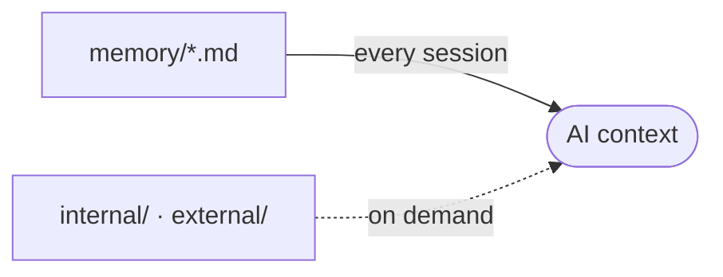

# memory/ - Project Memory

Structured context the AI assistant reads at the start of a session, so it does not rediscover the project each time.

## How it loads

The root files load every session through the project memory block in each AI context file. `internal/` and `external/` load only when relevant.

## Files

Refreshed automatically by the memory hook. Do not edit by hand.

<!-- files:start -->
- [aidd_docs/memory/api.md](aidd_docs/memory/api.md)
- [aidd_docs/memory/architecture.md](aidd_docs/memory/architecture.md)
- [aidd_docs/memory/auth.md](aidd_docs/memory/auth.md)
- [aidd_docs/memory/backlog.md](aidd_docs/memory/backlog.md)
- [aidd_docs/memory/browser-automation.md](aidd_docs/memory/browser-automation.md)
- [aidd_docs/memory/codebase-map.md](aidd_docs/memory/codebase-map.md)
- [aidd_docs/memory/coding-assertions.md](aidd_docs/memory/coding-assertions.md)
- [aidd_docs/memory/database.md](aidd_docs/memory/database.md)
- [aidd_docs/memory/deployment.md](aidd_docs/memory/deployment.md)
- [aidd_docs/memory/design.md](aidd_docs/memory/design.md)
- [aidd_docs/memory/ecosystem.md](aidd_docs/memory/ecosystem.md)
- [aidd_docs/memory/forms.md](aidd_docs/memory/forms.md)
- [aidd_docs/memory/integration.md](aidd_docs/memory/integration.md)
- [aidd_docs/memory/navigation.md](aidd_docs/memory/navigation.md)
- [aidd_docs/memory/project-brief.md](aidd_docs/memory/project-brief.md)
- [aidd_docs/memory/testing.md](aidd_docs/memory/testing.md)
- [aidd_docs/memory/vcs.md](aidd_docs/memory/vcs.md)
<!-- files:end -->

## Maintaining it

The AI writes and refreshes these files. When you edit one by hand:

- One file per concern (architecture, database, vcs, ...).
- Capture the macro and the non-derivable. Point to the code, never copy it.
- Current state only, kept small. No personal notes, no future TODOs.

## Subdirectories

- `internal/`: AIDD workflow traces (the capability profile, audit notes, learn captures).
- `external/`: external references the project pulls in (specs, design docs).
