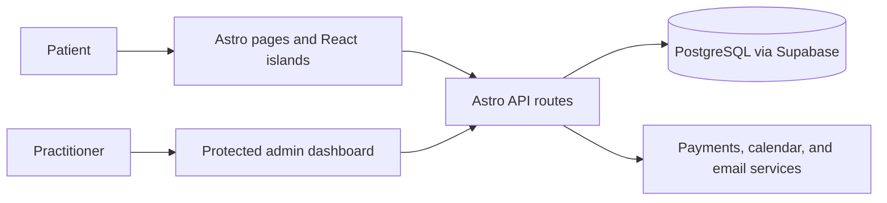

# Architecture

## Stack

- Astro renders the public site as static HTML; React islands add focused client interaction.
- Tailwind provides the UI styling. Server-only integrations remain in `src/lib/` and API routes.

## How it fits together

## Key decisions

- Use Astro islands to keep marketing pages fast and ship JavaScript only for interaction.
- Stripe is limited to video appointments; in-person sessions are paid on site.
- Paid video cancellations create internal credits instead of Stripe refunds; a credit and a Stripe payment share the `payment_received` state.
- Better Auth supports one practitioner account only.

## Gotchas

- Client-side URLs, redirects, and API calls must use a trailing slash, even though the current Astro setting is `ignore`.
- `src/lib/` is server-only and must not be imported by client islands.
- `npm run db:reset` replays only the initial migration; later migrations must be applied separately.
