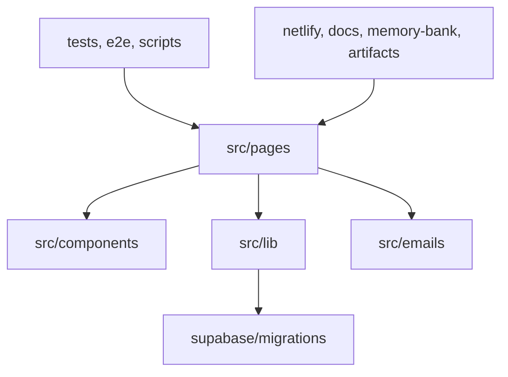

# Codebase Map

## Areas

- `src/pages`: Astro routes, including public pages and server-rendered APIs.
- `src/components`: Astro and React UI; `islands/` holds client-hydrated components and `admin/` holds protected UI.
- `src/lib`: server-side integrations and domain logic.
- `src/emails`: React Email templates and mail helpers.
- `supabase/migrations`: ordered PostgreSQL schema changes.
- `tests/unit` and `e2e`: Vitest and Playwright coverage.
- `docs`, `memory-bank`, and `artifacts`: operating documentation and Roxabi workflow history.

## Entry points

- `src/pages/` is the web and API routing entry point.
- `netlify/functions/` contains scheduled server jobs.
