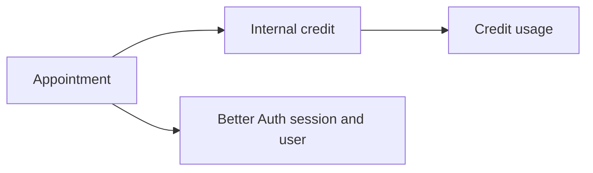

# Database

## Setup

- PostgreSQL persists the application. Production uses Supabase; local development uses Docker plus PostgREST compatibility services.

## Main entities

## Conventions

- Apply migrations in numeric order from `supabase/migrations/`.
- The credits migration introduces FIFO, transactional use and restoration of internal credits.
- The local reset command only reapplies the initial migration; apply later migrations manually when needed.
