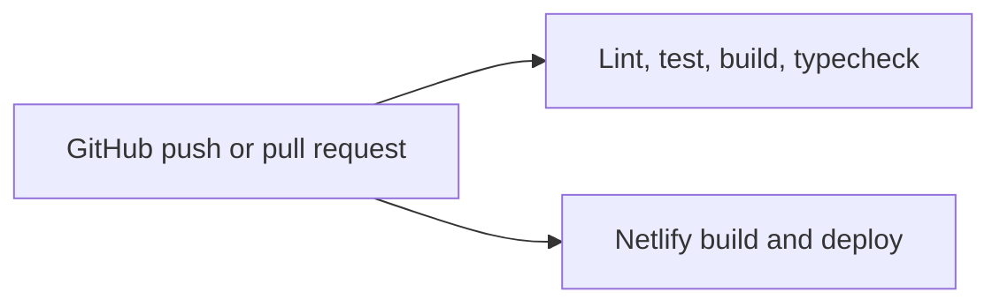

# Deployment

## Pipeline

- GitHub Actions runs lint, unit tests, build, and type checking for pull requests and pushes to `main`.
- Netlify builds and deploys the Astro site, API routes, and scheduled functions from the repository.

## Environments

- Local development uses Docker services and mocks.
- Netlify production and preview deployments must use separate Supabase projects to avoid patient-data contamination.

## Monitoring

- Sentry is optional at runtime and separates production from preview events.
- Netlify scheduled functions handle reminders, calendar-token health, and payment-confirmation reconciliation.
