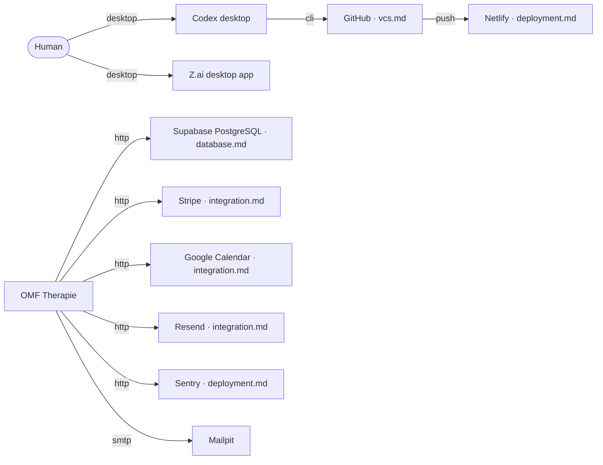

# Ecosystem

```mermaid
flowchart LR
  Human([Human])
  Codex[Codex desktop]
  Zai[Z.ai desktop app]
  App[OMF Therapie]
  GitHub[GitHub · vcs.md]
  Netlify[Netlify · deployment.md]
  Supabase[Supabase PostgreSQL · database.md]
  Stripe[Stripe · integration.md]
  Google[Google Calendar · integration.md]
  Resend[Resend · integration.md]
  Sentry[Sentry · deployment.md]
  Mailpit[Mailpit]

  Human -- desktop --> Codex
  Human -- desktop --> Zai
  Codex -- cli --> GitHub
  App -- http --> Supabase
  App -- http --> Stripe
  App -- http --> Google
  App -- http --> Resend
  App -- http --> Sentry
  App -- smtp --> Mailpit
  GitHub -- push --> Netlify
```
