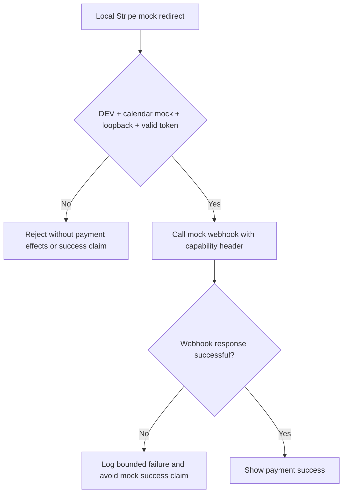
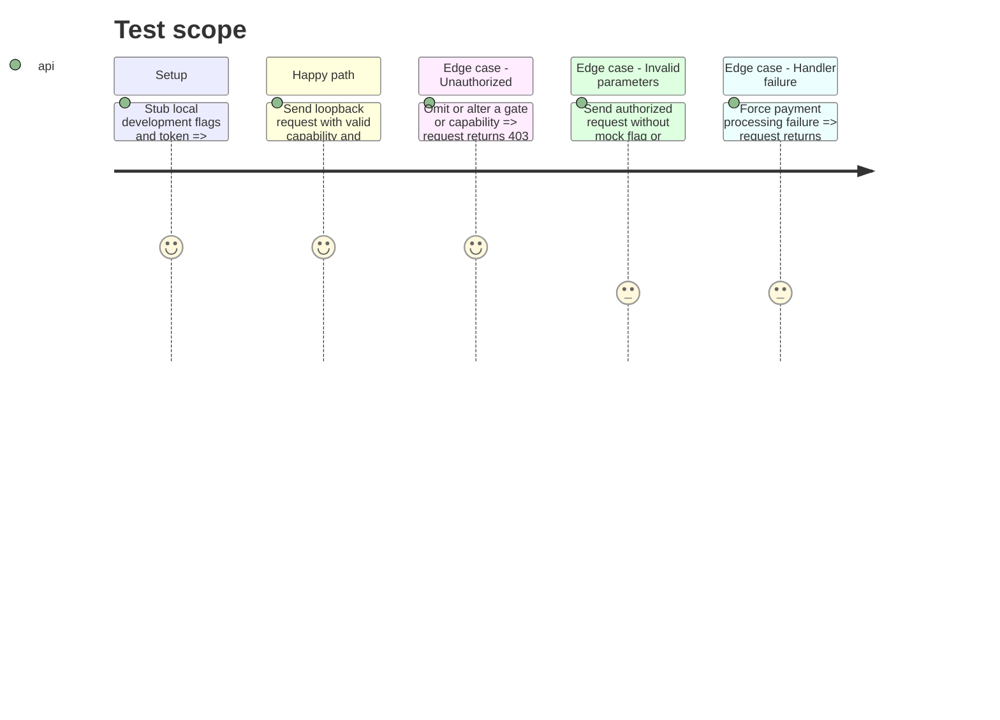

# Instruction: Authorize and verify local mock payments

## Architecture projection

> Tree of the final files. ✅ create · ✏️ modify · ❌ delete

```txt
.
├── .env.local.example                         ✏️ document the required local-only token
├── docs/LOCAL_DEV.md                          ✏️ document generation and scope of the token
├── src/env.d.ts                               ✏️ type the optional server-only token
├── src/lib/mock-mode.server.ts                ✅ centralize dev gates, loopback checks, and constant-time token validation
├── src/lib/calendar-cache.ts                  ✏️ fail closed outside Astro development
├── src/lib/google-calendar.ts                 ✏️ fail closed outside Astro development
├── src/lib/stripe.ts                          ✏️ include the capability in generated local mock redirects
├── src/pages/api/stripe-webhook.ts            ✏️ authorize each mock GET before processing
├── src/pages/rdv/merci.astro                  ✏️ authorize, bound, and verify the local mock callback
├── tests/unit/mock-mode.test.ts               ✅ cover the shared security predicate
└── tests/unit/stripe-webhook.test.ts          ✏️ cover success, 400, 403, and 500 branches
```

## User Journey



## Test Scope



## Tasks to do

### `1)` Centralize local mock authorization

> Make every mock activation fail closed unless it is explicitly local development.

1. Add a server-only helper for the development flag, loopback host, and constant-time token comparison.
2. Apply the development predicate to calendar mock readers.
3. Document and type the local-only token without adding it to production configuration.

### `2)` Protect the mock payment journey

> Require a capability on both the redirect page and webhook request.

1. Add the configured token to local mock redirects.
2. Require authorization before `merci.astro` triggers the webhook or claims mock success.
3. Forward the capability in a header, enforce a timeout, and check the webhook response.
4. Reject unauthorized webhook GET requests before parsing parameters or invoking effects.

### `3)` Complete regression coverage

> Prove the route remains usable locally and all error branches are stable.

1. Cover the shared authorization predicate.
2. Cover authorized success with deterministic IDs.
3. Cover 403, both 400 branches, and the JSON 500 branch.
4. Restore environment stubs after each test.

## Test acceptance criteria

| Task | Acceptance criteria |
| --- | --- |
| 1 | Calendar mocks are disabled whenever `import.meta.env.DEV` is false. |
| 1 | A missing token, wrong token, or non-loopback hostname cannot authorize a mock payment request. |
| 2 | A generated local mock payment link carries the configured capability, while production configuration remains unaware of it. |
| 2 | The confirmation page claims mock success only after an authorized, successful, timeout-bounded webhook response. |
| 2 | The webhook requires an authorized capability header before parsing mock parameters or performing side effects. |
| 3 | The authorized happy path returns 200 and deterministic mock event/payment identifiers. |
| 3 | Unauthorized, invalid-parameter, and handler-failure branches return their documented 403, 400, and 500 responses. |
| 3 | Lint, typecheck, the complete unit suite, and the production build pass through the WSL-safe sequential workflow. |
