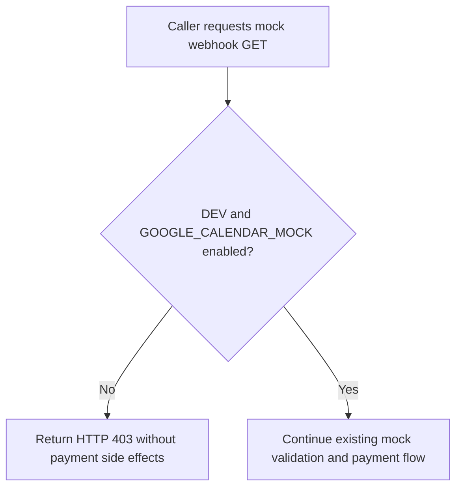
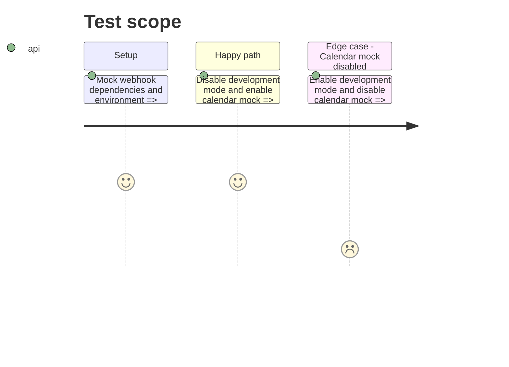

# Instruction: Gate and verify the mock webhook

## Architecture projection

> Tree of the final files. ✅ create · ✏️ modify · ❌ delete

```txt
.
├── src/pages/api/stripe-webhook.ts       ✏️ require development mode for mock GET access
└── tests/unit/stripe-webhook.test.ts    ✏️ cover the environment gate without running payment side effects
```

## User Journey



## Test Scope



## Tasks to do

### `1)` Enforce the development-only gate

> Reject the mock GET route unless both required environment conditions are true.

1. Combine `import.meta.env.DEV` with `GOOGLE_CALENDAR_MOCK` at the route boundary.
2. Preserve the existing development mock flow and French API responses.
3. Confirm the stale Stripe suppression is absent and keep the typed Stripe import.

### `2)` Prove the route boundary

> Add focused regression coverage and run the project validation commands.

1. Exercise both disabled-environment branches through the exported GET handler.
2. Assert payment persistence and notification side effects are not invoked.
3. Run the focused test, lint, typecheck, test suite, and production build.

## Test acceptance criteria

| Task | Acceptance criteria |
| ---- | ------------------- |
| 1 | A request is rejected with HTTP 403 whenever development mode is false, even if the calendar mock flag is true. |
| 1 | A request is rejected with HTTP 403 whenever the calendar mock flag is false, even if development mode is true. |
| 1 | The Stripe namespace import resolves without a TypeScript suppression. |
| 2 | Rejected requests cause no appointment update, email, or calendar event. |
| 2 | Existing Stripe webhook unit tests, lint, typecheck, and production build complete successfully. |
