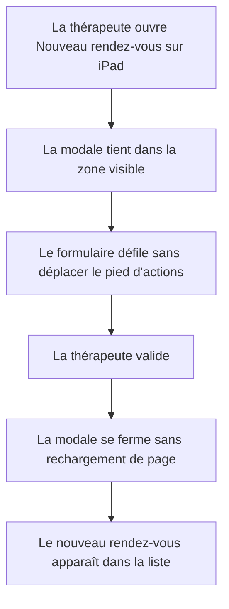
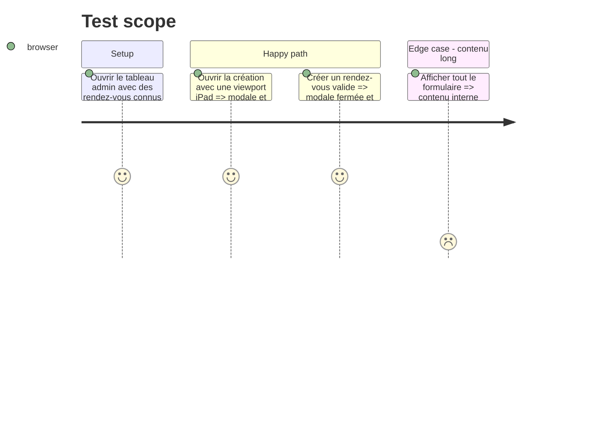

# Instruction: Modale iPad et mise à jour sans rechargement

## Architecture projection

> Tree of the final files. ✅ create · ✏️ modify · ❌ delete

```txt
.
├── src
│   └── components
│       └── admin
│           ├── ✏️ AdminCreateButton.tsx
│           └── ✏️ AppointmentsManager.tsx
└── tests
    └── unit
        └── ✅ admin-dashboard-ui.test.ts
```

## User Journey



## Test Scope



## Wireframe

```txt
┌──────────────────────────────────────┐
│ (1) En-tête de modale · fermeture    │
├──────────────────────────────────────┤
│ (2) Corps de formulaire défilable    │
│     champs patient et séance         │
│     tarification et options          │
├──────────────────────────────────────┤
│ (3) Actions toujours accessibles     │
└──────────────────────────────────────┘

1. En-tête : titre et fermeture restent distincts du contenu long.
2. Corps : tous les champs occupent la hauteur disponible et défilent en interne.
3. Actions : annulation et validation restent dans la zone sûre de la viewport.
```

## Tasks to do

### `1)` Contraindre la modale à la viewport iPad

> Garder la modale et ses actions dans la zone visible, y compris avec les barres natives de Safari.

1. Structurer la modale en en-tête, corps défilable et pied fixe.
2. Utiliser la hauteur dynamique de viewport et la safe area inférieure.
3. Bloquer le défilement de la page sous-jacente pendant l’ouverture.

### `2)` Mettre à jour la liste sans recharger la page

> Remplacer le rechargement complet par une mise à jour locale après le POST réussi.

1. Lire le rendez-vous renvoyé par l’API.
2. Fermer la modale et signaler la création au tableau admin.
3. Ajouter le rendez-vous à l’état de `AppointmentsManager` sans navigation.

### `3)` Couvrir les contrats UI testables

> Prévenir le retour du rechargement brutal et la perte de la mise à jour locale.

1. Extraire uniquement les contrats purs utiles au test si nécessaire.
2. Ajouter des assertions ciblées sans introduire de nouvel environnement de test lourd.

## Test acceptance criteria

| Task | Acceptance criteria |
| ---- | ------------------- |
| 1 | Sur une viewport iPad, le panneau ne dépasse pas la hauteur visible, le corps défile et les actions restent au-dessus de la safe area. |
| 2 | Une réponse 201 ferme la modale, ne recharge pas la page et ajoute le rendez-vous créé à la liste active. |
| 3 | Les tests ciblés détectent la réintroduction d’un rechargement complet ou l’absence de mise à jour locale. |
