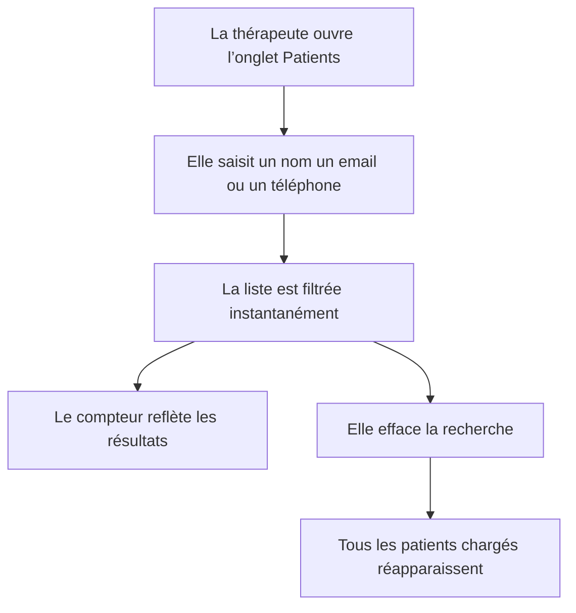
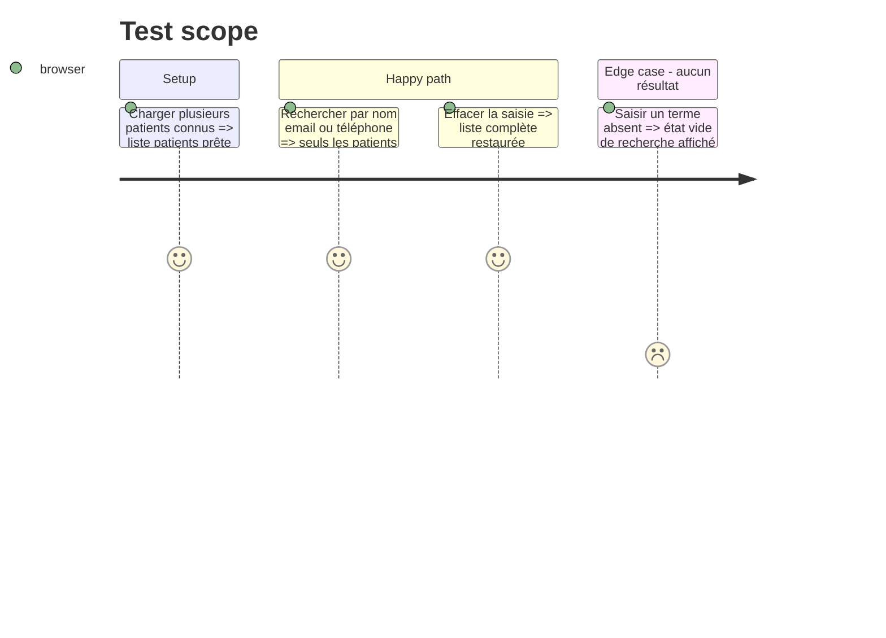

# Instruction: Recherche dans la liste des patients

## Architecture projection

> Tree of the final files. ✅ create · ✏️ modify · ❌ delete

```txt
.
├── src
│   └── components
│       └── admin
│           └── ✏️ PatientList.tsx
└── tests
    └── unit
        └── ✏️ admin-dashboard-ui.test.ts
```

## User Journey



## Test Scope



## Wireframe

```txt
┌──────────────────────────────────────┐
│ (1) Recherche patients · effacement  │
├──────────────────────────────────────┤
│ (2) Compteur · filtre inactifs       │
├──────────────────────────────────────┤
│ (3) Liste de patients filtrée        │
│     fiche · fiche · fiche            │
└──────────────────────────────────────┘

1. Recherche : champ accessible placé au même niveau fonctionnel que la recherche des rendez-vous.
2. Contrôles : compteur des résultats et option d’inclusion des patients inactifs.
3. Liste : résultats correspondants ou état vide contextualisé.
```

## Tasks to do

### `1)` Ajouter la recherche patients

> Filtrer côté client les patients déjà chargés par identité et coordonnées.

1. Ajouter un état de recherche différé et normalisé.
2. Rechercher sur le nom, l’email et le téléphone.
3. Rendre le champ et son bouton d’effacement accessibles.

### `2)` Aligner les retours de liste

> Faire refléter la recherche par le compteur et l’état vide.

1. Afficher le nombre de résultats filtrés.
2. Distinguer l’absence de patients de l’absence de correspondance.
3. Conserver le filtre des patients inactifs et le dépliage existant.

### `3)` Tester le filtrage

> Couvrir les correspondances et la normalisation sans dépendre d’un navigateur.

1. Tester les recherches par nom, email et téléphone.
2. Tester la casse, les espaces et l’absence de résultat.

## Test acceptance criteria

| Task | Acceptance criteria |
| ---- | ------------------- |
| 1 | Une recherche par nom, email ou téléphone filtre immédiatement les patients sans requête réseau supplémentaire. |
| 2 | Le compteur et l’état vide décrivent les résultats filtrés, et effacer la saisie restaure la liste chargée. |
| 3 | Les tests ciblés couvrent les champs recherchables, la normalisation et les non-correspondances. |
