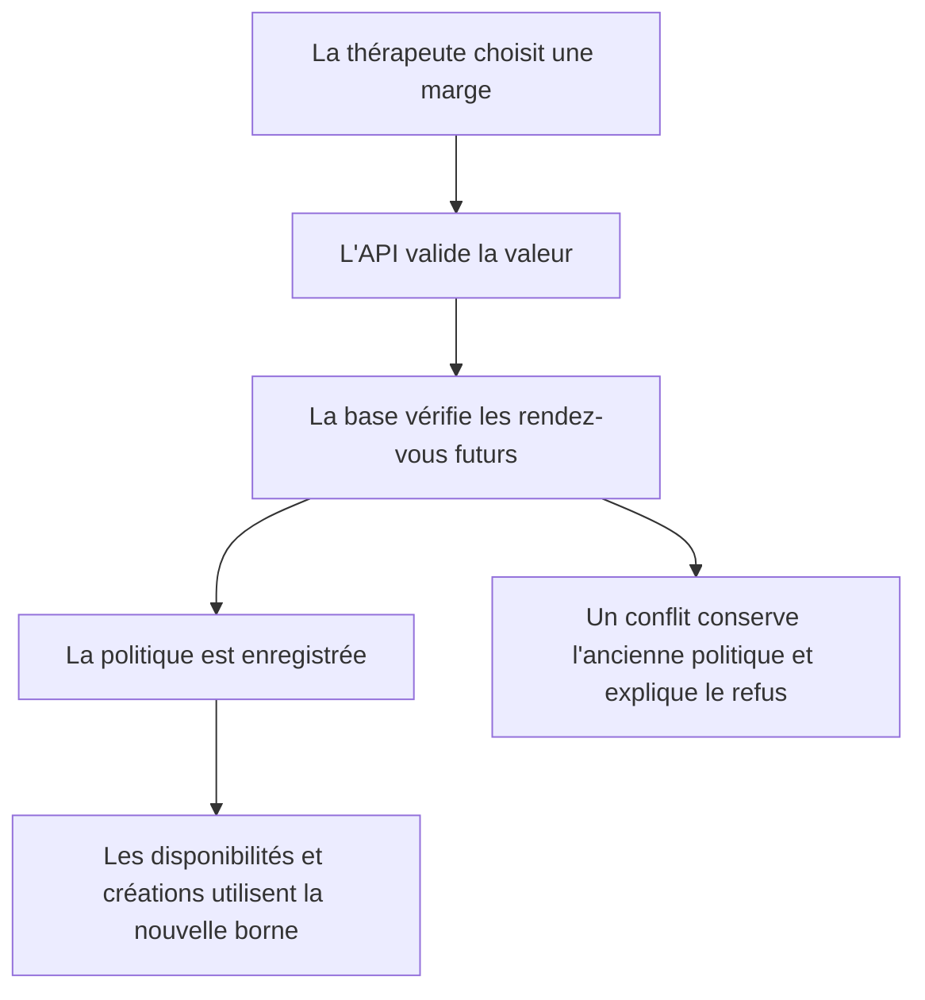
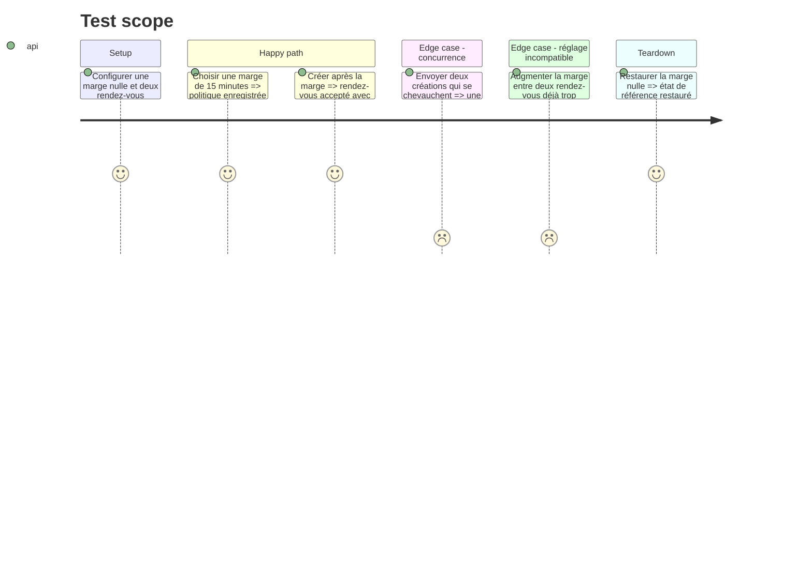

# Instruction: Politique de planification et marge globale

## Architecture projection

> Tree of the final files. ✅ create · ✏️ modify · ❌ delete

```txt
.
├── supabase/migrations/
│   └── 015_scheduling_settings.sql                         ✅ configuration, borne bloquée et garde concurrente
├── src/
│   ├── lib/
│   │   ├── appointment-conflicts.ts                        ✏️ conflits tenant compte de la marge et des longues durées
│   │   └── scheduling-settings.ts                          ✅ lecture et mise à jour de la politique globale
│   ├── pages/api/
│   │   ├── admin/
│   │   │   ├── appointments/index.ts                       ✏️ erreur de concurrence traduite en conflit métier
│   │   │   └── scheduling-settings/index.ts                ✅ API administrateur authentifiée
│   │   ├── appointments/
│   │   │   ├── index.ts                                    ✏️ création publique protégée par la garde DB
│   │   │   └── [id].ts                                     ✏️ reports protégés et réponse exploitable par l'UI
│   │   └── availability.ts                                 ✏️ périodes occupées étendues par la marge
│   └── types/
│       ├── appointment.ts                                  ✏️ borne de blocage typée
│       └── scheduling-settings.ts                          ✅ contrat de configuration
└── tests/unit/
    ├── appointment-conflicts.test.ts                       ✏️ chevauchements, marge et durée 240 min
    ├── availability.test.ts                                ✏️ filtrage des créneaux pendant la marge
    └── scheduling-settings.test.ts                         ✅ authentification, validation et conflits de réglage
```

## User Journey



## Test Scope



## Tasks to do

### `1)` Persister la politique de planification

> Introduire une configuration singleton et une borne technique de blocage sans modifier la durée clinique.

1. Ajouter la migration idempotente avec valeur par défaut nulle, contraintes 0/15/20 et droits service-role.
2. Ajouter `blocked_until` aux rendez-vous et la maintenir à partir de la fin clinique et de la marge courante.
3. Fournir une fonction transactionnelle de modification qui refuse une marge incompatible avec les rendez-vous futurs.
4. Sérialiser les insertions et déplacements actifs avant de contrôler les chevauchements.

### `2)` Centraliser le calcul des conflits

> Appliquer le même intervalle bloqué aux créations, aux reports et aux propositions de report.

1. Remplacer la borne fixe de 90 minutes par le maximum métier de 240 minutes augmenté de la marge.
2. Comparer les créneaux avec `blocked_until` et étendre également les propositions de report.
3. Conserver le contrôle applicatif pour le retour rapide et traduire la garde DB en réponse 409.

### `3)` Exposer et propager le réglage

> Permettre à l'administratrice de lire et modifier la marge tout en invalidant les disponibilités mises en cache.

1. Créer les types et helpers serveur stricts.
2. Ajouter une route GET/PATCH authentifiée avec validation de valeur.
3. Étendre les périodes occupées de l'API publique avec la borne de blocage.
4. Tester les valeurs, les erreurs, les frontières adjacentes et les chemins de report.

## Test acceptance criteria

| Task | Acceptance criteria |
| ---- | ------------------- |
| 1 | La base conserve séparément la fin clinique et la fin bloquée, et deux mutations concurrentes ne peuvent pas créer un chevauchement actif. |
| 2 | Une séance ou proposition de report de 15 à 240 minutes bloque sa durée plus la marge, avec une frontière de fin exclusive. |
| 3 | Seule l'administratrice peut lire ou modifier 0, 15 ou 20 minutes, et les disponibilités reflètent immédiatement la valeur acceptée. |
