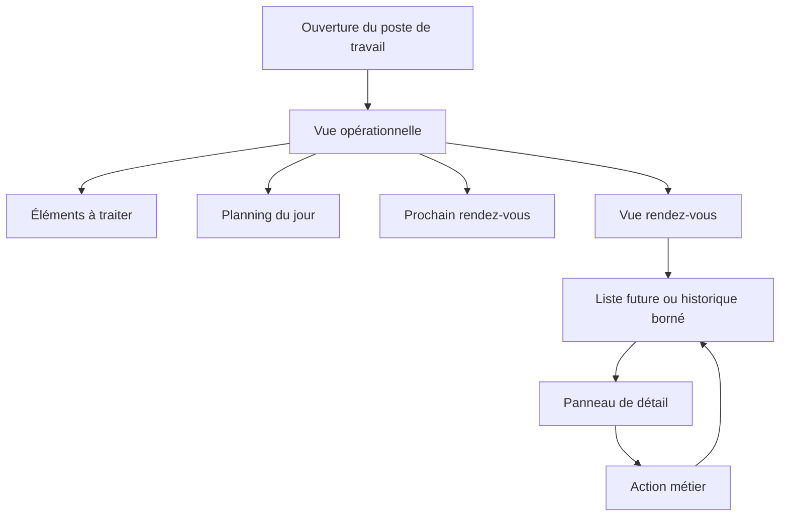
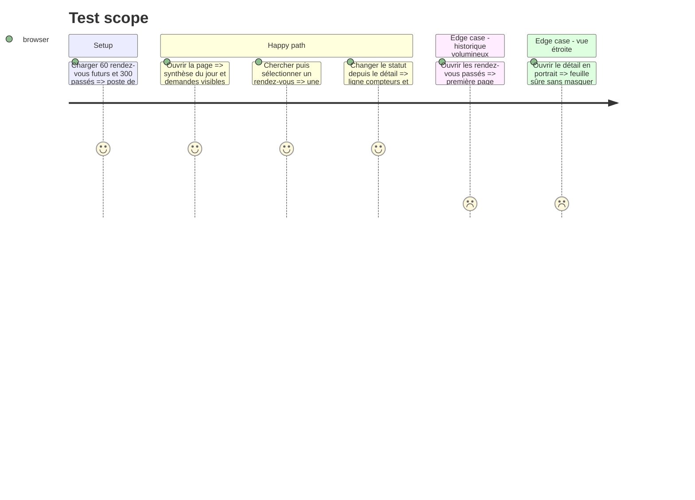

# Instruction: Socle du poste de travail et rendez-vous à grande échelle

## Architecture projection

> Tree of the final files. ✅ create · ✏️ modify · ❌ delete

```txt
.
├── src/
│   ├── components/admin/
│   │   ├── AdminWorkspace.tsx                              ✅ island unique, navigation et état partagé
│   │   ├── AdminOverview.tsx                               ✅ synthèse du jour et éléments à traiter
│   │   ├── AdminSidePanel.tsx                              ✅ panneau maître-détail accessible et responsive
│   │   ├── AppointmentsManager.tsx                         ✏️ liste compacte, filtres et pagination bornée
│   │   ├── AppointmentCard.tsx                             ✏️ détail sélectionné et mutations sans rechargement
│   │   ├── ConfirmModal.tsx                                ✏️ cibles tactiles et intégration au panneau
│   │   ├── Modal.tsx                                       ✏️ contrat de hauteur sûre pour les actions secondaires
│   │   └── admin-workspace-utils.ts                        ✅ sélections, compteurs et pagination testables
│   └── pages/mes-rdvs.astro                                ✏️ chargement serveur et montage d'une seule island
└── tests/unit/
    ├── admin-dashboard-ui.test.ts                          ✏️ migration vers les helpers du poste de travail
    └── admin-workspace.test.ts                             ✅ synthèse, pagination et mises à jour locales
```

## User Journey



## Test Scope



## Wireframe

```txt
┌──────────────────────────────────────────────────────────────────────┐
│ (1) En-tête : titre · état agenda · action principale · compte       │
├──────────────────────────────────────────────────────────────────────┤
│ (2) Navigation : synthèse · rendez-vous · patients · disponibilités  │
├───────────────────────────────┬──────────────────────────────────────┤
│ (3) Zone principale           │ (6) Panneau contextuel               │
│ ┌─────────────┬─────────────┐ │ ┌──────────────────────────────────┐ │
│ │ (4) À faire │ Aujourd'hui │ │ │ détail ou action sélectionnée   │ │
│ └─────────────┴─────────────┘ │ │                                  │ │
│ ┌───────────────────────────┐ │ │                                  │ │
│ │ (5) Liste compacte bornée │ │ │                                  │ │
│ │ ligne · ligne · ligne     │ │ └──────────────────────────────────┘ │
│ └───────────────────────────┘ │                                      │
└───────────────────────────────┴──────────────────────────────────────┘
```

1. En-tête : contexte global, connexion agenda et action la plus fréquente.
2. Navigation : quatre destinations stables dans un seul état d'application.
3. Zone principale : contenu de la destination active sans empilement de fiches.
4. Synthèse : éléments nécessitant une décision et déroulé de la journée.
5. Liste : résultats compacts, filtrés et rendus par lot.
6. Panneau : un seul détail ou formulaire conserve le contexte de la liste.

## Tasks to do

### `1)` Construire l'island de poste de travail

> Centraliser la navigation, les rendez-vous et les panneaux dans un état cohérent.

1. Monter une seule island depuis la page authentifiée et conserver la destination active en session.
2. Dériver en temps réel les compteurs, les rendez-vous du jour, le prochain rendez-vous et les demandes à traiter.
3. Intégrer le statut du calendrier et la déconnexion avec des cibles de 44 px.

### `2)` Remplacer la pile de fiches par une liste maître-détail

> Rendre le volume lisible sans perdre les actions existantes.

1. Afficher des lignes sémantiques compactes avec heure, patient, mode, durée et statut textuel.
2. Séparer futurs et historique, paginer côté rendu et conserver recherche et filtres.
3. Ouvrir un seul rendez-vous dans un panneau latéral ou une feuille portrait avec retour de focus.

### `3)` Supprimer les rechargements des actions

> Réconcilier chaque réponse API dans l'état partagé.

1. Faire retourner les données de rendez-vous mises à jour aux callbacks du détail.
2. Mettre à jour lignes, compteurs, sélection et synthèse après confirmation, refus, report, annulation et notes.
3. Distinguer les états enregistrés des traitements externes encore en cours.

## Test acceptance criteria

| Task | Acceptance criteria |
| ---- | ------------------- |
| 1 | La page démarre sur une synthèse exploitable et la navigation active reste cohérente pendant la session. |
| 2 | Au plus un détail complet et un lot borné de lignes sont rendus, y compris avec 360 rendez-vous. |
| 3 | Toute action réussie actualise les vues concernées sans `reload`, et toute erreur conserve le contexte et la saisie. |
