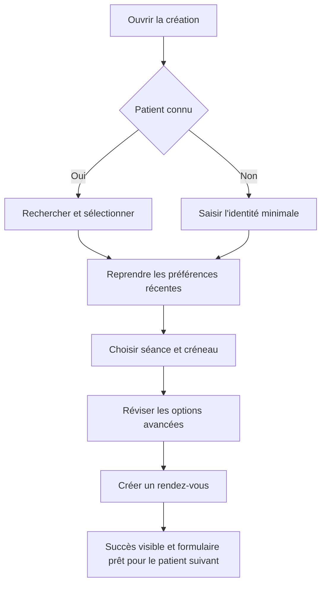
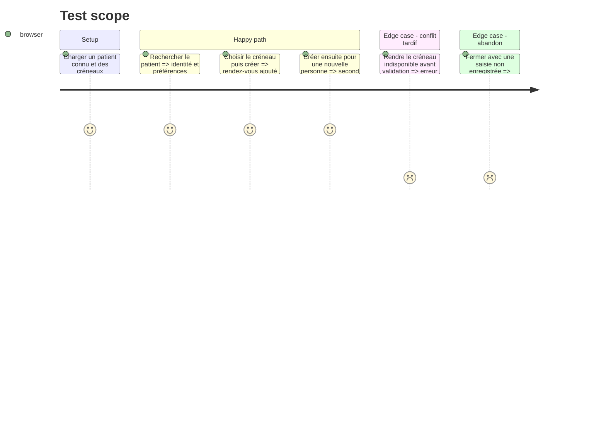

# Instruction: Création successive et répertoire patients

## Architecture projection

> Tree of the final files. ✅ create · ✏️ modify · ❌ delete

```txt
.
├── src/components/admin/
│   ├── AdminWorkspace.tsx                                  ✏️ orchestration du compositeur et du patient sélectionné
│   ├── AppointmentComposer.tsx                             ✅ panneau progressif de création individuelle
│   ├── AdminCreateButton.tsx                               ❌ remplacé par le compositeur contextuel
│   ├── PatientList.tsx                                     ✏️ répertoire compact maître-détail et préremplissage complet
│   ├── admin-dashboard-ui.ts                               ❌ événements inter-islands devenus inutiles
│   └── admin-workspace-utils.ts                            ✏️ recherche patient et initialisation de formulaire
└── tests/unit/
    ├── admin-dashboard-ui.test.ts                          ❌ remplacé par la couverture du nouvel état unifié
    ├── admin-workspace.test.ts                             ✏️ création locale et enchaînement
    └── appointment-composer.test.ts                        ✅ progression, préremplissage et conservation d'erreur
```

## User Journey



## Test Scope



## Wireframe

```txt
┌───────────────────────────────────────────────────────────────┐
│ (1) Panneau : titre · progression · fermer                    │
├───────────────────────────────────────────────────────────────┤
│ (2) Recherche patient existant                                │
│ ┌───────────────────────────────────────────────────────────┐ │
│ │ résultats compacts ou action nouvelle personne            │ │
│ └───────────────────────────────────────────────────────────┘ │
├───────────────────────────────────────────────────────────────┤
│ (3) Séance : type · mode · durée                              │
│ (4) Créneau : propositions · saisie exceptionnelle            │
│ (5) Options avancées repliées                                 │
├───────────────────────────────────────────────────────────────┤
│ (6) Résumé · état · action principale                         │
└───────────────────────────────────────────────────────────────┘
```

1. Panneau : contexte de création et sortie sûre.
2. Patient : sélection ou identité nouvelle avant les détails de séance.
3. Séance : préférences récentes modifiables.
4. Créneau : choix principal et exception clairement séparés.
5. Options : tarif, avoir, notification et lien vidéo hors du parcours minimal.
6. Résumé : conséquences visibles avant une seule création.

## Tasks to do

### `1)` Transformer la création en compositeur contextuel

> Réduire la charge initiale tout en conservant toutes les capacités métier.

1. Séparer patient, séance, créneau et options avancées avec des labels visibles.
2. Afficher le compositeur dans le panneau du poste de travail en paysage et en feuille sûre en portrait.
3. Conserver validation, tarification, avoirs, email et lien vidéo existants.

### `2)` Optimiser la création successive

> Revenir à une recherche patient prête après chaque rendez-vous réussi.

1. Insérer immédiatement la réponse dans l'état partagé et annoncer le succès.
2. Réinitialiser uniquement les données propres au patient et à la séance terminée.
3. Laisser le compositeur ouvert avec une action explicite pour terminer la session de création.

### `3)` Reconcevoir le répertoire patients

> Afficher environ cinquante patients sans pile de cards imbriquées.

1. Charger actifs et archivés, rechercher nom/email/téléphone et afficher une liste compacte.
2. Montrer un seul résumé patient et un historique borné dans le panneau de détail.
3. Lancer le compositeur avec identité, type, mode et durée les plus récents.

## Test acceptance criteria

| Task | Acceptance criteria |
| ---- | ------------------- |
| 1 | Le parcours minimal ne montre que les informations nécessaires à l'étape courante, tandis que toutes les options existantes restent accessibles. |
| 2 | Deux rendez-vous individuels pour deux patients différents peuvent être créés à la suite sans fermer le panneau ni recharger l'application. |
| 3 | Environ cinquante patients restent recherchables et un seul détail avec historique borné est rendu à la fois. |
