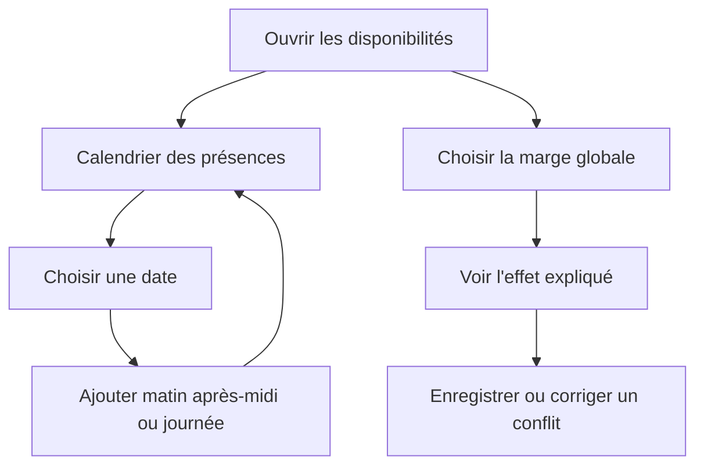
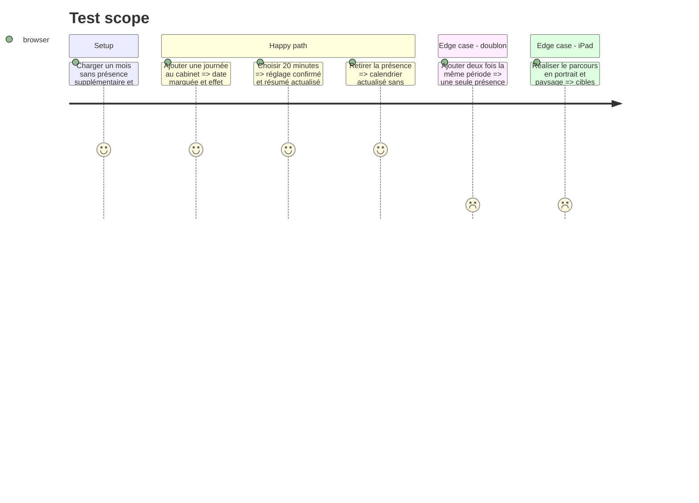

# Instruction: Disponibilités, présence au cabinet et finition iPad

## Architecture projection

> Tree of the final files. ✅ create · ✏️ modify · ❌ delete

```txt
.
├── src/components/admin/
│   ├── AdminWorkspace.tsx                                  ✏️ destination disponibilités et retours globaux
│   ├── AvailabilityManager.tsx                             ✅ calendrier de présence et réglage de marge
│   └── TimeSlotManager.tsx                                 ❌ remplacé par la surface de disponibilités
├── src/pages/api/admin/time-slots/
│   ├── index.ts                                            ✏️ erreurs de doublon cohérentes
│   └── [id].ts                                             ✏️ contrat de suppression exploitable par l'UI
└── tests/unit/
    ├── admin-availability.test.ts                          ✅ calendrier, présence et réglage
    └── manual-time-slots.test.ts                           ✏️ doublons et invalidation de cache
```

## User Journey



## Test Scope



## Wireframe

```txt
┌────────────────────────────────────────────────────────────────┐
│ (1) Disponibilités : résumé des règles actives                  │
├────────────────────────────────┬───────────────────────────────┤
│ (2) Calendrier des présences   │ (4) Rythme des séances        │
│ ┌────────────────────────────┐ │ ┌───────────────────────────┐ │
│ │ mois · grille · marqueurs  │ │ │ 0 · 15 · 20 minutes       │ │
│ └────────────────────────────┘ │ │ explication de l'effet     │ │
│ (3) Date : matin · après-midi  │ └───────────────────────────┘ │
│            · journée · retirer│                               │
└────────────────────────────────┴───────────────────────────────┘
```

1. Résumé : règles de disponibilité actuellement appliquées.
2. Calendrier : présences ajoutées visibles dans leur contexte mensuel.
3. Date : commandes de période et suppression avec libellés explicites.
4. Rythme : marge globale et impact sur le prochain départ de séance.

## Tasks to do

### `1)` Remplacer la liste de plages par un calendrier de présence

> Visualiser et modifier les demi-journées dans leur contexte.

1. Charger le mois visible et permettre la navigation mensuelle bornée.
2. Marquer matin, après-midi et journée sans utiliser la couleur seule.
3. Ajouter ou retirer localement une présence avec retour et URL à slash final.

### `2)` Intégrer la marge globale

> Exposer le réglage backend avec une conséquence compréhensible.

1. Charger 0/15/20 minutes et afficher l'effet sur le prochain créneau.
2. Sauvegarder avec état de progression, succès et conflit annoncé.
3. Conserver la valeur précédente si le serveur refuse la modification.

### `3)` Finaliser le contrat iPad et accessibilité

> Vérifier l'ensemble du poste de travail dans les tailles et modes d'entrée cibles.

1. Uniformiser les cibles tactiles, focus, labels, régions live et statuts non coloriels.
2. Gérer portrait, paysage, clavier logiciel, zones sûres et défilement interne des panneaux.
3. Réaliser le parcours complet de synthèse, recherche, création, détail et disponibilités.

## Test acceptance criteria

| Task | Acceptance criteria |
| ---- | ------------------- |
| 1 | Une présence est lisible, ajoutable et retirable depuis le calendrier sans rechargement ni doublon visible. |
| 2 | Le réglage 0/15/20 reflète exactement la valeur serveur acceptée et explique clairement son impact. |
| 3 | Les parcours principaux fonctionnent au toucher et au clavier en portrait et paysage, sans cible trop petite ni contenu essentiel masqué. |

