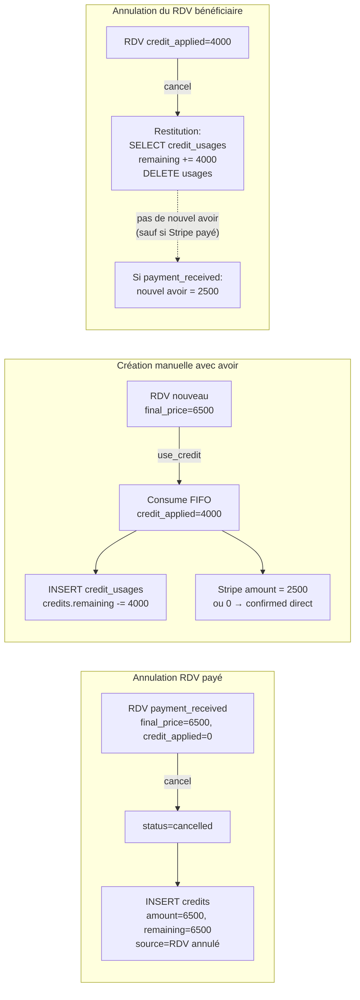
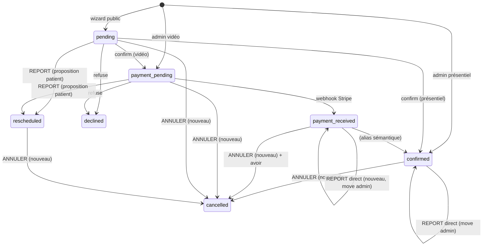

## Source

Demande produit (Tavian, issue #63) : *« The therapist need a better appointment workflow
from her rendez-vous page. Right now, she can refuse a remote meeting before it get payed.
Now, she needs to be able to cancel or reschedule every kind of further appointments in
every step of the workflow. Cette règle s'applique à tous les rendez vous à partir de la
veille du jour actuel. […] if it's cancelled, admin should have the information of "credit"
already payed but not consume. On next appointments, a checkbox should be available when
credit is available to deduce it from actual pricing. If price is zero, no need for stripe
payment. »*

Décisions de produit validées en framing (issue #63, frame approuvé) :

- Annuler (`cancelled`) ≠ Refuser (`declined`).
- Avoir interne uniquement — **pas de `stripe.refunds.create`**.
- Avoirs **admin-only** (le patient n'a pas d'UI ; il contacte la thérapeute).
- Montant de l'avoir = `final_price` réellement payé.
- Report d'un RDV vidéo déjà payé = move direct admin (corrige le bug double-facturation).
- Restitution d'avoir si le nouveau RDV est annulé.
- Reliquat d'avoir conservé si session moins chère (FIFO).

## Problem

Trois lacunes concrètes dans le back-office `/mes-rdvs/` :

1. **Pas d'annulation.** Le statut `cancelled` est défini (`src/types/appointment.ts:30`,
   `supabase/migrations/001_init.sql:47-55`) mais **aucun handler ni bouton ne le produit**.
   Une fois un RDV confirmé/payé, la thérapeute est bloquée. Seul `decline` existe
   (`src/pages/api/appointments/[id].ts:342-381`), limité aux demandes non payées.

2. **Bug de double-facturation sur report vidéo payé.** L'action `reschedule`
   (`[id].ts:408-503`) expire systématiquement le Payment Link Stripe (ligne 446) puis
   `accept_reschedule` (`[id].ts:583-592`) **régénère un nouveau lien Stripe pour toute
   vidéo**, même si le statut était `payment_received`. Un RDV vidéo déjà payé, reporté,
   est donc re-facturé au patient.

3. **Aucun mécanisme d'avoir.** Recherche exhaustive : zéro `stripe.refunds.create`,
   aucune colonne/table de crédit, aucun concept d'avoir dans le code. Seul texte
   informatif dans `src/pages/cgv.astro` et `src/components/pricing/PaymentInfo.tsx`.
   Une téléconsultation payée annulée = argent « perdu » côté app.

## Outcome

La thérapeute peut, depuis `/mes-rdvs/`, **annuler ou reporter n'importe quel RDV** dans
la fenêtre d'éligibilité (veille du jour actuel inclus), tous modes/statuts confondus.
L'annulation d'une téléconsultation payée génère un **avoir traçable**, réutilisable sur
une création manuelle ultérieure (case « Utiliser l'avoir »). Si le prix final tombe à 0,
aucun paiement Stripe n'est demandé. Le report d'un RDV payé ne re-facture plus. Les
avoirs consommés sont restitués si le RDV bénéficiaire est lui-même annulé.

## Appetite

Cycle F-full (~2-3 jours). Multi-domaine : migration DB (2 tables + 1 colonne), state
machine RDV, 2 nouveaux handlers, UI admin (2 composants), template email, logique de
ledger (FIFO + restitution).

## Décisions de modélisation résolues

Les 3 questions ouvertes du frame sont tranchées par l'analyse du code existant :

### D1 — Statut d'un RDV vidéo payé après report direct

**Décision : conserver `payment_received`.**

Raisons :
- Le handler `cancel` doit savoir qu'un RDV **a été payé** pour émettre un avoir. Le test
  naturel est `status === 'payment_received'` (sémantique « paiement Stripe reçu »,
  utilisée aussi par le webhook `stripe-webhook.ts:199`).
- Passer en `confirmed` ferait perdre cette information — il faudrait alors tester
  `stripe_payment_intent_id IS NOT NULL`, plus fragile (peut être null en mode mock).
- Le report direct devient : `scheduled_at` mis à jour, statut inchangé, Meet/Calendar
  mis à jour via `updateCalendarEvent`. Aucun email de demande de paiement.

### D2 — Afficher le solde d'avoir côté admin

**Décision : oui, sur la page Patients (`PatientList.tsx`) ET dans le formulaire de
création (`AdminCreateButton.tsx`).**

Raisons :
- Admin-only et faible coût (un endpoint `GET /api/admin/credits?email=` + un indicateur).
- La thérapeute doit voir qu'un patient a un avoir pour décider de l'appliquer — sinon la
  case à cocher est invisible jusqu'à saisir l'email, et le suivi est impossible.
- La page Patients est déjà le lieu naturel d'agrégation par email (`/api/admin/patients`).

### D3 — Granularité de `credit_usages`

**Décision : une ligne par tranche FIFO consommée** (standard ledger).

Une consommation peut toucher plusieurs lignes `credits` (quand le crédit disponible est
étalé sur plusieurs avoirs). Chaque tranche = une ligne `credit_usages`. La restitution se
fait par `SELECT … WHERE appointment_id = X` puis restauration `remaining` + `DELETE`.
Aucune colonne dénormalisée nécessaire côté appointments — sauf `credit_applied` pour
l'affichage et le calcul du montant Stripe (voir D4).

### D4 — Modèle de prix avec avoir (décision émergente de l'analyse)

**Décision : `credit_applied` est une colonne séparée sur `appointments` ; le montant
Stripe = `final_price − credit_applied`.**

La sémantique actuelle de `final_price` est « ce que Stripe facture » (`[id].ts:180`,
`[id].ts:587`, webhook). Si on réduisait `final_price` par l'avoir, on perdrait le prix
catalogue et casserait l'affichage (`AppointmentCard.tsx:319`). On garde donc :

| Colonne | Sémantique | Exemple (65€ grid, 40€ avoir) |
|---|---|---|
| `base_price` | prix grille | 6500 |
| `discount` | remise 1ère/solidaire | 0 |
| `final_price` | prix après remise (= dû catalogue) | 6500 |
| `credit_applied` (NEW) | avoir consommé | 4000 |
| — montant Stripe — | `final_price − credit_applied` | 2500 |

Si `credit_applied ≥ final_price` → montant Stripe = 0 → **aucun lien Stripe généré**
(règle produit « if price is zero, no need for stripe payment »).

**Statut cible quand montant = 0 — aligné sur D1 (correction de cohérence).** Puisque
(D1) un RDV vidéo payé conserve `payment_received`, un RDV vidéo **entièrement couvert
par avoir** doit aussi aboutir à `payment_received` (et non `confirmed`). Uniformité :
**`payment_received` = « la séance est réglée »**, peu importe le moyen (Stripe cash ou
avoir). Cas par mode :

| Mode | Montant Stripe | Statut cible |
|---|---|---|
| `in-person` | (jamais de Stripe) | `confirmed` |
| `video`, montant > 0 | `final_price − credit_applied` | `payment_pending` (lien Stripe) → `payment_received` (webhook) |
| `video`, montant = 0 (avoir couvre tout) | — | **`payment_received` direct**, aucun lien Stripe, Meet/Calendar générés |

Ainsi la règle consolidée d'annulation (`status === 'payment_received'` → émettre un avoir
de `final_price − credit_applied`) reste juste : pour un RDV vidéo financé à 100% par
avoir, `final_price − credit_applied = 0` → **aucun nouvel avoir** (aucun cash encaissé),
et `credit_applied > 0` → **restitution** de l'avoir source. Cohérent avec le tableau de
sémantique ci-dessous.

## Shapes — Modèle d'avoir

### Shape 1 : Ledger avec `credit_usages` (recommandé)

Deux tables :

```sql
CREATE TABLE credits (
  id UUID PRIMARY KEY DEFAULT gen_random_uuid(),
  patient_email TEXT NOT NULL,
  source_appointment_id UUID REFERENCES appointments(id),
  amount INTEGER NOT NULL CHECK (amount > 0),      -- cents, montant d'origine
  remaining INTEGER NOT NULL CHECK (remaining >= 0 AND remaining <= amount),
  reason TEXT NOT NULL DEFAULT 'cancellation',     -- extensible ('manual' future)
  created_at TIMESTAMPTZ NOT NULL DEFAULT now(),
  updated_at TIMESTAMPTZ NOT NULL DEFAULT now()
);

CREATE TABLE credit_usages (
  id UUID PRIMARY KEY DEFAULT gen_random_uuid(),
  credit_id UUID NOT NULL REFERENCES credits(id),
  appointment_id UUID NOT NULL REFERENCES appointments(id),  -- RDV consommateur
  amount INTEGER NOT NULL CHECK (amount > 0),
  created_at TIMESTAMPTZ NOT NULL DEFAULT now()
);

ALTER TABLE appointments ADD COLUMN credit_applied INTEGER NOT NULL DEFAULT 0;
```

**Flux :**
- **Création d'avoir** (annulation payée) : `INSERT credits (amount=remaining=final_price−credit_applied, source_appointment_id, patient_email)`.
- **Consommation** (création manuelle avec avoir) : requête FIFO
  `SELECT … WHERE patient_email AND remaining > 0 ORDER BY created_at`, boucle de
  consommation, `INSERT credit_usages` par tranche, `UPDATE credits.remaining`.
- **Restitution** (annulation d'un RDV consommateur) :
  `SELECT credit_usages WHERE appointment_id`, `UPDATE credits.remaining += amount`,
  `DELETE credit_usages`.

**Trade-offs :**
- ✅ Provenance complète (quel RDV a généré/consumé quoi).
- ✅ Restitution triviale et exacte.
- ✅ FIFO naturel (ORDER BY created_at).
- ✅ Extensible (« création manuelle d'avoir » future = INSERT avec reason='manual').
- ⚠️ 2 tables + 1 colonne ; logique de consommation ~40 lignes.

**Rough scope : L** (migration + lib `credits.ts` + intégrations).

### Shape 2 : Solde unique par patient

```sql
CREATE TABLE patient_credits (
  patient_email TEXT PRIMARY KEY,
  balance INTEGER NOT NULL DEFAULT 0
);
ALTER TABLE appointments ADD COLUMN credit_applied INTEGER NOT NULL DEFAULT 0;
```

**Flux :** `balance += final_price` à l'annulation payée ; `balance -= credit_applied` à
l'utilisation ; restitution `balance += credit_applied`.

**Trade-offs :**
- ✅ Minimal (1 table).
- ❌ Aucune provenance (impossible d'auditer quel RDV a créé l'avoir).
- ❌ La « création manuelle d'avoir depuis la page Patients » (soupape future) serait
  inauditable.
- ❌ Pas de FIFO (un seul pot).

**Rough scope : M.**

### Shape 3 : Event-sourcing (append-only `credit_events`)

Une table d'événements (`issued`/`consumed`/`restored`), solde calculé par agrégation.

**Trade-offs :**
- ✅ Audit maximal.
- ❌ Overkill pour 1 thérapeute — complexité de requête, pas de besoin en scala.
- ❌ Reconstruction du solde à chaque lecture.

**Éliminé** — ne sert pas l'appétit.

## Fit Check

**Shape 1 (Ledger) retenue.**

| Contrainte (frame) | Shape 1 | Shape 2 | Shape 3 |
|---|:---:|:---:|:---:|
| Restitution exacte sur re-annulation | ✅ | ⚠️ (via colonne) | ✅ |
| Provenance / audit | ✅ | ❌ | ✅ |
| FIFO explicite | ✅ | ❌ | ✅ |
| Extensible (avoir manuel futur) | ✅ | ⚠️ | ✅ |
| Appétit F-full maîtrisé | ✅ | ✅ | ❌ |

Shape 1 est le meilleur compromis auditabilité/complexité. Shape 2 est éliminée (perte de
provenance, restitution fragile). Shape 3 est éliminée (overkill).



## Décisions produit complémentaires (post-revue produit)

Ces points clarifient des scénarios soulevés en revue et sont **verrouillés** pour le spec :

1. **Cycle de vie de l'avoir — pas d'expiration.** Un avoir est ouvert indéfiniment,
   géré manuellement par la thérapeute (qui voit le solde sur la page Patients, D2).
   Aucun job de purge, aucune TTL. La thérapeute décide quand l'appliquer.

2. **Email d'annulation — wording « avoir interne, pas remboursement cash ».** Le template
   `AppointmentCancelled` doit expliciter que le patient dispose d'un **avoir réutilisable**
   (montant, validité permanente) et qu'il doit **contacter la thérapeute** pour l'utiliser
   — jamais parler de « remboursement ». C'est l'unique surface patient de l'avoir. Pour les
   annulations **sans** avoir (présentiel, impayé), l'email reste une notification simple.

3. **Éligibilité à l'avoir = statut `payment_received`, pas le mode.** En l'état, seul le
   mode `video` atteint `payment_received` (le présentiel est payé sur place, jamais prépayé
   en ligne). La règle reste gated sur **le paiement reçu**, pas sur le mode — ainsi, si un
   futur mode de paiement en ligne couvrait le présentiel, la règle tiendrait sans modification.

4. **Report d'un RDV financé par avoir (prix→0) vers un créneau de prix différent.**
   Le report direct (statut `confirmed` ou `payment_received`) conserve l'affectation :
   `credit_applied` et `final_price` inchangés. **Pas de re-facturation** de la différence,
   pas de restitution. Cohérent avec la règle « payment kept » du RDV vidéo payé cash.
   (La thérapeute peut, si besoin, annuler puis recréer manuellement pour réajuster.)

5. **Fenêtre d'éligibilité inclut des RDV déjà passés — par conception.** `>= début de la
   veille` permet d'annuler un RDV qui s'est déjà déroulé (ex. séance de la veille matin).
   La **jugement de la thérapeute est le garde-fou intentionnel** (citation produit :
   *« Pertinent pour annulation de dernière minute si le thérapeute n'a pas eu le temps de
   l'annuler le jour même »*). On n'ajoute pas de garde-fou automatique sur « RDV déjà
   écoulé » — ce serait contredire le besoin. Documenté pour mémoire.

6. **Bug (F) justifié dans cet incrément.** Le report et l'annulation partagent le même
   handler PATCH et la même zone UI ; traiter l'un sans l'autre laisserait un RDV vidéo
   payé impossible à déplacer sans re-facturation. Couplage fort → même epic.

## Sémantique d'annulation complète (cas figurés)

| RDV annulé | credit_applied | statut avant | Avoir créé ? | Restitution ? |
|---|---|---|---|---|
| vidéo, 65€ payés | 0 | `payment_received` | **oui** : 6500 | — |
| présentiel confirmé | 0 | `confirmed` | non (pas payé) | — |
| vidéo en attente paiement | 0 | `payment_pending` | non | — |
| vidéo créé avec 40€ avoir, 25€ Stripe payés | 4000 | `payment_received` | **oui** : 2500 (cash) | **oui** : 4000 |
| vidéo créé avec 65€ avoir (prix→0, non Stripe) | 6500 | `payment_received` | non (`final_price − credit_applied = 0`, aucun cash) | **oui** : 6500 |

**Règle consolidée à l'annulation :**
1. Si `credit_applied > 0` → **restituer** `credit_applied` aux avoirs sources (toujours).
2. Si `status === 'payment_received'` → **créer** un nouvel avoir de
   `final_price − credit_applied` (le cash réellement encaissé via Stripe) — si ce montant
   est 0, aucun avoir n'est créé (cas du RDV 100% financé par avoir).

## State machine cible (extraits)



## Fichiers impactés

| Fichier | Changement | Shape |
|---|---|:---:|
| `supabase/migrations/008_credits.sql` (NEW) | tables `credits`, `credit_usages`, colonne `credit_applied`, RLS, trigger `updated_at` | 1 |
| `src/lib/credits.ts` (NEW) | `getAvailableCredit`, `consumeCredit` (FIFO), `restoreCredit`, `issueCreditForCancellation` | 1 |
| `src/lib/appointment-eligibility.ts` | `isCancellableByTherapist` (fenêtre veille) | — |
| `src/utils/date.ts` | `startOfYesterdayParis` (helper TZ) | — |
| `src/pages/api/appointments/[id].ts` | actions `cancel` + `reschedule_paid` (branche payment_received) | — |
| `src/pages/api/admin/appointments/index.ts` | appliquer `use_credit`, calcul montant Stripe | — |
| `src/pages/api/admin/credits.ts` (NEW) | `GET ?email=` solde + historique | — |
| `src/components/admin/AppointmentCard.tsx` | bouton Annuler + éligibilité + cas report payé | — |
| `src/components/admin/AdminCreateButton.tsx` | case « Utiliser l'avoir » + affichage solde | — |
| `src/components/admin/PatientList.tsx` | badge « avoir disponible » | — |
| `src/emails/AppointmentCancelled.tsx` (NEW) | template email d'annulation | — |
| `src/types/appointment.ts` | `credit_applied` sur `Appointment` | — |

## Risques & idempotence

- **Idempotence de l'avoir à l'annulation** : protéger par `source_appointment_id UNIQUE`
  sur `credits` → impossible de créer 2 avoirs pour la même annulation (re-clic bouton).
- **Atomicité consommation** : la consommation FIFO doit être transactionnelle (SELECT
  FOR UPDATE ou lecture-then-write dans une RPC Postgres). Supabase JS n'expose pas
  `FOR UPDATE` ; utiliser une `pg` transaction (`src/lib/db.ts` existe ?) ou une RPC
  `consume_credits(p_email, p_amount, p_appointment_id)` SECURITY DEFINER. **Point pour
  spec/plan.**
- **Stripe mock** : en mode mock, `payment_received` est atteint sans vrai paiement
  (`stripe.ts:17`). L'avoir serait créé « à vide » — acceptable en dev, documenter.
- **Email non bloquant** : comme `decline`, l'échec d'envoi email ne doit pas faire échouer
  l'annulation (dégradation gracieuse).

## Atomicité du ledger — décision

**Investigation effectuée :**
- Aucun pool `pg` utilisable dans `src/` (seul `src/lib/auth.server.ts` importe `pg`, pour
  l'adaptateur interne better-auth — non réutilisable).
- Aucun usage de `.rpc()` dans tout `src/` — le codebase écrit via `supabaseAdmin` JS.
- `CREATE FUNCTION` Postgres est en revanche un pattern établi
  (`001_init.sql:94` `update_updated_at`, `001_init.sql:111` `compute_scheduled_end`) pour
  les triggers.

**Décision : RPC Postgres `SECURITY DEFINER` invoquée via `supabaseAdmin.rpc()`.**

La consommation FIFO concurrente (2 créations manuelles simultanées pour le même patient)
ne peut pas être rendue atomique avec `supabaseAdmin` JS seul (pas de `SELECT FOR UPDATE`,
pas de transaction multi-requêtes). Une fonction Postgres `consume_credits(p_email,
p_amount, p_appointment_id) RETURNS TABLE(credit_id, amount)` gère le verrouillage et
l'écriture en une transaction. De même `restore_credits(p_appointment_id)` pour la
restitution. C'est un nouveau pattern d'appel (`.rpc()`) mais conforme aux conventions SQL
existantes. `getAvailableCredit` et `issueCreditForCancellation` restent en JS pur (pas de
concurrency).
