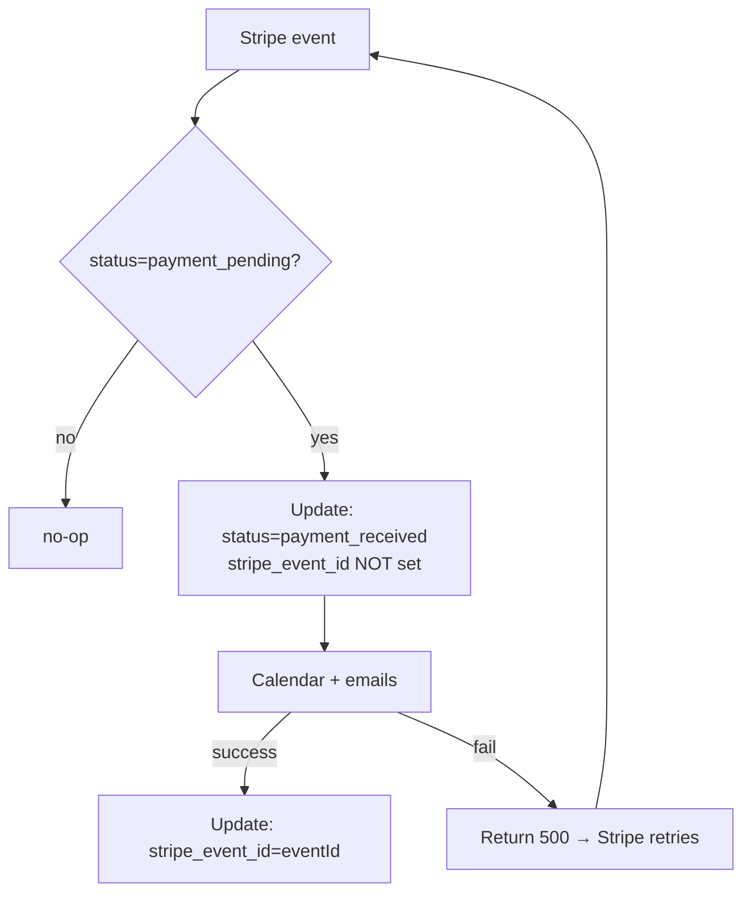
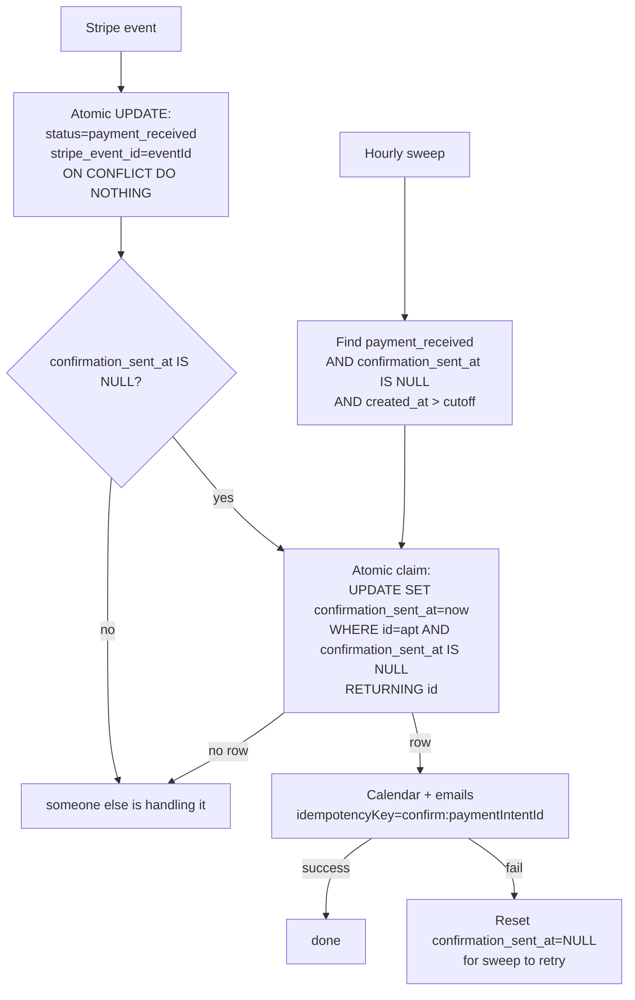

## Source

> "The Stripe webhook sets `stripe_event_id` **before** completing the post-update
> side effects (calendar event creation, two confirmation emails via
> `Promise.allSettled`). If any side effect fails or the Netlify Function times
> out, Stripe retries — but the retry sees `stripe_event_id` already set and
> returns early (idempotent no-op). The confirmation email is **never sent**."
> — Issue #68

## Problem

`handlePaymentSucceeded` (`src/pages/api/stripe-webhook.ts:199`) conflates two
distinct idempotency domains into a single key:

1. **Event-dedup (Stripe level)** — keyed by `stripe_event_id`. Records "we have
   seen and accepted this Stripe event." Durable, never changes once set.
2. **Side-effect completion (email/calendar level)** — the confirmation was
   actually delivered. Today this is *implicit* — assumed complete the moment
   the event-id update succeeds at line 201-212.

Today both are committed together. The `stripe_event_id` UNIQUE constraint
(correctly) deduplicates the *payment* write, but it also gates the entire
side-effect block: any retry hits the early return at line 214-218 and the
confirmation is permanently lost.

**The defect is structural, not a bug in a line of code** — it's the absence of
a separate "confirmation delivered" state. Reordering alone cannot fix it
(opens a duplicate-email window — see Shape 1). The fix must introduce a durable
side-effect-completion signal, *and* make the email send itself idempotent so
concurrent attempts dedupe server-side.

### Three failure triggers (all common)

| Trigger | Frequency | Why Stripe doesn't save us |
|---------|-----------|---------------------------|
| Email/calendar API hiccup (Resend 5xx, Google transient) | Common | `Promise.allSettled` swallows rejections; webhook returns 200 anyway |
| Netlify Function timeout (10s hobby / 26s pro) | Under load | Process killed mid-side-effect; Stripe may see 200 or 500 depending on timing |
| Stripe dual-event delivery (`payment_intent.succeeded` + `checkout.session.completed`) | Every payment | Second event no-ops on `stripe_event_id` — fine for payment, fatal if first event's side effects failed |

### Patient journey after payment (current state)

The merci page (`src/pages/rdv/merci.astro`) is the immediate post-checkout
surface. It shows **NO inline video link or calendar event** — only a recap of
type/mode/date from URL params, plus the promise:

> "Vous recevrez un email de confirmation avec le lien de connexion."
> "Un fichier .ics est joint à votre email de confirmation."

This makes the confirmation email the **single point of failure** for delivering
the video link. If the email is lost, the patient has *no way* to retrieve their
link from the app — there is no `/mes-rdvs` self-service retrieval for the video
link today. They must contact support or rebook (risking a duplicate payment).

## Outcome

Every paid appointment has a delivered confirmation (with video link + calendar)
**before the appointment start time**, not merely "within an hour of payment."

- **Happy path (tier 1, real-time):** webhook delivers the email within seconds.
- **Transient failure (tier 3, backstop):** the hourly reconciliation sweep
  catches stragglers. This is the *worst case*, not the expected path.

The sweep exists as a safety net for webhook-missed events, not as the primary
delivery channel. Steady-state target: 0 stale rows found by the sweep.

## Appetite

One focused cycle (~2-3 days), **staged in two increments** (see Staging):
- **Increment A (correctness, no migration):** reorder + Resend idempotency key
  + unique index on `stripe_payment_intent_id`. Ships fast; closes the duplicate-
  email window and prevents future lost confirmations from the ordering bug.
- **Increment B (resilience):** `confirmation_sent_at` column + reconciliation
  sweep + monitoring. Catches events Stripe abandons and historical losses.

## Shapes

### Shape 1: Reorder only — set `stripe_event_id` after side effects

Move the atomic update's `stripe_event_id` assignment to a second update that
fires only after side effects succeed.



**Trade-offs:**
- Pro: Minimal code change (~10 lines).
- Con: **UNSAFE under concurrent delivery.** Stripe fires overlapping events for
  one intent. Post-reorder, both invocations pass the `status` check and send
  the email *before* either records the event → **duplicate email.** Only a
  Resend idempotency key can close this window — reorder alone cannot.
- Con: **Netlify timeout gap.** If killed after the first update but before side
  effects complete, `stripe_event_id` stays NULL. Stripe may or may not retry
  (depends on whether it saw a response). No safety net.

**Verdict:** Eliminated as a standalone fix. Its useful parts (reorder +
idempotency key) are absorbed into Shape 2's Increment A.

### Shape 2: The three-part fix (staged: correctness then resilience)

Separate the two idempotency domains via a new `confirmation_sent_at` column
(mirroring the existing `reminder_sent_at` + cron-reconciliation idiom from
`001_init.sql:41` + `send-reminders.ts`), plus make the email send idempotent.



**The two critical concurrency primitives:**

1. **Atomic conditional UPDATE (single-winner-at-DB):** never read-then-write
   ("if null, send, set") — that's a TOCTOU race. Use:
   ```sql
   UPDATE appointments
   SET confirmation_sent_at = now()
   WHERE id = $1 AND confirmation_sent_at IS NULL
   RETURNING id;
   ```
   Only the invocation that gets a row back proceeds; the loser no-ops. This
   makes webhook + sweep + Stripe retry overlap safe *regardless* of timing.
2. **Resend idempotency key on `stripe_payment_intent_id`, NOT `stripe_event_id`:**
   two event types (`payment_intent.succeeded` + `checkout.session.completed`)
   share an intent id but have different event ids — keying on event id → two
   confirmations. Key format: `confirm:{stripe_payment_intent_id}`. Resend
   `^6.12.3` natively supports this via
   `resend.emails.send(payload, { idempotencyKey })` (confirmed in
   `node_modules/resend/dist/index.d.cts:178`).

**Trade-offs:**
- Pro: Mirrors the proven `reminder_sent_at` + `send-reminders.ts` pattern.
- Pro: Sweep is an independent safety net catching every failure mode within an
  hour; idempotency key makes overlap safe.
- Pro: Atomic claim eliminates the duplicate-email race at the DB level.
- Con: More moving parts. The sweep must be deployed + scheduled in Netlify.
- Con: `handlePaymentSucceeded`'s side-effect block needs extraction into a
  reusable function callable from both the webhook (Astro/Vite runtime) and the
  sweep (Netlify Node runtime) — see Runtime architecture below.
- Con: **Backfill hazard** (see Risks §1) — must be handled before enabling the
  sweep or every past customer gets re-emailed.

**Rough scope:** L

### Shape 3: Background queue (Supabase Edge Function / pg_cron)

Move side effects entirely out of the webhook into a queue table + worker.

**Trade-offs:**
- Pro: Cleanest separation — webhook returns in <1s, side effects have unlimited
  retry budget.
- Con: **Over-engineered** for a solo therapist's practice. New infrastructure
  concept with no existing pattern to mirror; adds a queue table, worker, dead-
  letter handling, monitoring burden. Diverges from the house `*_sent_at` + cron
  idiom. Larger blast radius (a queue bug stalls all confirmations).

**Verdict:** Eliminated — disproportionate scope and infra burden for the domain.

## Fit Check

| Criterion | Shape 1 | Shape 2 | Shape 3 |
|-----------|---------|---------|---------|
| Separates event-dedup from side-effect-completion | ✗ | ✓ | ✓ |
| No duplicate emails under concurrent delivery | ✗ (race) | ✓ (atomic claim + idempotency key) | ✓ |
| Safety net for Netlify timeout / abandoned retries | ✗ | ✓ (sweep) | ✓ (worker) |
| Unique `stripe_payment_intent_id` (dedupe payment rows) | ✗ | ✓ | ✓ |
| Mirrors existing patterns (`reminder_sent_at`, `send-reminders.ts`) | partial | ✓ | ✗ (new concept) |
| Bounded scope (≤3d) | ✓ | ✓ (staged) | ✗ |

**Shape 2 selected**, staged as Increment A (correctness) → Increment B
(resilience). Shape 1's useful parts are absorbed into Increment A.

## Staging

**Increment A — correctness (ships first, no migration-deploy risk):**
1. Migration `008_payment_idempotency.sql`: partial unique index on
   `stripe_payment_intent_id` (non-NULL only). **Must dedupe existing rows first
   or the index CREATE fails** (see Risks §2).
2. Reorder `handlePaymentSucceeded`: keep `stripe_event_id` set in the atomic
   update (payment receipt stays idempotent), but gate side effects on a claim
   primitive and set `confirmation_sent_at` only after success.
3. Resend idempotency key (`confirm:{paymentIntentId}`) on both confirmation
   emails.

This closes the duplicate-email window and prevents *future* lost confirmations
from the ordering bug. No sweep yet — Stripe's native retry handles most cases.

**Increment B — resilience (after A is live and stable):**
4. Backfill `confirmation_sent_at` for historical rows (see Risks §1).
5. `netlify/functions/reconcile-confirmations.ts` — hourly sweep querying
   `status='payment_received' AND confirmation_sent_at IS NULL AND created_at >
   cutoff`.
6. Monitoring: alert on rows stuck `confirmation_sent_at IS NULL AND created_at >
   now() - interval '6 hours'`.

This catches events Stripe abandons (after its retry window) and historical
losses.

## Runtime architecture (decision needed in spec)

The sweep runs in Netlify's Node runtime (`process.env`), but the side-effect
logic currently lives in Astro/Vite code (`import.meta.env`). Two options:

**Option R1 — Dependency-injected extraction:** Extract a runtime-agnostic
`runConfirmationSideEffects({ supabaseAdmin, resendClient, appointment, ... })`
function. Both runtimes become thin shims that read their own env, build
clients, and call the shared function. Clean Dependency Rule — use case pure,
env-readers are infrastructure adapters.

**Option R2 — Cron-trigger → Astro endpoint:** Make the Netlify function a
~5-line trigger (`fetch(INTERNAL_ASTRO_SWEEP_ENDPOINT, { headers: { auth } })`)
that calls an Astro API route owning all logic. Eliminates the env mismatch —
one runtime owns all business logic. Tradeoff: extra HTTP hop + endpoint must be
authenticated (shared secret).

**Recommendation: R1** — mirrors how `send-reminders.ts` already works
(instantiates its own clients in `process.env`), avoids a new authenticated
internal endpoint, and keeps the sweep self-contained. R2 is the lower-
complexity choice if the extraction proves awkward, but the existing
`send-reminders.ts` precedent shows R1 fits the codebase. **Flag for spec to
confirm.**

## Risks (ship-blockers — must resolve in spec)

1. **🔴 Backfill will re-spam every past customer.** New `confirmation_sent_at`
   is NULL for all historical rows, including successfully-emailed payments. The
   sweep (`WHERE confirmation_sent_at IS NULL`) would treat them all as unsent.
   **Fix:** backfill before enabling the sweep
   (`UPDATE ... SET confirmation_sent_at = created_at WHERE status =
   'payment_received'`), AND add a `created_at > cutoff` time bound to the sweep
   query so ancient data is never swept.
2. **🔴 Pre-existing duplicate `stripe_payment_intent_id` rows abort the
   migration.** The partial unique index `CREATE` fails if dupes exist (likely,
   given the bug's history). **Fix:** dedup/cleanup pass in the migration before
   the index (keep latest by `updated_at`, null-out or delete the rest).
3. **Two distinct indexes, not one.** (a) *Unique* partial index on
   `stripe_payment_intent_id` enforces row-uniqueness. (b) *Partial* index
   `WHERE confirmation_sent_at IS NULL` (and status = payment_received) makes
   the sweep fast — otherwise it's a full-table scan. Different purposes; both
   needed.
4. **Sweep timeout/batching.** Netlify scheduled function timeouts (10s–5min by
   plan) + many pending rows = mid-sweep death. Needs pagination, resumability,
   and per-row error isolation (one bad email doesn't abort the batch).
5. **Email-sent ↔ DB-commit gap is unavoidable** (Postgres + Resend, no
   distributed tx). Setting `confirmation_sent_at` before send risks suppressing
   a legit retry if send fails; after send risks a duplicate on crash. Decision:
   **claim (set) before send, reset to NULL on failure** — the Resend idempotency
   key is the dedup backstop if a crash happens between send and reset. (Outbox
   pattern is the gold standard but heavier than this domain warrants.)
6. **Webhook latency.** Reordering puts the Resend call before the Stripe 200.
   On serverless you can't safely do work after responding (process killed), so
   the send is in-band → higher webhook latency → Stripe timeouts → more
   retries → more idempotency-key load. Quantify; consider acceptable.

## Files Impacted

| File | Change | Increment |
|------|--------|-----------|
| `supabase/migrations/008_payment_idempotency.sql` | **NEW** — dedupe pass + partial unique index on `stripe_payment_intent_id` | A |
| `supabase/migrations/009_confirmation_sent_at.sql` | **NEW** — column + backfill + partial sweep index | B |
| `src/lib/payment-confirmation.ts` | **NEW** — extracted runtime-agnostic side-effect function (DI) | A |
| `src/pages/api/stripe-webhook.ts` | Reorder: claim primitive + set `confirmation_sent_at` after success | A |
| `src/lib/resend.ts` | Add `idempotencyKey` param → Resend SDK option | A |
| `src/types/appointment.ts` | Add `confirmation_sent_at` field | B |
| `netlify/functions/reconcile-confirmations.ts` | **NEW** — hourly sweep | B |
| `netlify.toml` | (maybe) document schedule env | B |
