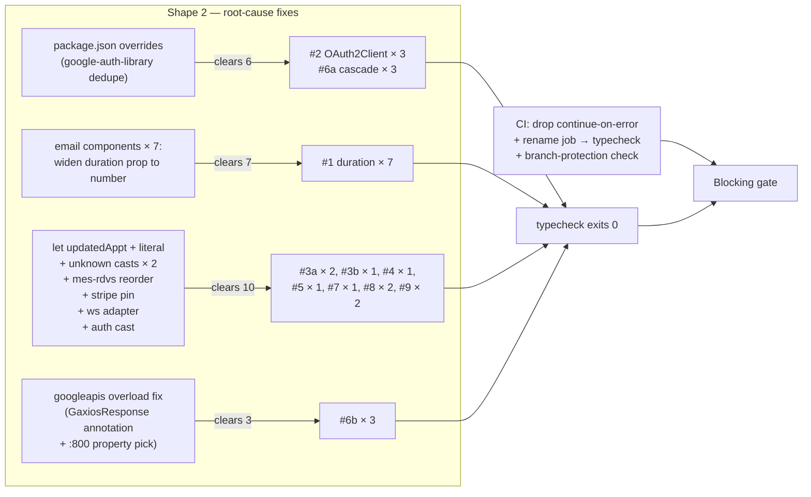

## Source

Issue #86: *"fix(ts): clear 26 pre-existing typecheck errors and promote
typecheck to blocking gate"* — P1 bug. PR #67/#85 added CI with typecheck as
non-blocking advisory (`continue-on-error: true`) because the codebase had 26
pre-existing type errors that were never caught (Netlify doesn't typecheck, no
`typecheck` script before #67).

## Problem

`npm run typecheck` (= `astro check`) reports **26 errors, 0 warnings** across
8 distinct root causes. Two of those are suspected real logic bugs in the
appointments API. While the typecheck job stays advisory, every PR inherits
this debt silently and the gate gives no signal.

Re-verified locally on the worktree: counts match the issue exactly (no drift).
The `overrides` fix impact was empirically tested (override applied → typecheck
re-run → override reverted): it clears **6** googleapis errors, not 9 as
initially assumed — `:662`, `:667`, `:800` are an independent root cause (see #6b).

## Outcome

- `npm run typecheck` exits 0 on `main`.
- The CI typecheck job is a blocking member of the build gate (no
  `continue-on-error`).
- The two suspected logic bugs are confirmed real or intentional; the real
  one is fixed (with regression coverage), the intentional one documented.

No `as any` / `// @ts-ignore` papering over runtime defects.

## Appetite

Single short cycle. Most fixes are 1–5 lines each. The largest single change
is one `overrides` field in `package.json`. Excludes any scope creep into
Supabase DB-type generation or refactoring the appointments API beyond the 26
error sites.

## Root-cause map

9 distinct root causes across 5 subsystems. Empirically verified — the
`overrides`-cascade hypothesis was tested end-to-end and corrected (see #6a/#6b).

| # | Subsystem | File:lines | Code(s) | Count | Root cause |
|---|-----------|-----------|---------|-------|------------|
| 1 | Email-component duration boundary | `appointments/[id].ts` (294, 328, 692, 905, 939), `stripe-webhook.ts` (352, 370) | ts(2769) | **7** | Email components declare `duration: 60 \| 90` but render `Appointment.duration`, which is typed `number` at the entity level (`src/types/appointment.ts:50`). The `60 \| 90` narrowing was never type-valid at the render boundary. **7** components affected: `AppointmentConfirmed`, `AppointmentReminder`, `AppointmentRequestNotification`, `AppointmentRequestReceived`, `AppointmentRescheduled`, `PaymentReceivedNotification`, `PaymentRequest`. (2 components — `AppointmentRescheduledPaid`, `PaymentReminder` — already use `number`.) Widening the prop is honest about what the DB already holds. NB: leave `AppointmentDuration = 60 \| 90` in `pricing.ts` and `google-calendar.ts:108` untouched — that union is a *patient-flow input-form* constraint, not a render constraint. |
| 2 | googleapis OAuth2Client dedup | `google-calendar.ts` (183, 219, 543) | ts(2322/2769) | **3** | npm installed **two** `google-auth-library` copies: 10.9.0 (root) and 10.5.0 (nested under `googleapis-common@8.0.2`). The two `OAuth2Client` classes declare private `redirectUri` separately → not assignable. One `overrides` field collapses them. |
| 3a | Supabase error-shape casts — **safe sites** | `appointments/[id].ts` (823, 882) | ts(2352) | **2** | `SupabaseClient<any>` + postgrest-js v1 select-parser emits `GenericStringError = ParserError<'Received a generic string'>` for the `data` shape. **Safe:** code guards `if (updateError \|\| !updated) return errorResponse(...)` immediately before each cast (lines 818, 878), so the cast branch only runs on a verified-success row. `as unknown as Appointment` is safe by construction here. |
| 3b | Supabase error-shape cast — **frame-flagged site** | `mes-rdvs.astro:54` | ts(2352) | **1** | Same `GenericStringError` shape, **different control flow**: cast at :54 executes *before* the `if (error)` block at :56, and the error block only logs — it does not return. Today the `rows ?? []` defensive fallback degrades to an empty list on error (not a crash), so this is **not currently a runtime defect**. But it is exactly the **residual risk surface the frame names** ("cast hides a Supabase error shape that should have been branch-handled"). Fix is **not a cast** — reorder so `error` short-circuits (render an error state or coerce to `[]`) before binding `appointments`. Residual risk of masked select-list drift (a field dropped/renamed) remains; only Shape 3 eliminates it. **Track as follow-up.** |
| 4 | **BUG** — const reassignment | `appointments/[id].ts:882` | ts(2588) | **1** | `const updatedAppt` (declared :823) reassigned at :882. At runtime throws `TypeError: Assignment to constant variable` whenever the reschedule-accept + in-person + calendar-event-id-changed path fires. **Real production crash in the reschedule flow.** See §"Two suspected logic bugs" for the fix and a state-smell caveat. |
| 5 | **Dead code** — mode comparison | `appointments/[id].ts:213` | ts(2367) | **1** | Inside `appointment.appointment_mode === 'video'` branch (:196), the `=== 'in-person'` check at :213 is unreachable; TS narrows mode to `"video"`. Runtime result already correct (`'Téléconsultation'`, the video-visit location label — the in-person `CABINET_ADDRESS` case is handled by the sibling branch at :249/:264/:827/:856). Replace dead ternary with the literal. Copy-paste provenance: a generic mode-ternary dropped into a context where mode was already narrowed. |
| 6a | googleapis calendar overloads — **cascade from #2** | `google-calendar.ts` (691, 719, 818) | ts(2769) | **3** | Once `auth` is the wrong `OAuth2Client` type, `calendar.events.{patch,insert,delete}` overload resolution fails. **Empirically verified:** cleared by the `overrides` fix in #2. |
| 6b | googleapis overload — **independent root cause** | `google-calendar.ts` (662, 667, 800) | ts(2769/2339/2345) | **3** | **Empirically verified independent of #2** (override applied, typecheck re-run, these 3 errors persist). googleapis v171 `calendar.events.get`/`events.insert` return type is an intersection `Promise<GaxiosResponseWithHTTP2<Readable>> & Promise<GaxiosResponseWithHTTP2<Schema$Event>> & void` — a malformed overload-resolution artifact in the googleapis type defs. `:662` overload failure, `:667` `.data` access on the intersection, `:800` `Schema$Event` shape mismatch against `extractEventResult`'s param. Fix: explicit `GaxiosResponse<Schema$Event>` annotation on the response local, and/or a property pick on the `:800` argument. |
| 7 | Stripe version pin | `stripe.ts:21` | ts(2694) | **1** | `Stripe.LatestApiVersion` export was removed in current stripe.js. Fix: drop the `as` cast, keep the literal `'2024-12-18.acacia'` — **but verify the literal matches the live Stripe account's pinned API version** (Dashboard → Developers → API version), or Stripe silently pins to the account version regardless of the SDK value. |
| 8 | Supabase realtime transport | `supabase.ts` (60, 81) | ts(2345) | **2** | `typeof ws` (Node `ws` module, address: `string \| URL`) ≠ supabase's `WebSocketLikeConstructor` (address: `null` — a `@types/ws` v8.18 vs `@supabase/realtime-js` shape skew, surfaced by adding `@types/ws`). Fix: a small typed adapter (3–5 lines: bridge `URL`→`string` and the options/protocols arity) or a targeted cast at the boundary with a comment pinning the conflict. |
| 9 | better-auth middleware context | `auth.server.ts` (89, 95) | ts(2339) | **2** | `MiddlewareInputContext<MiddlewareOptions>` in better-auth v1.6.11 does **not** expose `.path` / `.context` on the public type — confirmed by reading the installed type defs (there is no alternate property path). The runtime fields still exist (the comment at :85 documents the v1.6.11 hook signature). Fix: a single narrow type assertion on the `context` parameter with a comment pinning better-auth v1.6.11. |
| | | | **Total** | **26** | (9 root causes; #6a is the only true cascade) |

### Two suspected logic bugs — verdict

1. **`:882` IS a real bug — and the highest-priority finding in this analysis.**
   `const updatedAppt` is declared at :823 and reassigned at :882. JavaScript
   throws `TypeError: Assignment to constant variable` the first time the code
   path executes (reschedule-accept → in-person → `syncedEventId` differs from
   `updatedAppt.google_calendar_event_id`). This is a production crash in the
   reschedule-confirmation flow, silent until a therapist accepts a reschedule
   for an in-person appointment whose calendar event was newly created or
   recreated.

   **Severity:** Critical (full outage of the reschedule-accept flow) × High
   impact (every therapist accepting an in-person reschedule). The bug
   surfaces under #86 (a P1) but is itself P0-grade.

   **In-scope fix:** `let updatedAppt` at :823 (the frame's "no API refactor"
   rule forbids extracting the sync logic; `let` is the minimal correct fix).

   **State-smell caveat (not fixed here):** `updatedAppt` is declared `const`
   in 6 handler branches (245, 358, 447, 550, 676, 823); only the :823 branch
   reassigns. That asymmetry exists because :823's branch does a *second* DB
   write (persisting `google_calendar_event_id` at :866-877) and wants the
   refreshed row for the email body. The cleaner invariant would be a second
   const (`finalAppt`) for the post-sync state, but that is the refactor the
   frame forbids. **Action:** add an inline comment at :823 documenting *why*
   this branch mutates (`// let, not const: re-bound at :882 after
   google_calendar_event_id persistence — reschedule-accept sync`); file a
   follow-up issue for the invariant cleanup.

   **Regression coverage — calibration:** the analysis originally proposed a
   unit test exercising the reschedule-accept path. On review, `:882` lives
   inside a 900-line `APIRoute` handler with 5+ side-effecting dependencies
   (`supabaseAdmin`, `updateCalendarEvent`, `createCalendarEvent`, `sendEmail`,
   Stripe) and the repo's existing unit tests deliberately cover *pure
   functions only* (`cabinetEligibility`, `isCancellableByTherapist`,
   `getAvailableCredit`). There is no Astro-`APIRoute` test harness, and
   vitest has no coverage thresholds — so a runtime test would require heavy
   mocking (or an extraction refactor that brushes the "no API refactor" scope
   fence) and would not be CI-enforced. **Decision:** the typecheck-going-green
   *is* the regression guard for the 1-char fix (TS proves the assignment
   becomes legal). A runtime test is optional belt-and-suspenders, deferred to
   the follow-up issue if the team wants it.

   **Recommended split:** because the bug is P0-grade and the fix is one line,
   consider landing it as a fast-tracked hotfix (separate PR, merged first)
   rather than bundling into #86 — so the reschedule flow stops crashing
   before the 26-error PR's review completes. Bundling is acceptable if the
   team is confident in #86's review timeline; the analysis should not silently
   assume either path.

2. **`:213` is NOT a runtime bug — it is dead code.** The comparison lives
   inside the `if (appointment.appointment_mode === 'video' && ...)` block
   (line 196), so by line 213 TS has narrowed `appointment_mode` to `"video"`.
   The `=== 'in-person'` check is therefore always false and the location
   always evaluates to `'Téléconsultation'`, which is the intended video-visit
   location label. The in-person `CABINET_ADDRESS` case is handled correctly
   in the sibling branches (:249, :264, :827, :856) where `appointment_mode`
   is *not* narrowed. **Fix:** replace the dead ternary with the literal
   `'Téléconsultation'`. No regression test needed — the runtime behavior is
   unchanged; the change only removes the impossible branch. A comment
   referencing the sibling in-person handling prevents a future reader from
   "fixing" it by re-adding the branch.

## Shapes

### Shape 1: Cast-everywhere (surgical)

Apply the most local fix to each error site:

- 3 supabase casts → `as unknown as Appointment`
- 3 OAuth2Client boundaries → `as unknown as OAuth2Client`
- 6 calendar overload sites → cast each request body / response
- 7 duration call sites → `duration: updatedAppt.duration as AppointmentDuration`
- Stripe, supabase-ws, better-auth → targeted `as` / `as any` + eslint-disable
- Fix the 2 logic bugs

**Trade-offs:**
- Pro: smallest diff, no dependency changes, lowest runtime-regression risk.
- Con: the **duration** cast (`as AppointmentDuration`) lies about a runtime
  value that legitimately varies (admin can set non-60/90 durations), so it
  masks real type drift at the render boundary — this is the failure mode the
  frame names. The other casts (`as any` for Stripe/ws/auth) are at
  type-system-only boundaries where the runtime value is correct, so they are
  less dangerous — but they still suppress future drift signal exactly where
  the gate is meant to catch it (auth, payments, calendar).

**Rough scope:** S.

### Shape 2: Dedupe at the root + boundary-only casts (recommended)

Fix the root cause where it's cheap; cast only where the upstream typing is
genuinely the issue; reorder (not cast) the one frame-flagged site:

- **`package.json` `overrides`**: pin `google-auth-library` to a single
  version → clears root cause #2 (3 errors) + cascade #6a (3 errors) =
  **6 errors gone, one line of config.** Must regenerate `package-lock.json`
  in the same PR or CI's `npm ci` hard-fails. Add a `package.json` comment
  noting the override must be re-evaluated on every `googleapis` bump
  (future `googleapis-common` could pin a *higher* minor than the override,
  silently forcing a downgrade) — and assert a single copy via
  `npm ls google-auth-library` in CI.
- **Email components**: widen the `duration` prop from `60 | 90` to `number`
  on the **7** components that currently require the narrow union. The
  entity type `Appointment.duration: number` already holds any int; the
  narrowing was never type-valid at the render boundary. → clears all 7
  duration errors (#1). Leave `AppointmentDuration = 60 | 90` in `pricing.ts`
  and `google-calendar.ts:108` untouched (legitimate patient-flow input-form
  constraint). Patient-facing creation is already validated (`VALID_DURATIONS
  = new Set([60, 90])` in `appointments/index.ts:100` and `availability.ts:40`),
  so widening is **zero new patient-facing risk**.
- **`appointments/[id].ts:823, :882`** → `as unknown as Appointment`, with a
  one-line comment documenting that the error branch is already checked (so
  the cast cannot mask a Supabase error). Safe by construction (guards at
  :818, :878 precede the casts).
- **`mes-rdvs.astro:54`** → **NOT a cast.** Reorder: short-circuit on `error`
  before binding `appointments` (render an error state or coerce to `[]`).
  The site's current `rows ?? []` already degrades to empty on error (not a
  crash), but the cast executes before the error is inspected — the exact
  residual risk surface the frame names. Residual select-list-drift risk
  remains (only Shape 3 eliminates it); **track as follow-up.**
- **googleapis overload #6b** (`:662`, `:667`, `:800`) → explicit
  `GaxiosResponse<Schema$Event>` annotation on the response local; property
  pick on the `:800` argument shape. **Not** cleared by `overrides`.
- **Stripe version pin**: drop `as Stripe.LatestApiVersion`, keep the literal
  `'2024-12-18.acacia'` — **but verify the literal matches the live Stripe
  account's pinned API version** (Dashboard → Developers → API version) or
  Stripe silently pins to the account version regardless of the SDK value.
- **Supabase realtime transport**: a small typed adapter (3–5 lines bridging
  `URL`→`string` and the options/protocols arity between `@types/ws` v8.18
  and `@supabase/realtime-js`) or a targeted cast at the boundary with a
  comment pinning the conflict.
- **better-auth middleware**: a single narrow type assertion on the `context`
  parameter (no alternate property path exists in v1.6.11), with a comment
  pinning the version.
- **Fix the 2 logic bugs** (let + literal). See §"Two suspected logic bugs"
  for the :882 hotfix-split recommendation.

**Trade-offs:**
- Pro: addresses the root causes that produce 13 of 26 errors (#2+#6a+#1);
  remaining casts are at genuine type-system boundaries, each documented as
  safe; the duration fix is honest (no lying cast on a value that
  legitimately varies); the frame-flagged mes-rdvs site is reordered rather
  than cast; future type drift is still caught at every site that isn't an
  intentional boundary.
- Con: touches more files than Shape 1; the `overrides` field is a small
  supply-chain consideration with a documented re-eval trigger; the Stripe
  literal needs an account-config verification step (not pure code); the
  mes-rdvs reorder is a control-flow change, not a 1-line edit.

**Rough scope:** M.

### Shape 3: Generate Supabase DB types + dedupe

Run `supabase gen types typescript --project-id <ref>` → produce
`src/types/database.types.ts`; replace `SupabaseClient<any>` with
`SupabaseClient<Database>`; eliminates the 3 `GenericStringError` casts at
the source. Combine with Shape 2's other fixes.

**Trade-offs:**
- Pro: most durable; query results become fully typed.
- Con: requires Supabase project ref / DB access at type-gen time; generated
  types must be kept in sync with prod schema on every migration; risk of
  type/runtime drift if generated types lag the live DB; **explicitly out of
  scope per the frame** ("Refactoring the appointments API beyond what the 26
  error sites require").

**Rough scope:** L.

## Fit Check

| Constraint (from frame) | Shape 1 | Shape 2 | Shape 3 |
|-------------------------|:------:|:------:|:------:|
| `npm run typecheck` exits 0 | ✓ | ✓ | ✓ |
| No `as any` papering over runtime defects | ✗ (duration cast lies) | ✓ | ✓ |
| mes-rdvs reorder (frame-flagged site) | ✗ (cast only) | ✓ | ✓ |
| No runtime regressions in auth/payments/calendar | ✓ | ⚠ (CI can't prove override is runtime-safe — see below) | ⚠ (typed-query drift) |
| Two logic bugs investigated + real one fixed | ✓ | ✓ | ✓ |
| Stays in scope (no API refactor / DB-type gen) | ✓ | ✓ | ✗ |
| Failure mode ("cast masks a real bug") guarded against | ✗ | ✓ (3a sites safe; mes-rdvs reordered; residual tracked) | ✓ |

**On the "runtime regressions" caveat for Shape 2:** CI's typecheck job
type-checks but does not execute the auth/calendar path; CI's build job runs
`astro build` which also doesn't meaningfully exercise it; and Netlify's
deploy build runs `astro build` (no `astro check`) — so a transitive
incompatibility introduced by the `google-auth-library` override can land on
`main` green and only surface as a prod auth/calendar outage. The `overrides`
fix is type-safe and the dedupe is to a version npm already resolves, but
"CI passes" does not prove "no runtime regression." Mitigations: assert a
single `google-auth-library` copy in CI (`npm ls google-auth-library`), and
treat the first post-merge prod deploy as the runtime smoke check.

**Recommendation: Shape 2.** It is the only shape that satisfies every frame
constraint simultaneously. It fixes the root causes responsible for 13 of 26
errors (#2+#6a via one `overrides` field; #1 via one boundary-type widening),
handles the googleapis overload root cause #6b directly, and reorders (rather
than casts) the frame-flagged mes-rdvs site. Shape 1 fails the frame's stated
failure mode (the duration cast would lie about a value that legitimately
varies). Shape 3 violates the explicit out-of-scope.

**Files impacted:**

| File | Change | Errors cleared |
|------|--------|---------------|
| `package.json` | add `overrides: { "google-auth-library": "10.9.0" }` + comment; regenerate `package-lock.json` | 6 (cascade #2+#6a) |
| `src/emails/AppointmentConfirmed.tsx` | widen `duration` prop to `number` | (cascade) |
| `src/emails/AppointmentReminder.tsx` | widen `duration` prop to `number` | (cascade) |
| `src/emails/AppointmentRequestNotification.tsx` | widen `duration` prop to `number` | (cascade) |
| `src/emails/AppointmentRequestReceived.tsx` | widen `duration` prop to `number` | (cascade) |
| `src/emails/AppointmentRescheduled.tsx` | widen `duration` prop to `number` | (cascade) |
| `src/emails/PaymentReceivedNotification.tsx` | widen `duration` prop to `number` | (cascade) |
| `src/emails/PaymentRequest.tsx` | widen `duration` prop to `number` | (cascade) |
| `src/pages/api/appointments/[id].ts` | `let updatedAppt` + comment (:823); drop dead `:213` ternary → literal; `as unknown as` at :823/:882 | 4 (#3a×2 + #4 + #5) |
| `src/pages/api/stripe-webhook.ts` | (cascade — no direct edit once email props widen) | 2 |
| `src/pages/mes-rdvs.astro` | **reorder** — short-circuit on `error` before binding `appointments` (not a cast) | 1 (#3b) |
| `src/lib/google-calendar.ts` | `GaxiosResponse<Schema$Event>` annotation + `:800` property pick | 3 (#6b) |
| `src/lib/stripe.ts` | drop `as Stripe.LatestApiVersion` (:21) + verify account-version match | 1 (#7) |
| `src/lib/supabase.ts` | typed ws adapter (3–5 lines) or boundary cast at :60/:81 | 2 (#8) |
| `src/lib/auth.server.ts` | narrow type assertion on `context` param + version-pin comment | 2 (#9) |
| `.github/workflows/ci.yml` | drop `continue-on-error`, rename `typecheck-advisory` → `typecheck`, update stale comment | (gate) |

## Operational risks (CI / deploy)

Surfaced by review; must be addressed in /spec's acceptance criteria:

- **`npm ci` determinism**: adding `overrides` without regenerating
  `package-lock.json` in the same PR makes CI's `npm ci` hard-fail before
  typecheck runs. The lockfile update is mandatory, not optional.
- **`overrides` re-eval trigger**: future `npm update googleapis` may bump
  `googleapis-common`'s declared `google-auth-library` above the override
  version, silently forcing a downgrade. Mitigation: a `package.json`
  comment + a CI assertion (`npm ls google-auth-library` exits non-zero if
  more than one copy) so the dedupe is enforced.
- **Runtime safety of the override is not CI-provable**: Netlify runs
  `astro build` (no `astro check`), CI typecheck type-checks but doesn't
  execute the auth/calendar path, CI build doesn't import it meaningfully.
  A transitive incompatibility from the override can land green and surface
  only as a prod outage. Treat the first post-merge prod deploy as the
  smoke check; do not assert "no runtime regressions" on CI's authority.
- **Branch protection is the real blocking mechanism**: removing
  `continue-on-error` only makes the job *fail the run*. Whether a failed
  run blocks merge is determined by GitHub required-status-checks on `main`,
  which live outside this repo. If `typecheck-advisory` is renamed to
  `typecheck`, any pre-existing required-check entry for the old name is
  invalidated and the gate silently stops blocking. Verification step
  belongs in acceptance criteria.

## Open questions for /spec

- **CI gate structure**: keep `typecheck-advisory` as a separate (now-blocking) job, or fold the typecheck step into the existing `build` job? Issue allows either — operational trade-off analysis belongs in /spec. (DevOps review leans separate-job for parallelism + signal isolation, but the decision is /spec's to make.)
- **`:882` hotfix split**: bundle the 1-line `let` fix into #86, or fast-track as a P0 hotfix PR merged first? Product-fit decision — depends on #86's review timeline.
- **Branch protection**: removing `continue-on-error` is necessary but not sufficient — GitHub required-status-checks on `main` must include the (renamed) `typecheck` job, or the gate silently doesn't block. If the job is renamed, the old check name (if any) is invalidated. This is a repo-settings verification step (not provable from the workflow file) that /spec should list as an acceptance criterion.

## Follow-up issues (out of scope for #86)

- **Shape 3** (Supabase DB-type generation) — eliminates the residual select-list-drift risk at the 3 cast sites, including the reordered mes-rdvs site. Track once #86 lands.
- **`:823` state-smell cleanup** — extract the reschedule-accept "update → read-back → optional calendar sync → read-back again" into a helper returning a single value, so `updatedAppt` can stay `const`. Refactor (out of scope per frame).
- **`AdminCreateButton.customDurationMinutes` validation** — no positivity/upper-bound check (`Number(e.target.value)` accepts `0`, `-5`, `99999`). Pre-existing admin-UX risk, noticed during analysis, unrelated to #86.
- **`AppointmentDuration` alias duplication** — declared in both `pricing.ts:8` and `google-calendar.ts:108`. Consolidate (no behavior change).
