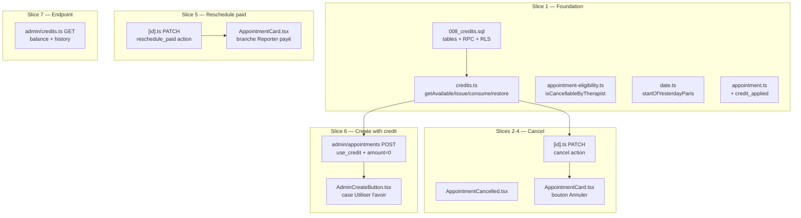
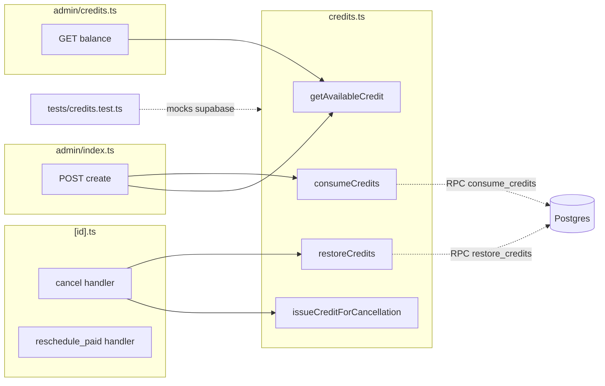

## Summary

Implémente l'annulation (`cancel`) et le report direct des RDV vidéo payés (`reschedule_paid`),
plus un ledger d'avoir interne (`credits`/`credit_usages`) consommable en création manuelle
admin. 7 slices → ~17 micro-tasks sur 5 waves. Aucun `stripe.refunds.create` ; atomicité
FIFO via RPC Postgres.

## Architecture





## Bootstrap Context

Conventions vérifiées dans le code :
- **Tests** : `tests/unit/*.test.ts`, vitest, env `node`, `@/` alias → `./src/`, mock supabase
  via `setup.ts` (`vi.stubEnv`). Pattern : `vi.mock('@/lib/...')` pour isoler la logique pure.
- **Prix** : centimes (integer). `calculatePrice` retourne des euros → `* 100` au stockage.
- **Emails** : `src/emails/*.tsx` (React), rendus via `@react-email/render`, envoyés par
  `sendEmail` (`src/lib/resend.ts`), `threadKey: appointment:{id}:patient`.
- **State machine** : actions dispatch dans `PATCH [id].ts` via `body.action`.
- **Migration** : fichiers `supabase/migrations/00N_*.sql` numérotés ; `CREATE FUNCTION`
  établi (`001_init.sql:94,111`) ; RLS service_role-only.
- **GCal** : `deleteCalendarEvent`/`updateCalendarEvent` (`src/lib/google-calendar.ts`),
  appels non-bloquants (`.catch(console.error)`).

## Agents

| Agent | Tasks | Fichiers |
|---|---|---|
| backend-dev-A | T1 (migration+RPC), T4 (credits.ts), T9 (cancel handler), T13 (reschedule_paid), T16 (admin POST use_credit) | `008_credits.sql`, `credits.ts`, `[id].ts`, `admin/appointments/index.ts` |
| backend-dev-B | T18 (GET endpoint), T19 (types) | `admin/credits.ts`, `appointment.ts` |
| frontend-dev-A | T10 (email), T11 (cancel UI), T14 (reschedule UI), T17 (credit checkbox) | `AppointmentCancelled.tsx`, `AppointmentCard.tsx`, `AdminCreateButton.tsx` |
| backend-dev-C | T6 (date helper), T7 (eligibility) | `date.ts`, `appointment-eligibility.ts` |
| tester-A | T5 (credits tests), T8 (eligibility tests) | `tests/unit/credits.test.ts`, `tests/unit/cancel-eligibility.test.ts` |

## Wave Structure

5 waves, max 3 agents parallèles. ~3 jours vs ~5 séquentiel.

| Wave | Trigger | Agents | Tasks |
|------|---------|--------|-------|
| 1 | start | 3 ∥ | backend-dev-A: T1→T4 · backend-dev-C: T6→T7 · backend-dev-B: T19 · tester-A: T5→T8 |
| 2 | Wave 1 done | 2 ∥ | backend-dev-A: T9 · frontend-dev-A: T10→T11 |
| 3 | Wave 2 done | 2 ∥ | backend-dev-A: T13 · frontend-dev-A: T14 |
| 4 | Wave 3 done | 2 ∥ | backend-dev-A: T16 · frontend-dev-A: T17 |
| 5 | Wave 4 done | 1 | backend-dev-B: T18 |

### Budget — per task

| Task | Items | Class | Est. ops | Split? |
|------|-------|-------|----------|--------|
| T1 migration+RPC | 4 (tables, column, 2 RPC, RLS, triggers) | judgmental | 6 | — |
| T4 credits.ts | 4 fonctions | judgmental | 5 | — |
| T9 cancel handler | 1 (logique restore+issue+email+gcal) | judgmental | 6 | — |
| T13 reschedule_paid | 1 | bounded | 3 | — |
| T16 admin POST use_credit | 1 (branch amount=0) | judgmental | 5 | — |
| autres (T6,7,10,11,14,17,18,19) | 1 chacun | bounded | 2-3 | — |

**Total estimé : ~50 ops.** Aucune tâche > 50, aucune instance > 4 tasks ni > 2 subjects.

### Budget — per agent instance

| Instance | Tasks | Σ ops | Subjects | Split? |
|----------|-------|-------|----------|--------|
| backend-dev-A | T1, T4, T9, T13, T16 | 22 | credits, appointments, rpc | — (séquentiel par waves) |
| backend-dev-B | T18, T19 | 5 | credits, types | — |
| frontend-dev-A | T10, T11, T14, T17 | 10 | email, ui | — |
| backend-dev-C | T6, T7 | 4 | date, eligibility | — |
| tester-A | T5, T8 | 6 | credits, eligibility | — |

Aucun split requis (max 5 tasks sur backend-dev-A mais étalés sur 5 waves, jamais > 1 par wave simultanée).

## Consistency Report

- **Covered** : 24/24 critères de succès (chacun tracé à ≥1 micro-task).
- **Uncovered** : 0.
- **Untraced tasks** : 0 (toutes les tasks mappent vers un critère).
- **Exemptions** : les RPC PL/pgSQL (`consume_credits`, `restore_credits`) ne sont pas
  unit-testables sans DB ; vérifiées par revue manuelle + tests d'intégration via le flow
  applicatif (T5 teste `credits.ts` qui les invoque, en mockant le retour RPC).

## Micro-Tasks

### Slice 1 — Foundation (Wave 1)

#### T1 — Migration 008 : tables credits + RPC — `[P]` Wave 1
- **File**: `supabase/migrations/008_credits.sql` (NEW)
- **Agent**: backend-dev-A
- **Subject**: rpc
- **Spec trace**: SC migration + RPC
- **Slice**: V1
- **Phase**: GREEN
- **Difficulty**: 4
- **Shape**:
  ```sql
  -- tables
  CREATE TABLE credits (
    id UUID PRIMARY KEY DEFAULT gen_random_uuid(),
    patient_email TEXT NOT NULL,
    source_appointment_id UUID REFERENCES appointments(id) ON DELETE SET NULL,
    amount INTEGER NOT NULL CHECK (amount > 0),
    remaining INTEGER NOT NULL CHECK (remaining >= 0 AND remaining <= amount),
    reason TEXT NOT NULL DEFAULT 'cancellation',
    created_at TIMESTAMPTZ NOT NULL DEFAULT now(),
    updated_at TIMESTAMPTZ NOT NULL DEFAULT now()
  );
  CREATE UNIQUE INDEX credits_source_appointment_uniq ON credits(source_appointment_id) WHERE source_appointment_id IS NOT NULL;
  CREATE INDEX credits_patient_email_idx ON credits(patient_email) WHERE remaining > 0;

  CREATE TABLE credit_usages (
    id UUID PRIMARY KEY DEFAULT gen_random_uuid(),
    credit_id UUID NOT NULL REFERENCES credits(id) ON DELETE CASCADE,
    appointment_id UUID NOT NULL REFERENCES appointments(id) ON DELETE CASCADE,
    amount INTEGER NOT NULL CHECK (amount > 0),
    created_at TIMESTAMPTZ NOT NULL DEFAULT now()
  );
  CREATE UNIQUE INDEX credit_usages_once_per_appt_credit ON credit_usages(credit_id, appointment_id);
  CREATE INDEX credit_usages_appointment_idx ON credit_usages(appointment_id);

  ALTER TABLE appointments ADD COLUMN credit_applied INTEGER NOT NULL DEFAULT 0;
  ALTER TABLE appointments ADD CONSTRAINT credit_applied_chk CHECK (credit_applied >= 0);

  -- triggers updated_at (réutiliser update_updated_at() de 001)
  CREATE TRIGGER credits_updated_at BEFORE UPDATE ON credits
    FOR EACH ROW EXECUTE FUNCTION update_updated_at();

  -- RLS service_role-only (comme appointments)
  ALTER TABLE credits ENABLE ROW LEVEL SECURITY;
  ALTER TABLE credit_usages ENABLE ROW LEVEL SECURITY;
  CREATE POLICY credits_service_role_all ON credits USING (auth.role() = 'service_role');
  CREATE POLICY credit_usages_service_role_all ON credit_usages USING (auth.role() = 'service_role');

  -- RPC consume_credits : FIFO atomique, SECURITY DEFINER durci
  CREATE OR REPLACE FUNCTION consume_credits(p_email TEXT, p_amount INTEGER, p_appointment_id UUID)
  RETURNS TABLE(credit_id UUID, amount INTEGER)
  LANGUAGE plpgsql SECURITY DEFINER AS $$
  DECLARE total_available INTEGER;
  BEGIN
    SELECT COALESCE(SUM(remaining),0) INTO total_available
      FROM credits WHERE patient_email = LOWER(p_email) AND remaining > 0 FOR UPDATE;
    IF total_available < p_amount THEN
      RAISE EXCEPTION 'CREDIT_INSUFFICIENT: dispo %, demandé %', total_available, p_amount;
    END IF;
    -- FIFO : boucle sur les avoirs les plus anciens
    RETURN QUERY
      WITH picked AS (
        SELECT id, remaining,
               LEAST(remaining, p_amount - COALESCE(SUM(p_amount) OVER (ORDER BY created_at, id ROWS BETWEEN UNBOUNDED PRECEDING AND 1 PRECEDING),0)) AS take
        FROM credits WHERE patient_email = LOWER(p_email) AND remaining > 0
        ORDER BY created_at, id
      )
      UPDATE credits c SET remaining = c.remaining - p.take
        FROM picked p WHERE c.id = p.id AND p.take > 0
        RETURNING c.id, p.take;
    -- enregistrer les usages
    INSERT INTO credit_usages(credit_id, appointment_id, amount)
      SELECT c.id, p_appointment_id, ... ; -- (voir implémentation détaillée)
  END;
  $$;
  REVOKE ALL ON FUNCTION consume_credits(TEXT,INTEGER,UUID) FROM PUBLIC;
  GRANT EXECUTE ON FUNCTION consume_credits(TEXT,INTEGER,UUID) TO service_role;

  -- RPC restore_credits : idem pattern
  CREATE OR REPLACE FUNCTION restore_credits(p_appointment_id UUID) RETURNS void ...;
  REVOKE ALL ON FUNCTION restore_credits(UUID) FROM PUBLIC;
  GRANT EXECUTE ON FUNCTION restore_credits(UUID) TO service_role;
  ```
- **Verify**: `docker compose exec postgres psql -U postgres -d omf_therapie -f /docker-entrypoint-initdb.d/008_credits.sql` (ou apply locale) ; `\df consume_credits` liste la fonction.
- **Expected**: 0 erreurs, 2 tables + 1 colonne + 2 fonctions créées.
- **Time**: 8 min

#### T4 — credits.ts lib — Wave 1 (après T1)
- **File**: `src/lib/credits.ts` (NEW)
- **Agent**: backend-dev-A
- **Subject**: credits
- **Spec trace**: S1–S4
- **Slice**: V1
- **Phase**: GREEN
- **Difficulty**: 3
- **Shape**: exporte `getAvailableCredit(email): Promise<number>` (SUM remaining),
  `issueCreditForCancellation(appt): Promise<CreditRow>` (INSERT, gère UNIQUE conflict),
  `consumeCredits(email, amount, apptId): Promise<Usage[]>` (`supabaseAdmin.rpc('consume_credits', ...)`),
  `restoreCredits(apptId): Promise<void>` (`supabaseAdmin.rpc('restore_credits', ...)`).
- **Verify**: `npx tsc --noEmit` ; `npm run lint`.
- **Expected**: 0 erreurs de type.
- **Time**: 5 min

#### T5 — Tests credits.ts — `[P]` Wave 1
- **File**: `tests/unit/credits.test.ts` (NEW)
- **Agent**: tester-A
- **Subject**: credits
- **Spec trace**: SC tests credits
- **Slice**: V1
- **Phase**: RED-GATE
- **Difficulty**: 3
- **Shape**: mock `@/lib/supabase` (supabaseAdmin) ; cas — consume exact, consume partiel
  (reliquat > 0), consume > dispo (échec via RPC RAISE), restore, double-issue bloqué
  (UNIQUE), plusieurs NULL source_appointment_id autorisés.
- **Verify**: `npm test -- credits`.
- **Expected**: tous verts.
- **Time**: 6 min

#### T6 — startOfYesterdayParis — `[P]` Wave 1
- **File**: `src/utils/date.ts`
- **Agent**: backend-dev-C
- **Subject**: date
- **Spec trace**: SC éligibilité
- **Slice**: V1
- **Phase**: GREEN
- **Difficulty**: 2
- **Shape**: `export function startOfYesterdayParis(now = new Date()): Date` — calcule
  minuit de la veille en Europe/Paris via `Intl.DateTimeFormat` (pattern `toParisDateString`).
- **Verify**: `npm test` (après T8).
- **Time**: 3 min

#### T7 — isCancellableByTherapist — Wave 1 (après T6)
- **File**: `src/lib/appointment-eligibility.ts`
- **Agent**: backend-dev-C
- **Subject**: eligibility
- **Spec trace**: SC éligibilité
- **Slice**: V1
- **Phase**: GREEN
- **Difficulty**: 2
- **Shape**: `export function isCancellableByTherapist(appt: {scheduled_at: string; status: AppointmentStatus}): boolean`
  → `appt.status ∉ {'declined','cancelled'} && new Date(appt.scheduled_at) >= startOfYesterdayParis()`.
- **Verify**: `npm test -- cancel-eligibility`.
- **Time**: 3 min

#### T8 — Tests éligibilité — `[P]` Wave 1
- **File**: `tests/unit/cancel-eligibility.test.ts` (NEW)
- **Agent**: tester-A
- **Subject**: eligibility
- **Spec trace**: SC éligibilité
- **Slice**: V1
- **Phase**: RED-GATE
- **Difficulty**: 2
- **Shape**: cas — RDV veille (éligible), RDV avant-hier (non), status declined/cancelled
  (non), RDV hier soir tard (éligible). Pattern du `appointment-eligibility.test.ts` existant.
- **Verify**: `npm test -- cancel-eligibility`.
- **Expected**: tous verts.
- **Time**: 4 min

#### T19 — Type credit_applied — `[P]` Wave 1
- **File**: `src/types/appointment.ts`
- **Agent**: backend-dev-B
- **Subject**: types
- **Spec trace**: D4
- **Slice**: V1
- **Phase**: GREEN
- **Difficulty**: 1
- **Shape**: ajouter `credit_applied: number;` à l'interface `Appointment`.
- **Verify**: `npx tsc --noEmit`.
- **Time**: 2 min

### Slice 2-4 — Annulation (Wave 2)

#### T9 — Handler cancel — Wave 2
- **File**: `src/pages/api/appointments/[id].ts`
- **Agent**: backend-dev-A
- **Subject**: appointments
- **Spec trace**: N1, SC annulation + avoir + restitution
- **Slice**: V2/V3/V4
- **Phase**: GREEN
- **Difficulty**: 4
- **Shape**: ajouter `if (action === 'cancel') { ... }` après `decline` :
  1. guard `isCancellableByTherapist(appointment)` (sinon 422).
  2. `if (appointment.credit_applied > 0) await restoreCredits(id)` — non-bloquant si échec ? NON, bloquant (cohérence ledger) → 500 si échec.
  3. `if (appointment.status === 'payment_received') { const cash = appointment.final_price - appointment.credit_applied; if (cash > 0) await issueCreditForCancellation(appointment, cash); }`
  4. UPDATE status='cancelled'.
  5. `deleteCalendarEvent` si google_calendar_event_id (non-bloquant).
  6. `sendEmail(AppointmentCancelled, { hasCredit: cash>0, creditAmount: cash, ... })` (non-bloquant).
  Ajouter 'cancel' à la liste d'actions valides (ligne 103).
- **Verify**: `npx tsc --noEmit` ; test manuel via curl sur un RDV de test.
- **Time**: 7 min

#### T10 — Email AppointmentCancelled — `[P]` Wave 2
- **File**: `src/emails/AppointmentCancelled.tsx` (NEW)
- **Agent**: frontend-dev-A
- **Subject**: email
- **Spec trace**: SC email wording
- **Slice**: V2
- **Phase**: GREEN
- **Difficulty**: 2
- **Shape**: props `{ patientName, scheduledAt, hasCredit, creditAmount? }`. Deux variantes :
  sans avoir (notification simple) / avec avoir (mention « Vous disposez d'un avoir de X€,
  valide en permanence. Contactez votre thérapeute pour l'utiliser »). **Jamais** le mot
  « remboursement ». Pattern de `AppointmentDeclined.tsx`/`BaseLayout.tsx`.
- **Verify**: `npx tsc --noEmit`.
- **Time**: 4 min

#### T11 — UI bouton Annuler — Wave 2 (après T10)
- **File**: `src/components/admin/AppointmentCard.tsx`
- **Agent**: frontend-dev-A
- **Subject**: ui
- **Spec trace**: U1, U2
- **Slice**: V2
- **Phase**: GREEN
- **Difficulty**: 3
- **Shape**: ajouter `isCancellableByTherapist` import ; bouton « Annuler » (rouge) visible
  quand éligible ET non read-only ; modal type 'cancel' (message optionnel) ; `handleCancel`
  → `callPatch({ action: 'cancel', ...(msg ? {therapist_notes: msg} : {}) })`.
- **Verify**: build `npm run build` (island compile).
- **Time**: 5 min

### Slice 5 — Report vidéo payé (Wave 3)

#### T13 — Handler reschedule_paid — Wave 3
- **File**: `src/pages/api/appointments/[id].ts`
- **Agent**: backend-dev-A
- **Subject**: appointments
- **Spec trace**: N2, SC reschedule_paid
- **Slice**: V5
- **Phase**: GREEN
- **Difficulty**: 3
- **Shape**: `if (action === 'reschedule_paid') { ... }` :
  - guard `status === 'payment_received' && appointment_mode === 'video' && isCancellableByTherapist`.
  - valider `rescheduled_to` (futur, business hours, conflict).
  - UPDATE scheduled_at uniquement (status/prix/stripe inchangés).
  - `updateCalendarEvent(google_calendar_event_id, {start, end})` (non-bloquant).
  - `sendEmail(AppointmentRescheduled, { ... SANS acceptUrl })` (non-bloquant).
  - **Aucun** `createAppointmentPaymentLink`, **aucun** `stripe.paymentLinks.update`.
  Ajouter 'reschedule_paid' à la liste d'actions (ligne 103).
- **Verify**: `npx tsc --noEmit`.
- **Time**: 5 min

#### T14 — UI branche Reporter payé — Wave 3
- **File**: `src/components/admin/AppointmentCard.tsx`
- **Agent**: frontend-dev-A
- **Subject**: ui
- **Spec trace**: U3
- **Slice**: V5
- **Phase**: GREEN
- **Difficulty**: 2
- **Shape**: pour `status === 'payment_received' && mode video && éligible`, le bouton
  « Reporter » appelle `reschedule_paid` (move direct) au lieu du flow proposition. Badge
  « payé » visible. Pour les autres statuts, flow existant inchangé.
- **Verify**: `npm run build`.
- **Time**: 4 min

### Slice 6 — Création avec avoir (Wave 4)

#### T16 — Admin POST use_credit — Wave 4
- **File**: `src/pages/api/admin/appointments/index.ts`
- **Agent**: backend-dev-A
- **Subject**: appointments
- **Spec trace**: N3, SC création avec avoir
- **Slice**: V6
- **Phase**: GREEN
- **Difficulty**: 4
- **Shape**: lire `use_credit` du body ; après `calculatePrice` :
  - si `use_credit` : `balance = await getAvailableCredit(email)` ; `credit_applied = min(balance, final_price)`.
  - si `credit_applied > 0` : `await consumeCredits(email, credit_applied, appointment.id)` (après insert, donc après avoir l'id).
  - montant dû = `final_price − credit_applied`.
  - **status initial** : `video` → (`montant == 0 ? 'payment_received' : 'payment_pending'`) ; `in-person` → `confirmed` (inchangé).
  - Stripe link **seulement si** video ET montant > 0 (`amount: montantDû`).
  - Meet/Calendar **si** montant==0 (équivalent d'une séance confirmée payée).
  Inclure `credit_applied` dans l'INSERT.
- **Verify**: `npx tsc --noEmit`.
- **Time**: 7 min

#### T17 — UI case Utiliser l'avoir — Wave 4
- **File**: `src/components/admin/AdminCreateButton.tsx`
- **Agent**: frontend-dev-A
- **Subject**: ui
- **Spec trace**: U5
- **Slice**: V6
- **Phase**: GREEN
- **Difficulty**: 3
- **Shape**: quand `patient_email` change et est valide, fetch `GET /api/admin/credits?email=`
  → si `balance > 0`, afficher case « Utiliser l'avoir (X€ disponibles) ». Si cochée,
  `livePrice` affiche le montant dû après déduction. Payload inclut `use_credit: true`.
- **Verify**: `npm run build`.
- **Time**: 5 min

### Slice 7 — Endpoint GET (Wave 5)

#### T18 — GET /api/admin/credits — Wave 5
- **File**: `src/pages/api/admin/credits.ts` (NEW)
- **Agent**: backend-dev-B
- **Subject**: credits
- **Spec trace**: N4, SC endpoint
- **Slice**: V7
- **Phase**: GREEN
- **Difficulty**: 2
- **Shape**: `export const GET` — auth admin ; query `email` ; retourne `{ balance, history: CreditRow[] }`
  via `getAvailableCredit` + SELECT credits/credit_usages WHERE patient_email = LOWER(email).
  Validation email (EMAIL_RE). Pattern de `admin/appointments/index.ts`.
- **Verify**: `npx tsc --noEmit` ; `curl` test local.
- **Time**: 4 min

## Task Seeding Blueprint

<!-- Used by /implement to seed TaskCreate calls on session start.
     Format: T{n} | agent-instance | blockedBy | subject
     blockedBy refs T-numbers within this list (not session task IDs).
     Agent instances are named (tester-A/B, backend-dev-A/B/C, devops-A/B)
     so parallel tasks map to distinct spawned agents.
     Seed in wave order; within a wave all rows are parallel (∥). -->

### Wave 1 — no deps, 4 agents ∥

| Task | Agent instance | blockedBy | Subject |
|------|---------------|-----------|---------|
| T1 | backend-dev-A | — | rpc |
| T6 | backend-dev-C | — | date |
| T19 | backend-dev-B | — | types |

### Wave 1b — after T1/T6, parallel

| Task | Agent instance | blockedBy | Subject |
|------|---------------|-----------|---------|
| T4 | backend-dev-A | T1 | credits |
| T7 | backend-dev-C | T6 | eligibility |
| T5 | tester-A | T4 | credits |
| T8 | tester-A | T7 | eligibility |

### Wave 2 — after Wave 1, 2 agents ∥

| Task | Agent instance | blockedBy | Subject |
|------|---------------|-----------|---------|
| T9 | backend-dev-A | T4, T7 | appointments |
| T10 | frontend-dev-A | T19 | email |
| T11 | frontend-dev-A | T9, T10 | ui |

### Wave 3 — after Wave 2, 2 agents ∥

| Task | Agent instance | blockedBy | Subject |
|------|---------------|-----------|---------|
| T13 | backend-dev-A | T7 | appointments |
| T14 | frontend-dev-A | T13 | ui |

### Wave 4 — after Wave 3, 2 agents ∥

| Task | Agent instance | blockedBy | Subject |
|------|---------------|-----------|---------|
| T16 | backend-dev-A | T4 | appointments |
| T17 | frontend-dev-A | T16 | ui |

### Wave 5 — after Wave 4

| Task | Agent instance | blockedBy | Subject |
|------|---------------|-----------|---------|
| T18 | backend-dev-B | T4 | credits |

## RED-GATE Sentinels

- **Gate V1** (après T5+T8) : `npm test` vert (credits + eligibility). Si rouge, ne pas
  passer à Wave 2.
- **Gate V2** (après T9) : `npx tsc --noEmit` vert + handler cancel compile (restore+issue
  câblés). Si rouge, bloquer.
- **Gate V6** (après T16+T17) : build complet `npm run build` vert (island checkbox compile
  + POST gère amount=0).

## Task IDs

<!-- Generated by /plan. Used by /implement to resume tasks on session restart.
     Single-session execution: agent runs all waves sequentially. -->
- T1 — rpc (migration 008: tables credits/credit_usages + RPC consume/restore)
- T4 — credits (src/lib/credits.ts: getAvailable/issue/consume/restore)
- T5 — credits (tests/unit/credits.test.ts)
- T6 — date (src/utils/date.ts: startOfYesterdayParis)
- T7 — eligibility (src/lib/appointment-eligibility.ts: isCancellableByTherapist)
- T8 — eligibility (tests/unit/cancel-eligibility.test.ts)
- T9 — appointments ([id].ts: cancel handler)
- T10 — email (src/emails/AppointmentCancelled.tsx)
- T11 — ui (AppointmentCard.tsx: bouton Annuler)
- T13 — appointments ([id].ts: reschedule_paid handler)
- T14 — ui (AppointmentCard.tsx: branche Reporter payé)
- T16 — appointments (admin/appointments/index.ts: use_credit)
- T17 — ui (AdminCreateButton.tsx: case Utiliser l'avoir)
- T18 — credits (src/pages/api/admin/credits.ts: GET balance)
- T19 — types (src/types/appointment.ts: credit_applied)
