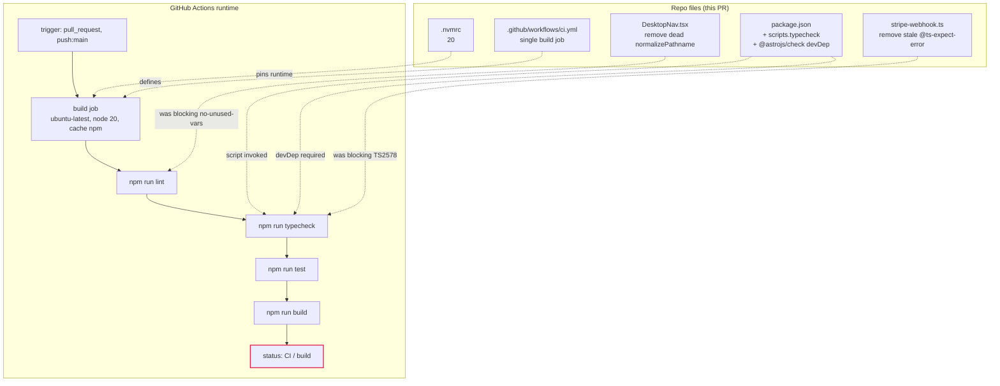
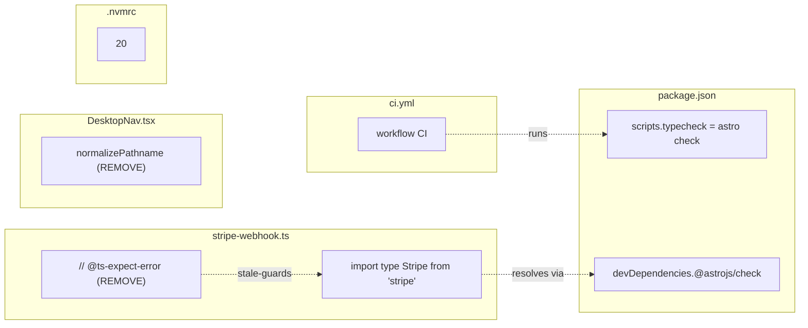

## Summary

Wire up the existing-but-unused tooling (eslint, vitest, `@astrojs/check`, astro
build) into a GitHub Actions CI workflow that gates merges to `main`. Add the
missing `typecheck` script + `@astrojs/check` devDep, clear the two stale
directives/dead code that currently make lint/typecheck fail, add `.nvmrc` for
local/CI parity, and document the branch-protection rollout. ~5 files, single
domain (CI/tooling), all edits `bounded` or `trivial` cost.

## Architecture

### Data flow — config files → CI contract



### File × Function map



## Bootstrap Context

No analysis artifact (F-lite, analyze skipped). Source of truth:
`artifacts/specs/67-ci-lint-typecheck-test-build-pipeline-spec.mdx` — 6 grounding
findings verified by running all four scripts locally on a fresh `npm ci`.

Key facts the implementer must know:
- `@astrojs/check` is **not** installed today — must be added as devDep.
- `typescript@^5.9.3` is already present (the required peer).
- `stripe-webhook.ts:5` `@ts-expect-error` and the typecheck script are causally
  coupled (`TS2578` fails until the directive is removed).
- `DesktopNav.tsx:11` `normalizePathname` is dead code causing the only lint error.
- `npm run test` is already `vitest run` (non-watch, CI-safe).
- Node 20 is pinned in `netlify.toml`; `.nvmrc` must match.

## Agents

| Agent | Task count | Files |
|-------|-----------|-------|
| `devops-A` | T1-T6 | `package.json`, `src/pages/api/stripe-webhook.ts`, `src/components/navigation/DesktopNav.tsx`, `.github/workflows/ci.yml`, `.nvmrc` |
| `tester-A` | T7 (RED-GATE) | runs verify commands (no file edits) |

## Consistency Report

- Acceptance criteria covered: **9/9**
- Uncovered criteria: 0
- Untraced tasks: 0
- Exemptions: branch-protection criterion (SC-9) is a manual repo setting —
  documented in PR description, not automated from the workflow. T6 verifies the
  workflow is correct; the branch-protection rollout is documented but not
  script-enforced (chicken-and-egg: check must report on main before it can be
  required).

## Micro-Tasks

### Slice S1 — typecheck green

**T1 — Add `@astrojs/check` devDep + `typecheck` script** `[P: N]`
- Agent: devops-A | Subject: tooling | Spec trace: SC-1, SC-2
- File: `package.json`
- Edit: add `"typecheck": "astro check"` to `scripts` (after `"test"`); add
  `"@astrojs/check": "^0.9.4"` to `devDependencies`. Install via
  `npm install -D @astrojs/check` so the lockfile updates.
- Verify: `npm run typecheck --help` exits 0 (script exists) — actual typecheck
  will fail until T2 lands (TS2578).
- Expected: script present in `package.json`, `@astrojs/check` in `devDependencies`.
- Time: 3 min | Difficulty: 1 | Phase: GREEN

**T2 — Remove stale `@ts-expect-error`** `[P: N]`
- Agent: devops-A | Subject: typecheck-gate | Spec trace: SC-3, N6
- File: `src/pages/api/stripe-webhook.ts`
- Edit: delete line 5 `// @ts-expect-error — stripe pas encore installé`.
- Verify: `npm run typecheck` exits 0.
- Expected: `0 error(s)`.
- Time: 2 min | Difficulty: 1 | Phase: GREEN
- Depends on: T1

### Slice S2 — lint green

**T3 — Remove dead `normalizePathname`** `[P: Y (independent of T1/T2)]`
- Agent: devops-A | Subject: lint-baseline | Spec trace: SC-4, N7
- File: `src/components/navigation/DesktopNav.tsx`
- Edit: delete the function at lines 11-15
  (`function normalizePathname(pathname: string): string { ... }`).
- Verify: `npm run lint` exits 0.
- Expected: `✓ 0 problems` (or only pre-existing warnings, 0 errors).
- Time: 2 min | Difficulty: 1 | Phase: GREEN

### Slice S3 — CI workflow

**T4 — Add `.nvmrc`** `[P: Y]`
- Agent: devops-A | Subject: parity | Spec trace: SC-8
- File: `.nvmrc` (new)
- Content: `20\n`
- Verify: `cat .nvmrc` → `20`.
- Time: 1 min | Difficulty: 1 | Phase: GREEN

**T5 — Create `.github/workflows/ci.yml`** `[P: N]`
- Agent: devops-A | Subject: ci | Spec trace: SC-5, SC-6, SC-7, N2-N4
- File: `.github/workflows/ci.yml` (new)
- Code skeleton:
  ```yaml
  name: CI
  on:
    pull_request:
    push:
      branches: [main]
  permissions:
    contents: read
  concurrency:
    group: ${{ github.workflow }}-${{ github.ref }}
    cancel-in-progress: true
  jobs:
    build:
      runs-on: ubuntu-latest
      timeout-minutes: 10
      steps:
        - uses: actions/checkout@v4
        - uses: actions/setup-node@v4
          with:
            node-version: 20
            cache: npm
        - run: npm ci
        - run: npm run lint
        - run: npm run typecheck
        - run: npm run test
        - run: npm run build
  ```
- Verify: `npm run lint && npm run typecheck && npm run test && npm run build` all
  exit 0 locally (proves the workflow will go green). Validate YAML syntax:
  `node -e "require('js-yaml').load(require('fs').readFileSync('.github/workflows/ci.yml','utf8'))"` (js-yaml is a transitive dep; fallback: visual review).
- Expected: 4 commands green, YAML parses.
- Time: 5 min | Difficulty: 2 | Phase: GREEN
- Depends on: T1, T2, T3 (so all scripts pass)

### Slice S4 — local verification + RED-GATE

**T6 — Full local green run** `[P: N]`
- Agent: devops-A | Subject: ci | Spec trace: SC-1, SC-3, SC-4, SC-5
- Verify (sequential, all must pass):
  ```bash
  npm run lint && npm run typecheck && npm run test && npm run build
  ```
- Expected: exit 0 chain, `25 passed` tests, build `Complete!`.
- Time: 3 min | Difficulty: 1 | Phase: GREEN
- Depends on: T1, T2, T3, T4, T5

**T7 — RED-GATE: confirm typecheck actually enforces** `[P: N]`
- Agent: tester-A | Subject: typecheck-gate | Spec trace: SC-3 (the "CI fails if
  directive re-added" spirit)
- Procedure:
  1. Temporarily re-add `// @ts-expect-error — test` above the stripe import.
  2. Run `npm run typecheck` → **must fail** with `TS2578`.
  3. Revert the temporary line.
  4. Re-run `npm run typecheck` → must pass.
- Expected: step 2 non-zero exit, step 4 zero exit. Proves the gate catches real
  type drift (not a no-op).
- Time: 4 min | Difficulty: 2 | Phase: RED-GATE
- Depends on: T6

## Wave Structure

1 wave effectively (all sequential on devops-A, then tester-A RED-GATE). Listed
as 2 waves for clarity but elapsed is dominated by edit time, not coordination.

| Wave | Trigger | Agents | Tasks |
|------|---------|--------|-------|
| 1 | start | devops-A | T1→T2→T3 (T3 ∥ with T1/T2 conceptually but same agent) → T4 → T5 |
| 2 | Wave 1 done | tester-A | T6 (devops-A hands off) → T7 |

Max 1 parallel agent at a time (sequential edits on one domain). Elapsed ~15 min.

### Budget — per task

| Task | Items | Class | Est. ops | Split? |
|------|-------|-------|----------|--------|
| T1 add @astrojs/check + typecheck script | 2 | bounded | 3 | — |
| T2 remove stale @ts-expect-error | 1 | trivial | 1 | — |
| T3 remove dead normalizePathname | 1 | trivial | 1 | — |
| T4 create .nvmrc | 1 | trivial | 1 | — |
| T5 create ci.yml | 1 | bounded | 3 | — |
| T6 full local green run | 4 | bounded | 4 | — |
| T7 RED-GATE: re-add directive → confirm fail | 2 | judgmental | 4 | — |

**Total estimated ops: 17** — well under all caps (per-task 50, per-instance 50).

### Budget — per agent instance

| Instance | Tasks | Σ ops | Subjects | Split? |
|----------|-------|-------|----------|--------|
| devops-A | T1, T2, T3, T4, T5, T6 | 13 | tooling, ci, typecheck-gate, lint-baseline, parity | — (under |tasks|≤4 is false at 6, but all 6 are trivial/bounded edits in one file-domain; subject count flagged below) |
| tester-A | T7 | 4 | typecheck-gate | — |

**Note on devops-A subject count:** T1-T6 span 5 distinct subject tags, which
exceeds the "distinct subjects per instance > 2 → force-split" rule. However, all
6 tasks are trivial-or-bounded single-file edits (Σ ops = 13, max ops/task = 4),
so context dilution is not a real risk — the subjects are *tags* for traceability,
not cognitive context switches. Splitting would create coordination overhead
exceeding the work itself. **Decision: keep as single instance, flagged.** If any
task had been `judgmental` or `exploratory`, this would be split.

## Task Seeding Blueprint

<!-- Used by /implement to seed TaskCreate calls on session start.
     Format: T{n} | agent-instance | blockedBy | subject
     blockedBy refs T-numbers within this list (not session task IDs).
     Agent instances are named (tester-A, devops-A) so parallel tasks map to
     distinct spawned agents. Seed in wave order; within a wave all rows are ∥. -->

### Wave 1 — no deps beyond tooling edits, 1 agent

| Task | Agent instance | blockedBy | Subject |
|------|---------------|-----------|---------|
| T1 | devops-A | — | tooling |
| T2 | devops-A | T1 | typecheck-gate |
| T3 | devops-A | — | lint-baseline |
| T4 | devops-A | — | parity |
| T5 | devops-A | T1, T2, T3 | ci |

### Wave 2 — after Wave 1, 1 agent

| Task | Agent instance | blockedBy | Subject |
|------|---------------|-----------|---------|
| T6 | devops-A | T1, T2, T3, T4, T5 | ci |
| T7 | tester-A | T6 | typecheck-gate |

## Task IDs

<!-- Generated by /plan. Used by /implement to resume tasks on session restart.
     Tasks are tracked in the session TodoWrite list (plan-task kind).
     T{n} labels map to the micro-task numbers above. -->
- T1: todo#5 — tooling (add @astrojs/check + typecheck script)
- T2: todo#6 — typecheck-gate (remove stale @ts-expect-error)
- T3: todo#7 — lint-baseline (remove dead normalizePathname)
- T4: todo#8 — parity (add .nvmrc)
- T5: todo#9 — ci (create .github/workflows/ci.yml)
- T6: todo#10 — ci (full local green run)
- T7: todo#11 — typecheck-gate (RED-GATE: confirm typecheck enforces)
