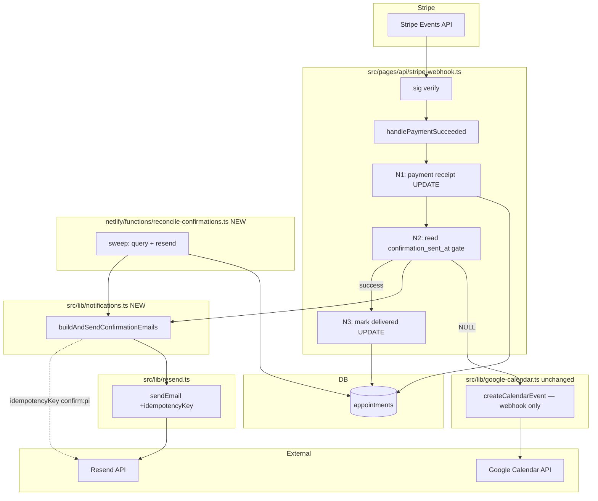
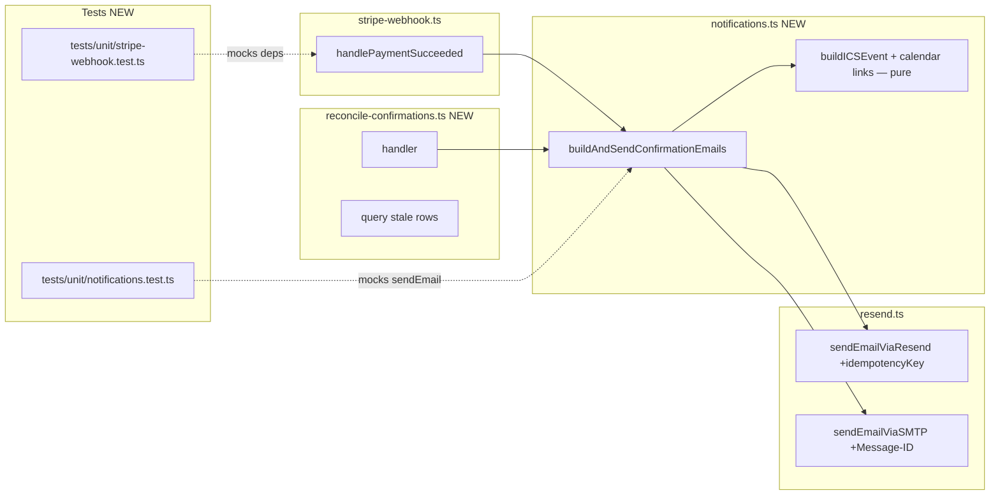

## Summary

Separate payment-receipt idempotency (`stripe_event_id`) from confirmation-delivery state (`confirmation_sent_at`), make email sends idempotent via Resend `idempotencyKey` on `stripe_payment_intent_id`, and add an hourly Netlify scheduled reconciliation sweep as a backstop. Staged in two increments: A (slices 1-5) closes the bug for new payments; B (slice 6) adds the sweep.

## Architecture





## Bootstrap Context

From analysis: the bug conflates payment-receipt idempotency (`stripe_event_id`, set before side effects) with confirmation-delivery state. Two-layer idempotency fixes it: L1 = Resend `idempotencyKey` on `stripe_payment_intent_id` (concurrent in-flight dedup, ~24h TTL); L2 = `confirmation_sent_at` flag set only after full success (durable "stop trying"). The flag is **never reset** — avoids the reset-on-failure race. The sweep is email-only (reuses `buildAndSendConfirmationEmails`); calendar creation stays webhook-only (it's `import.meta.env`-coupled and the sweep doesn't need it).

## Agents

| Agent | Task count | Files |
|-------|-----------|-------|
| backend-dev-A | 4 | `src/lib/resend.ts`, `src/lib/notifications.ts`, `src/types/appointment.ts`, `src/pages/api/stripe-webhook.ts` |
| devops-A | 3 | `supabase/migrations/008_payment_intent_unique.sql`, `supabase/migrations/009_confirmation_sent_at.sql`, `netlify/functions/reconcile-confirmations.ts` |
| tester-A | 2 | `tests/unit/notifications.test.ts`, `tests/unit/stripe-webhook.test.ts` |

## Wave Structure

2 waves, max 2 parallel agents. Sequential estimate ~equal given cross-wave deps; parallelism is limited because slice 5 (webhook reorder) depends on slices 1-4.

| Wave | Trigger | Agents | Tasks |
|------|---------|--------|-------|
| 1 | start | 2 ∥ | devops-A: T1→T2 · backend-dev-A: T3→T4 |
| 2 | Wave 1 done | 2 ∥ | backend-dev-A: T5 (webhook reorder) · tester-A: T6→T7 |
| 3 | Wave 2 done | 1 | devops-A: T8 (sweep function — Increment B) |

### Budget — per task

| Task | Items | Class | Est. ops | Split? |
|------|-------|-------|----------|--------|
| T1 migration 008 (dedupe + unique index) | 4 | judgmental | 6 | — |
| T2 migration 009 (column + backfill) | 3 | bounded | 4 | — |
| T3 resend idempotencyKey param | 3 | bounded | 4 | — |
| T4 buildAndSendConfirmationEmails extraction | 5 | judgmental | 6 | — |
| T5 webhook reorder + idempotency keys | 6 | judgmental | 8 | — |
| T6 notifications unit test | 3 | bounded | 4 | — |
| T7 webhook idempotency unit test | 4 | judgmental | 6 | — |
| T8 reconcile-confirmations sweep | 8 | judgmental | 10 | — |

**Total estimated ops: 48**

### Budget — per agent instance

| Instance | Tasks | Σ ops | Subjects | Split? |
|----------|-------|-------|----------|--------|
| backend-dev-A | T3, T4, T5 | 18 | email, webhook, types | — |
| devops-A | T1, T2, T8 | 20 | migrations, scheduled-fn | — |
| tester-A | T6, T7 | 10 | email-idempotency, webhook-idempotency | — |

All instances within caps (Σ ops ≤ 50, |tasks| ≤ 4, subjects ≤ 2).

## Consistency Report

- Spec success criteria covered: 26/26 (T1→SC1,SC2 · T2→SC3 · T3→SC6,SC19 · T4→SC7 · T5→SC4,SC5,SC6,SC8,SC9,SC10,SC11,SC12 · T6→SC8(idempotency key assertion) · T7→SC9,SC10(overlap + retry) · T8→SC13-26)
- Uncovered: 0
- Untraced tasks: 0
- Exemptions: none

## Micro-Tasks

### T1 — Migration 008: dedupe + partial unique index on `stripe_payment_intent_id`

- **File:** `supabase/migrations/008_payment_intent_unique.sql` (NEW)
- **Agent instance:** devops-A
- **Subject:** migrations
- **Slice:** V1 (Increment A)
- **Phase:** GREEN
- **Difficulty:** 3
- **Code skeleton:**
  ```sql
  -- Audit table capturing rows nulled by the dedupe pass (reversibility).
  CREATE TABLE IF NOT EXISTS _audit_008_dedup AS
    SELECT id, stripe_payment_intent_id, created_at, updated_at
    FROM appointments
    WHERE stripe_payment_intent_id IS NOT NULL
      AND id NOT IN (
        SELECT DISTINCT ON (stripe_payment_intent_id) id
        FROM appointments
        WHERE stripe_payment_intent_id IS NOT NULL
        ORDER BY stripe_payment_intent_id, updated_at DESC, id DESC
      );

  -- Null the duplicates (keep latest by updated_at DESC, id DESC).
  UPDATE appointments
  SET stripe_payment_intent_id = NULL
  WHERE stripe_payment_intent_id IS NOT NULL
    AND id NOT IN (
      SELECT DISTINCT ON (stripe_payment_intent_id) id
      FROM appointments
      WHERE stripe_payment_intent_id IS NOT NULL
      ORDER BY stripe_payment_intent_id, updated_at DESC, id DESC
    );

  -- Single transaction: dedupe + index (per devops review).
  CREATE UNIQUE INDEX IF NOT EXISTS idx_appointments_stripe_payment_intent_id_unique
    ON appointments (stripe_payment_intent_id)
    WHERE stripe_payment_intent_id IS NOT NULL;
  ```
- **Verify:** `docker compose exec postgres psql -U postgres -d omf_therapie -c "\d _audit_008_dedup"` shows audit table; `\di idx_appointments_stripe_payment_intent_id_unique` shows index.
- **Expected output:** Index exists; duplicate insert now fails with unique violation.
- **Time:** 6 min.

### T2 — Migration 009: add `confirmation_sent_at` column

- **File:** `supabase/migrations/009_confirmation_sent_at.sql` (NEW)
- **Agent instance:** devops-A
- **Subject:** migrations
- **Slice:** V2 (Increment A)
- **Phase:** GREEN
- **Difficulty:** 2
- **Code skeleton:**
  ```sql
  -- Backfill: mark existing payment_received rows as already delivered so the
  -- sweep doesn't re-spam historical customers. Uses updated_at as proxy for
  -- when confirmation was actually sent (best-effort).
  ALTER TABLE appointments
    ADD COLUMN IF NOT EXISTS confirmation_sent_at TIMESTAMPTZ;

  UPDATE appointments
  SET confirmation_sent_at = updated_at
  WHERE status = 'payment_received'
    AND confirmation_sent_at IS NULL;

  -- Partial index for fast sweep scans (separate from the unique index in 008).
  CREATE INDEX IF NOT EXISTS idx_appointments_confirmation_pending
    ON appointments (scheduled_at)
    WHERE status = 'payment_received' AND confirmation_sent_at IS NULL;
  ```
- **Verify:** `docker compose exec postgres psql -U postgres -d omf_therapie -c "\d appointments"` shows `confirmation_sent_at` column; `\di idx_appointments_confirmation_pending` shows the partial index.
- **Expected output:** Column exists, nullable, backfilled for existing rows.
- **Time:** 4 min.

### T3 — Add `idempotencyKey` param to `sendEmail`

- **File:** `src/lib/resend.ts`
- **Agent instance:** backend-dev-A
- **Subject:** email
- **Slice:** V3 (Increment A)
- **Phase:** GREEN
- **Difficulty:** 2
- **Code skeleton:**
  ```ts
  // Add to SendEmailParams interface:
  export interface SendEmailParams {
    // ... existing fields ...
    /** Resend idempotency key — dedupes concurrent sends within Resend's TTL (~24h). */
    idempotencyKey?: string;
  }

  // In sendEmailViaResend, pass to SDK:
  const { data, error } = await resendClient.emails.send(payload, {
    ...(params.idempotencyKey ? { idempotencyKey: params.idempotencyKey } : {}),
  });

  // In sendEmailViaSMTP, mirror via Message-ID header for dev parity:
  // (optional — SMTP path is dev-only via Mailpit; threading header suffices)
  ```
- **Verify:** `npm run lint` passes; `npx tsc --noEmit` (or `astro check`) passes; grep confirms `idempotencyKey` plumbed through `sendEmail` → both paths.
- **Expected output:** Type-checks clean; param threads from caller to Resend SDK option.
- **Time:** 4 min.
- **[P]** Parallel-safe with T1, T2.

### T4 — Extract `buildAndSendConfirmationEmails` (email-only, DI)

- **File:** `src/lib/notifications.ts` (NEW)
- **Agent instance:** backend-dev-A
- **Subject:** email
- **Slice:** V4 (Increment A)
- **Phase:** GREEN
- **Difficulty:** 4
- **Code skeleton:**
  ```ts
  import { createElement } from 'react';
  import { sendEmail, buildAppointmentConversationSubject, type SendEmailParams } from './resend';
  import { generateGoogleCalendarLink, generateOutlookCalendarLink, generateAppleCalendarInviteLink, CABINET_ADDRESS } from './ics';
  import { createSecureLinkToken } from './secure-links';
  import { getTypeLabel, getModeLabel } from './pricing';
  import AppointmentConfirmed from '../emails/AppointmentConfirmed';
  import PaymentReceivedNotification from '../emails/PaymentReceivedNotification';
  import type { Appointment } from '../types/appointment';

  export interface SendConfirmationsResult {
    patientEmailSent: boolean;
    therapistEmailSent: boolean;
  }

  export interface BuildAndSendOptions {
    videoLink?: string;
    calendarEventCreated?: boolean;
    /** Inject for testing; defaults to the module's sendEmail. */
    sendFn?: typeof sendEmail;
  }

  export async function buildAndSendConfirmationEmails(
    appointment: Appointment,
    options: BuildAndSendOptions = {},
  ): Promise<SendConfirmationsResult> {
    const send = options.sendFn ?? sendEmail;
    const idempotencyKey = appointment.stripe_payment_intent_id
      ? `confirm:${appointment.stripe_payment_intent_id}`
      : undefined;
    // ... build ICS links, React elements (extracted from stripe-webhook.ts:323-378)
    // ... return sendEmail results aggregated
  }
  ```
- **Verify:** `npm run lint` + `npx tsc --noEmit` pass; function importable from both stripe-webhook.ts and the sweep (no `import.meta.env` access inside the module).
- **Expected output:** Module exports `buildAndSendConfirmationEmails` + types; no env reads inside.
- **Time:** 6 min.
- **Depends on:** T3 (uses `idempotencyKey` param).

### T5 — Webhook reorder: gate + mark delivered + idempotency keys

- **File:** `src/pages/api/stripe-webhook.ts`, `src/types/appointment.ts`
- **Agent instance:** backend-dev-A
- **Subject:** webhook
- **Slice:** V5 (Increment A)
- **Phase:** GREEN
- **Difficulty:** 4
- **Code skeleton:**
  ```ts
  // src/types/appointment.ts — add field:
  export interface Appointment {
    // ... existing fields ...
    /** Timestamp the confirmation email + calendar invite were delivered. NULL = pending. */
    confirmation_sent_at: string | null;
  }

  // src/pages/api/stripe-webhook.ts — handlePaymentSucceeded reorder:
  // 1. Keep N1 (payment receipt UPDATE) unchanged — sets stripe_event_id, status, stripe_payment_intent_id
  // 2. After N1, READ confirmation_sent_at (N2 gate): if set, return early
  // 3. Run calendar creation (existing block, unchanged) — webhook only
  // 4. Replace the inline email block (lines 323-378) with:
  //    const result = await buildAndSendConfirmationEmails(updatedAppt, { videoLink, calendarEventCreated });
  // 5. On full success: UPDATE confirmation_sent_at = now() WHERE id AND confirmation_sent_at IS NULL (N3)
  // 6. On any failure: return without setting confirmation_sent_at → caller returns 500 → Stripe retries

  // Also: remove the stale @ts-expect-error on the stripe import (line 5) — stripe is installed.
  ```
- **Verify:** `npm run lint` + `astro check` pass; mock GET path still works; manual trace: failed side effect leaves `confirmation_sent_at` NULL.
- **Expected output:** Webhook gates on `confirmation_sent_at`, sets it only after success, delegates emails to `buildAndSendConfirmationEmails`.
- **Time:** 8 min.
- **Depends on:** T2 (column), T3 (idempotencyKey), T4 (buildAndSendConfirmationEmails).

### T6 — Unit test: `buildAndSendConfirmationEmails` passes idempotency key

- **File:** `tests/unit/notifications.test.ts` (NEW)
- **Agent instance:** tester-A
- **Subject:** email-idempotency
- **Slice:** V4 (Increment A)
- **Phase:** RED-GATE → GREEN
- **Difficulty:** 3
- **Code skeleton:**
  ```ts
  import { describe, expect, it, vi } from 'vitest';
  import { buildAndSendConfirmationEmails } from '@/lib/notifications';
  import type { Appointment } from '@/types/appointment';

  const mockAppt = (overrides: Partial<Appointment> = {}): Appointment => ({
    // ... minimal valid appointment with stripe_payment_intent_id: 'pi_test_123'
  });

  describe('buildAndSendConfirmationEmails', () => {
    it('passes idempotency key confirm:{stripe_payment_intent_id} to both emails', async () => {
      const sendFn = vi.fn().mockResolvedValue({ success: true, id: 're_123' });
      await buildAndSendConfirmationEmails(mockAppt(), { sendFn });
      expect(sendFn).toHaveBeenCalledTimes(2);
      for (const call of sendFn.mock.calls) {
        expect(call[0].idempotencyKey).toBe('confirm:pi_test_123');
      }
    });

    it('omits idempotency key when stripe_payment_intent_id is null', async () => {
      const sendFn = vi.fn().mockResolvedValue({ success: true, id: 're_123' });
      await buildAndSendConfirmationEmails(mockAppt({ stripe_payment_intent_id: null }), { sendFn });
      expect(sendFn.mock.calls[0][0].idempotencyKey).toBeUndefined();
    });
  });
  ```
- **Verify:** `npx vitest run tests/unit/notifications.test.ts` passes.
- **Expected output:** 2 tests green; both confirm `confirm:{pi}` key passed.
- **Time:** 4 min.
- **Depends on:** T4.

### T7 — Unit test: webhook idempotency under retry + overlap

- **File:** `tests/unit/stripe-webhook.test.ts` (NEW)
- **Agent instance:** tester-A
- **Subject:** webhook-idempotency
- **Slice:** V5 (Increment A)
- **Phase:** RED-GATE → GREEN
- **Difficulty:** 4
- **Code skeleton:**
  ```ts
  import { describe, expect, it, vi, beforeEach } from 'vitest';

  // Mock supabaseAdmin, buildAndSendConfirmationEmails, createCalendarEvent
  vi.mock('@/lib/supabase', () => ({ supabaseAdmin: { from: vi.fn() } }));
  vi.mock('@/lib/notifications', () => ({ buildAndSendConfirmationEmails: vi.fn() }));
  vi.mock('@/lib/google-calendar', () => ({ createCalendarEvent: vi.fn() }));

  import { handlePaymentSucceeded } from '@/pages/api/stripe-webhook';
  import { buildAndSendConfirmationEmails } from '@/lib/notifications';

  describe('handlePaymentSucceeded idempotency', () => {
    it('skips side effects when confirmation_sent_at is already set', async () => {
      // Mock supabase chain: payment receipt UPDATE returns 0 rows OR
      // confirmation_sent_at read returns non-null → buildAndSendConfirmationEmails not called
    });

    it('marks confirmation_sent_at only after side effects succeed', async () => {
      // Mock success path → assert final UPDATE sets confirmation_sent_at
    });

    it('leaves confirmation_sent_at NULL when side effects fail (retry can resume)', async () => {
      // Mock buildAndSendConfirmationEmails rejecting → assert no N3 UPDATE
    });

    it('passes confirm:{stripe_payment_intent_id} idempotency key under dual-event overlap', async () => {
      // Two concurrent handlePaymentSucceeded calls → both call buildAndSendConfirmationEmails
      // with the same idempotency key (Resend dedupes server-side)
    });
  });
  ```
- **Verify:** `npx vitest run tests/unit/stripe-webhook.test.ts` passes.
- **Expected output:** 4 tests green covering gate, success, failure, overlap.
- **Time:** 6 min.
- **Depends on:** T5.

### T8 — Reconciliation sweep function (Increment B)

- **File:** `netlify/functions/reconcile-confirmations.ts` (NEW), `netlify.toml` (env docs)
- **Agent instance:** devops-A
- **Subject:** scheduled-fn
- **Slice:** V6 (Increment B)
- **Phase:** GREEN
- **Difficulty:** 5
- **Code skeleton:**
  ```ts
  import type { Config } from '@netlify/functions';
  import { createClient } from '@supabase/supabase-js';
  import { Resend } from 'resend';
  import ws from 'ws';
  // NOTE: cannot import src/lib/* (import.meta.env). Re-implement the email send
  // path locally OR import only buildAndSendConfirmationEmails if it has no env reads
  // (it doesn't — T4 ensures DI). But it imports from './resend' which DOES read env.
  // Decision: replicate the minimal send path inline (mirror send-reminders.ts pattern),
  // OR extract a pure email-builder that the sweep calls with its own client.

  export default async function handler(): Promise<void> {
    const startedAt = Date.now();
    const DEADLINE_MS = 8500;
    // 1. Instantiate clients from process.env (service-role key for Supabase)
    // 2. Query: SELECT ... WHERE status='payment_received' AND confirmation_sent_at IS NULL
    //          AND created_at > now() - interval '14 days'
    //          ORDER BY scheduled_at ASC LIMIT 25
    // 3. For each row:
    //    - if Date.now() - startedAt > DEADLINE_MS → break (log deadlineHit)
    //    - try: send emails with idempotencyKey=confirm:{pi}
    //           on success: UPDATE confirmation_sent_at=now() WHERE id AND confirmation_sent_at IS NULL
    //    - catch: if permanent 4xx → UPDATE confirmation_sent_at=now() (poison escape), log error
    //             else (retryable) → leave NULL, log warn
    // 4. Log structured summary: { found, sent, failed, deadlineHit, msElapsed }
  }

  export const config: Config = {
    schedule: '5 * * * *', // hourly, offset :05 to dodge webhook contention
  };
  ```
- **Verify:** `npm run build` succeeds (function compiles); manual trigger via `netlify dev` invoke against a seeded stale row sends the email.
- **Expected output:** Function deploys; respects LIMIT + deadline; idempotency keys passed; structured logs.
- **Time:** 10 min.
- **Depends on:** T2 (column + backfill so it doesn't re-spam), T4 (buildAndSendConfirmationEmails shape — may need a runtime-agnostic variant or local replication).

## Task Seeding Blueprint

<!-- Used by /implement to seed TaskCreate calls on session start.
     Format: T{n} | agent-instance | blockedBy | subject
     blockedBy refs T-numbers within this list (not session task IDs).
     Agent instances are named (tester-A/B, backend-dev-A/B/C, devops-A/B)
     so parallel tasks map to distinct spawned agents.
     Seed in wave order; within a wave all rows are parallel (∥). -->

### Wave 1 — no deps, 2 agents ∥

| Task | Agent instance | blockedBy | Subject |
|------|---------------|-----------|---------|
| T1 | devops-A | — | migrations |
| T2 | devops-A | T1 | migrations |
| T3 | backend-dev-A | — | email |
| T4 | backend-dev-A | T3 | email |

### Wave 2 — after Wave 1, 2 agents ∥

| Task | Agent instance | blockedBy | Subject |
|------|---------------|-----------|---------|
| T5 | backend-dev-A | T2, T4 | webhook |
| T6 | tester-A | T4 | email-idempotency |
| T7 | tester-A | T5 | webhook-idempotency |

### Wave 3 — after Wave 2, 1 agent

| Task | Agent instance | blockedBy | Subject |
|------|---------------|-----------|---------|
| T8 | devops-A | T2, T4 | scheduled-fn |

## Task IDs

<!-- Generated by /plan. Used by /implement to resume tasks on session restart.
     Task list (TodoWrite) tracks these inline; the dev-pipeline tasks above
     (recheck/frame/analyze/spec/plan/implement/pr/validate/review/fix) are
     owned by /dev and tracked separately. -->
- T1: devops-A — migrations (migration 008: dedupe + unique index)
- T2: devops-A — migrations (migration 009: confirmation_sent_at column)
- T3: backend-dev-A — email (idempotencyKey param in sendEmail)
- T4: backend-dev-A — email (buildAndSendConfirmationEmails extraction)
- T5: backend-dev-A — webhook (webhook reorder + idempotency keys)
- T6: tester-A — email-idempotency (notifications unit test)
- T7: tester-A — webhook-idempotency (webhook idempotency unit test)
- T8: devops-A — scheduled-fn (reconciliation sweep, Increment B)
