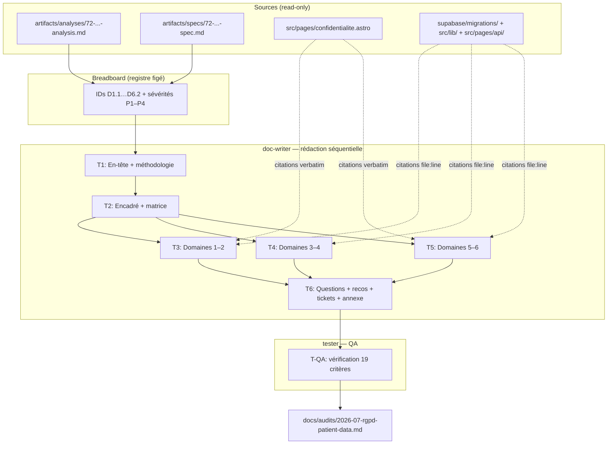
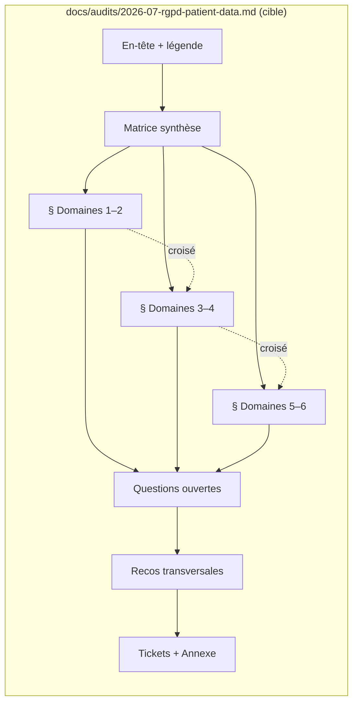

## Summary

Rédaction d'un document unique `docs/audits/2026-07-rgpd-patient-data.md` (Shape 3 hybride : matrice de synthèse P1-d'abord + détails par-domaine) en 6 slices séquentielles. Un seul agent (doc-writer) possède l'intégralité du document — la parallélisation n'est pas pertinente (fichier unique, DAG de slices). Le contenu dérive mécaniquement de l'analyse #72 (constats + preuves) et de la spec #72 (structure + IDs figés + critères).

## Architecture

### Data Flow

### File × Function Map

## Bootstrap Context

L'analyse #72 a produit 18 constats avec preuves `file:line`, mappés sur 6 domaines. La spec #72 a figé les IDs (`D{domaine}.{n}` numériques, D4.1–D4.6 réconciliés), défini la structure Shape 3 hybride (matrice + détails), et résolu les 3 χ items : (χ1) critère de succès/échec resserré documenté, (χ2) recommandation suppression GA4, (χ3) document autonome. Le breadboard de la spec est le **registre figé** — la rédaction consomme les IDs/sévérités, ne les invente pas. Les facettes redondantes (D5.2≡D6.2, D2.1≡D5.5) sont dédupliquées : remédiation écrite une fois sur le constat principal, renvoi croisé sur la facette.

## Agents

| Agent | Task count | Files |
|-------|-----------|-------|
| doc-writer | T1–T6 | `docs/audits/2026-07-rgpd-patient-data.md` |
| tester | T-QA | (lecture seule, vérification critères) |

## Wave Structure

1 wave (sequential single-file). Le DAG de slices formalise les dépendances pour la reprise (reprise après panne), mais l'exécution est séquentielle dans une session doc-writer. Elapsed ~2–4h vs ~2–4h séquentiel (pas de parallélisation possible sur fichier unique).

| Wave | Trigger | Agents | Tasks |
|------|---------|--------|-------|
| 1 | start | 1 | doc-writer: T1→T2→T3→T4→T5→T6, puis tester: T-QA |

### Budget — per task

| Task | Items | Class | Est. ops | Split? |
|------|-------|-------|----------|--------|
| T1 En-tête + méthodologie | 5 | judgmental | 6 | — |
| T2 Encadré + matrice | 18 + 1 | judgmental | 8 | — |
| T3 Domaines 1–2 | 4 constats | judgmental | 6 | — |
| T4 Domaines 3–4 | 7 constats | judgmental | 8 | — |
| T5 Domaines 5–6 | 7 constats | judgmental | 8 | — |
| T6 Clôture (4 sections) | 4 | judgmental | 7 | — |
| T-QA Vérification 19 critères | 19 | bounded | 3 | — |

**Total estimated ops: 46**

### Budget — per agent instance

Caps: `Σ ops > 50` OR `|tasks| > 4` OR `distinct subjects > 2` → split.

| Instance | Tasks | Σ ops | Subjects | Split? |
|----------|-------|-------|----------|--------|
| doc-writer | T1, T2, T3, T4, T5, T6 | 43 | rgpd-audit (1) | — (sous le cap ops ; |tasks|=6 >4 MAIS sujet unique = monolithe cohérent, split artificiel nuirait à la cohérence du doc) |
| tester | T-QA | 3 | qa | — |

> **Note split doc-writer :** le cap `|tasks|>4` déclenche techniquement, mais l'éclatement d'un document unique en plusieurs agents créerait des incohérences de ton/structure. La spécification contraint la structure (7 sections, IDs figés, légende) ce qui borne le risque de dérive. Décision : **garder doc-writer comme instance unique** (le document est conçu comme un artefact cohérent, pas une agrégation). Le cap `|tasks|>4` est conçu pour la diversité des sujets — ici 1 sujet, donc l'intention du cap (dilution du focus) ne s'applique pas.

## Consistency Report

- Criteria covered: 19/19
- Uncovered criteria: none
- Tasks without spec backing: none
- Gold plating exemptions applied: 0

## Micro-Tasks

### Slice V1: T1 — En-tête + méthodologie + légende

#### Task 1: Rédiger en-tête du document → doc-writer
- **File:** `docs/audits/2026-07-rgpd-patient-data.md`
- **Snippet:** structure frontale : `# Audit RGPD — données patient OMF Thérapie`, date `2026-07-11`, auteur, périmètre (6 domaines), méthodologie (fichiers inspectés), stance (neutre sur Art. 9), **légende P1–P4** (copier verbatim de l'analyse L25–32), lien vers `artifacts/analyses/72-rgpd-patient-data-compliance-audit-analysis.md`.
- **Verify:** `grep -c "P1.*Critique" docs/audits/2026-07-rgpd-patient-data.md` (ready)
- **Expected:** ≥1 (légende présente)
- **Time:** 6 min
- **Difficulty:** 3
- **Traces:** SC-1, SC-3
- **Phase:** GREEN

### Slice V2: T2 — Cadrage risque-métier + encadré 3-actions + matrice synthèse

#### Task 2: Rédiger synthèse exécutive + matrice → doc-writer
- **File:** `docs/audits/2026-07-rgpd-patient-data.md`
- **Snippet:** (a) Paragraphe cadrage risque-métier (confiance patient = actif commercial, exposition CNIL, bouche-à-oreille). (b) **Encadré « 3 actions prioritaires »** en langage métier (3–5 phrases, traduisant D5.2/D6.2 GA4 + D2.1/D5.5 effacement + D5.1 patient_reason, sans jargon). (c) **Matrice synthèse** — tableau 18 lignes (tous les constats du breadboard spec L83–101), colonnes : ID, Domaine, Sévérité, Écart (1 ligne), Remédiation (1 ligne). Triée P1 → P4.
- **Verify:** `grep -c "^| D[1-6]\." docs/audits/2026-07-rgpd-patient-data.md` (ready)
- **Expected:** 18 (tous les constats dans la matrice)
- **Time:** 8 min
- **Difficulty:** 4
- **Traces:** SC-2, SC-4, SC-5
- **Phase:** GREEN

### Slice V3: T3 — Domaines 1–2 (inventaire + rétention/effacement)

#### Task 3: Rédiger détails Domaines 1 et 2 → doc-writer
- **File:** `docs/audits/2026-07-rgpd-patient-data.md`
- **Snippet:** **Domaine 1** (D1.1, D1.2) : inventaire des champs PII + flux externes (table Resend/Google/Stripe/Logs/URLs de l'analyse), preuves `file:line` (migrations, `AppointmentRequestNotification.tsx:131`, `send-reminders.ts:192`). **Domaine 2** (D2.1, D2.2) : `appointments.deleted_at` colonne morte (précision `manual_time_slots` écrite mais pas appointments), pas de cron de purge, pas d'endpoint Art. 17, tables annexes (`email_threads`, `credits`). Chaque constat : preuve + sévérité + **remédiation chiffrable-ticket** (nomme la surface). Renvoisés croisés : D2.1→D5.5 (facette).
- **Verify:** `grep -c "D1\.\|D2\." docs/audits/2026-07-rgpd-patient-data.md` (ready)
- **Expected:** ≥4 (D1.1, D1.2, D2.1, D2.2 référencés)
- **Time:** 6 min
- **Difficulty:** 3
- **Traces:** SC-6 (4 P1 dont D2.1), SC-7 (remédiation), SC-8 (Art. 17)
- **Phase:** GREEN

### Slice V4: T4 — Domaines 3–4 (patient_reason + consentement)

#### Task 4: Rédiger détails Domaines 3 et 4 → doc-writer
- **File:** `docs/audits/2026-07-rgpd-patient-data.md`
- **Snippet:** **Domaine 3** (D3.1) : `patient_reason` collecte (`BookingWizard.tsx:666-689`), `required` vs politique « facultatif », texte d'aide RSA/ASS, **question Art. 9 ouverte** (deux scénarios : qualifié Art. 9 vs Art. 6, impact sur sévérités). **Domaine 4** (D4.1–D4.6) : consentement — `trackEvent()` sans gate, `url_passthrough:true`, consent update délégué CookieYes, CSP, chargement GA4, plafond polling. Chaque constat : preuve `file:line` + sévérité + remédiation. Renvoisés croisés : D3.1→D1.1, D5.1 (facette patient_reason).
- **Verify:** `grep -c "D3\.1\|D4\." docs/audits/2026-07-rgpd-patient-data.md` (ready)
- **Expected:** ≥2 (D3.1 + au moins D4.1)
- **Time:** 8 min
- **Difficulty:** 4
- **Traces:** SC-7 (Art. 9 deux scénarios), SC-6 (remédiation)
- **Phase:** GREEN

### Slice V5: T5 — Domaines 5–6 (politique/réalité + sous-traitants)

#### Task 5: Rédiger détails Domaines 5 et 6 + reco GA4 → doc-writer
- **File:** `docs/audits/2026-07-rgpd-patient-data.md`
- **Snippet:** **Domaine 5** (D5.1–D5.5) : diff politique vs réalité — chaque ligne cite verbatim la politique (`confidentialite.astro:L103`, `L137-138`, `L177-190`, `L123`, `L254`) + décrit la réalité code. Les **deux P1 documentés en détail** : D5.2 (politique ment sur GA4, citation L137-138 + L310-313) et D5.5 (droit Art. 17 annoncé non exécutable). Note réordonnancement : D5.2 et D5.5 conjointement P1. **Domaine 6** (D6.1, D6.2) : CookieYes omis (P2), GA4 omis+démenti (P1, facette D5.2). **Recommandation GA4 (résolution χ2)** : recommander suppression (aligner code sur promesse), documenter divulgation comme alternative.
- **Verify:** `grep -c "D5\.\|D6\." docs/audits/2026-07-rgpd-patient-data.md` (ready)
- **Expected:** ≥7 (D5.1–D5.5, D6.1, D6.2)
- **Time:** 8 min
- **Difficulty:** 4
- **Traces:** SC-6 (4 P1 dont D5.2, D5.5), SC-9 (diff 5.1–5.5), SC-10 (CookieYes+GA4), SC-14 (reco suppression GA4)
- **Phase:** GREEN

### Slice V6: T6 — Questions ouvertes + recos transversales + tickets + annexe

#### Task 6: Rédiger clôture (4 sections) → doc-writer
- **File:** `docs/audits/2026-07-rgpd-patient-data.md`
- **Snippet:** (a) **Questions ouvertes** : Art. 9 (avis juridique), scopes OAuth Google (à confirmer), réglage CookieYes Consent Mode v2 (vérif manuelle), `therapist_notes` (potentiellement clinique / secret médical). (b) **Recommandations transversales** : registre Art. 30, préparation breach Art. 33/34, AIPD si Art. 9 confirmé, **critère succès/échec explicite** (résolution χ1 : chaque P1 remédié en flux OU accepté documenté + chaque P2 a un plan ; ancien critère « zéro P1 remédié » noté comme trop permissif et rejeté). (c) **Suivi** : libellés de tickets suggérés par constat P1 (D2.1, D5.2, D5.5, D6.2) et P2, suffisamment précis pour création post-merge mécanique. (d) **Annexe** : fichiers inspectés (`confidentialite.astro`, `mentions-legales.astro`, migrations 001–008, `Layout.astro`, `analytics.ts`, API routes citées).
- **Verify:** `grep -c "Art\. 30\|Art\. 33\|critère\|Annexe" docs/audits/2026-07-rgpd-patient-data.md` (ready)
- **Expected:** ≥3
- **Time:** 7 min
- **Difficulty:** 3
- **Traces:** SC-11, SC-12, SC-13 (critère échec), SC-15 (tickets P1+P2), SC-16 (annexe fichiers), SC-17 (pas de reco code)
- **Phase:** GREEN

### Slice V7: T-QA — Vérification finale

#### Task QA: Vérifier intégrité références croisées + orphelins + 19 critères → tester
- **File:** `docs/audits/2026-07-rgpd-patient-data.md` (lecture seule)
- **Snippet:** Vérifications : (1) intégrité références croisées — D5.2↔D6.2, D2.1↔D5.5, D1.1↔D3.1↔D5.1 sont bidirectionnels. (2) pas de constat orphelin — chaque ID du breadboard apparaît dans la matrice ET dans au moins une section de détail. (3) pas de recommandation d'implémentation de code (doc-only). (4) les 4 P1 (D2.1, D5.2, D5.5, D6.2) ont tous une preuve détaillée.
- **Verify:** `grep -c "^- \[x\]" <(checklist manuelle)` (manual)
- **Expected:** 19/19 critères de la spec passés
- **Time:** 3 min
- **Difficulty:** 2
- **Traces:** SC-18 (intégrité croisée), SC-19 (pas d'orphelin), tous SC (gate final)
- **Phase:** REFACTOR

## Task Seeding Blueprint

<!-- Used by /implement to seed TaskCreate calls on session start.
     Format: T{n} | agent-instance | blockedBy | subject
     blockedBy refs T-numbers within this list (not session task IDs).
     Agent instances are named so parallel tasks map to distinct spawned agents.
     Seed in wave order; within a wave all rows are parallel (∥).
     Ici : 1 wave, 1 agent doc-writer séquentiel + 1 tester final. -->

### Wave 1 — séquentiel (fichier unique), doc-writer puis tester

| Task | Agent instance | blockedBy | Subject |
|------|---------------|-----------|---------|
| T1 | doc-writer | — | header |
| T2 | doc-writer | T1 | matrix |
| T3 | doc-writer | T2 | domains-1-2 |
| T4 | doc-writer | T2 | domains-3-4 |
| T5 | doc-writer | T2 | domains-5-6 |
| T6 | doc-writer | T3,T4,T5 | closeout |
| T-QA | tester | T6 | qa |

> T3, T4, T5 partagent le même blockedBy (T2) mais sont exécutés séquentiellement par le même agent (fichier unique, pas de parallélisation). T6 agrège les 3. T-QA est le gate final.

## Task IDs

<!-- Generated by /plan. Used by /implement to resume tasks on session restart.
     This environment tracks tasks via TodoWrite (session list) rather than a
     persistent TaskCreate store. Task state lives in the dev-pipeline todos.
     The 7 micro-tasks (T1–T6 + T-QA) are nested under the `implement` dev-pipeline task. -->
- T1 — header (doc-writer)
- T2 — matrix (doc-writer, blockedBy T1)
- T3 — domains-1-2 (doc-writer, blockedBy T2)
- T4 — domains-3-4 (doc-writer, blockedBy T2)
- T5 — domains-5-6 (doc-writer, blockedBy T2)
- T6 — closeout (doc-writer, blockedBy T3,T4,T5)
- T-QA — qa (tester, blockedBy T6)
