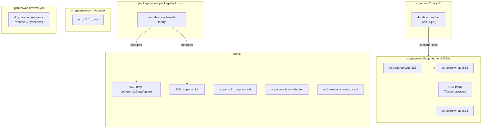

## Summary

Clear all 26 `astro check` typecheck errors across 9 root causes and promote
the CI typecheck job from non-blocking advisory to a blocking gate member.
Shape 2 from the approved analysis: dedupe `google-auth-library` via
`package.json` `overrides`, widen 7 email-component `duration` props to
`number`, fix the `:882` P0 const-reassignment crash, reorder the
`mes-rdvs.astro` error guard, and apply narrow boundary casts with safety
comments at the remaining sites.

## Architecture

### Data flow



### File × Function map

```mermaid
flowchart LR
  subgraph lib["src/lib"]
    google-calendar.ts -->|events.get| GC[pollMeetLink]
    google-calendar.ts -->|events.insert| UPSERT[upsertEvent]
    stripe.ts --> STRIPE[stripe singleton]
    supabase.ts --> SB[supabase/supabaseAdmin]
    auth.server.ts --> AUTH[betterAuth hooks.before]
  end
  subgraph pages["src/pages"]
    "appointments/[id].ts" -->|PATCH| PATCH[confirm/decline/cancel/reschedule]
    mes-rdvs.astro --> DASH[admin dashboard SSR]
    "stripe-webhook.ts" --> WH[status sync]
  end
  subgraph mail["src/emails"]
    EC["7 components<br/>duration prop"]
  end
  PATCH -->|renders| EC
  WH -->|renders| EC
  DASH -->|fetches| SB
```

## Bootstrap Context

From the approved analysis — empirically verified root-cause map:

- **26 errors, 9 root causes** (verified on clean `npm ci`).
- **`overrides` clears 6** (verified: 26→20 post-override).
- **`:662` is independent of dedup** (verified: persists post-override; `conferenceDataVersion` not in `Params$Resource$Events$Get`).
- **`:882` is a real P0 crash** (const reassignment → TypeError in reschedule-accept flow).
- **`:213` is dead code** (inside narrowed `=== 'video'` branch).

## Agents

| Agent | Task count | Files |
|-------|-----------|-------|
| backend-dev-A | 4 | `appointments/[id].ts`, `google-calendar.ts`, `stripe.ts`, `mes-rdvs.astro` |
| backend-dev-B | 3 | `supabase.ts`, `auth.server.ts` |
| devops-A | 3 | `package.json`, `package-lock.json`, `ci.yml` |
| tester-A | 1 | full typecheck verification |

## Wave Structure

3 waves, max 3 parallel agents. Elapsed ~3 sequential passes vs ~5 fully serial.

| Wave | Trigger | Agents | Tasks |
|------|---------|--------|-------|
| 1 | start | 3 ∥ | devops-A: T1 (overrides+lockfile) · backend-dev-B: T4 (supabase ws) · backend-dev-B: T5 (auth cast) |
| 2 | Wave 1 done | 3 ∥ | backend-dev-A: T2 (email props ×7) · backend-dev-A: T3 (appts :213/:823/:882) · backend-dev-A: T6 (google-calendar :662/:800) · backend-dev-A: T7 (stripe :21) · backend-dev-B: T4-cont (mes-rdvs reorder) |
| 3 | Wave 2 done | 1 | tester-A: T8 (full typecheck exit 0) · devops-A: T9 (CI gate flip) · devops-A: T10 (dedup assertion step) |

### Budget — per task

| Task | Items | Class | Est. ops | Split? |
|------|-------|-------|----------|--------|
| T1 overrides+lockfile | 2 | bounded | 3 | — |
| T2 email props ×7 | 7 | trivial | 2 | — |
| T3 appts code fixes | 4 | bounded | 3 | — |
| T4 supabase ws + mes-rdvs | 2 | judgmental | 5 | — |
| T5 auth cast | 1 | bounded | 2 | — |
| T6 google-calendar | 2 | bounded | 3 | — |
| T7 stripe pin | 1 | trivial | 1 | — |
| T8 typecheck verify | 1 | bounded | 2 | — |
| T9 CI gate flip | 3 | bounded | 3 | — |
| T10 dedup assertion | 1 | bounded | 2 | — |

**Total estimated ops: 26** (well under all caps)

### Budget — per agent instance

| Instance | Tasks | Σ ops | Subjects | Split? |
|----------|-------|-------|----------|--------|
| backend-dev-A | T2, T3, T6, T7 | 9 | appts, calendar, stripe | — |
| backend-dev-B | T4, T5 | 7 | supabase, auth | — |
| devops-A | T1, T9, T10 | 8 | deps, ci | — |
| tester-A | T8 | 2 | typecheck | — |

(All under thresholds: |tasks|≤4, subjects≤2, ops≤50.)

## Consistency Report

- Covered: 12/12 acceptance criteria
- Uncovered: 0
- Untraced: 0
- Exemptions: χ (Stripe account-version) is AC #6, tracked as maintainer verification (T7 includes a code comment; verification is manual)

## Micro-Tasks

### Slice S1 — Type-boundary fixes (21 errors)

#### T1 — Add `overrides` + regenerate lockfile `[P]`

- **File:** `package.json`, `package-lock.json`
- **Agent:** devops-A · **Instance:** devops-A · **Subject:** deps
- **Snippet:**
  ```json
  "overrides": {
    "google-auth-library": "10.9.0"
  }
  ```
  Add a comment in package.json noting the override must be re-evaluated on every `googleapis` bump.
- **Verify:** `npm install` succeeds; `npm ls google-auth-library --all` shows exactly one install path.
- **Expected:** single `google-auth-library@10.9.0`.
- **Est:** 3 min · **Difficulty:** 2 · **Phase:** GREEN · **Slice:** V1
- **Spec trace:** AC#4, AC#5 · **Err cleared:** #2 (×3) + #6a (×3) = 6

#### T2 — Widen 7 email-component `duration` props to `number` `[P]`

- **Files:** `src/emails/AppointmentConfirmed.tsx`, `AppointmentReminder.tsx`, `AppointmentRequestNotification.tsx`, `AppointmentRequestReceived.tsx`, `AppointmentRescheduled.tsx`, `PaymentReceivedNotification.tsx`, `PaymentRequest.tsx`
- **Agent:** backend-dev-A · **Instance:** backend-dev-A · **Subject:** emails
- **Snippet:** change `duration: 60 | 90;` → `duration: number;` (~line 28 in each).
- **Verify:** `npm run typecheck 2>&1 | grep -c "error ts("` drops by 7 (the `duration: number` overload errors at the call sites).
- **Expected:** 7 fewer `ts(2769)` errors.
- **Est:** 4 min · **Difficulty:** 1 · **Phase:** GREEN · **Slice:** V1
- **Spec trace:** AC#1 (partial) · **Err cleared:** #1 (×7)

#### T3 — Appointments `[id].ts` code fixes `[P]`

- **File:** `src/pages/api/appointments/[id].ts`
- **Agent:** backend-dev-A · **Instance:** backend-dev-A · **Subject:** appts
- **Snippets:**
  - **:213** — replace `location: appointment.appointment_mode === 'in-person' ? CABINET_ADDRESS : 'Téléconsultation',` with `location: 'Téléconsultation',` (dead ternary inside narrowed `=== 'video'` branch; in-person handled by sibling branches at :249/:264/:827/:856).
  - **:823** — change `const updatedAppt = updated as Appointment;` to:
    ```ts
    // let, not const: re-bound at :882 after google_calendar_event_id
    // persistence — reschedule-accept sync (see analysis §:882).
    let updatedAppt = updated as unknown as Appointment;
    ```
  - **:882** — change `updatedAppt = refreshedAfterCalendar as Appointment;` to `updatedAppt = refreshedAfterCalendar as unknown as Appointment;`
- **Verify:** `npm run typecheck 2>&1 | grep "appointments/\[id\].ts"` shows 0 errors for :213, :823, :882.
- **Expected:** 4 errors cleared (#3a×2 + #4 + #5).
- **Est:** 3 min · **Difficulty:** 2 · **Phase:** GREEN · **Slice:** V1
- **Spec trace:** AC#7, AC#8 · **Err cleared:** #3a (×2) + #4 + #5 = 4

#### T4 — `mes-rdvs.astro` reorder + `supabase.ts` ws adapter `[P]`

- **Files:** `src/pages/mes-rdvs.astro`, `src/lib/supabase.ts`
- **Agent:** backend-dev-B · **Instance:** backend-dev-B · **Subject:** supabase
- **Snippets:**
  - **mes-rdvs:54** — replace:
    ```ts
    const appointments: Appointment[] = (rows ?? []) as Appointment[];
    if (error) { console.error('[mes-rdvs] Erreur Supabase :', error); }
    ```
    with:
    ```ts
    if (error) { console.error('[mes-rdvs] Erreur Supabase :', error); }
    // Cast applies only on the verified-success branch (empty array on error).
    const appointments: Appointment[] = error ? [] : (rows as Appointment[]);
    ```
  - **supabase.ts:60,81** — wrap the realtime transport in a small typed adapter bridging `@types/ws` ↔ `@supabase/realtime-js`, or apply a boundary cast with a comment pinning the conflict:
    ```ts
    // @types/ws (address: string|URL) vs @supabase/realtime-js WebSocketLikeConstructor
    // (address: null) shape skew — bridge at this boundary.
    ...(realtimeTransport ? { realtime: { transport: realtimeTransport as unknown as never } } : {}),
    ```
    (Prefer the adapter if <5 lines; else the cast + comment.)
- **Verify:** `npm run typecheck 2>&1 | grep -E "mes-rdvs|supabase.ts"` shows 0 errors.
- **Expected:** 3 errors cleared (#3b + #8×2).
- **Est:** 5 min · **Difficulty:** 3 · **Phase:** GREEN · **Slice:** V1
- **Spec trace:** AC#9, AC#1 (partial) · **Err cleared:** #3b + #8 (×2) = 3

#### T5 — `auth.server.ts` context cast `[P]`

- **File:** `src/lib/auth.server.ts`
- **Agent:** backend-dev-B · **Instance:** backend-dev-B · **Subject:** auth
- **Snippet:** at the `hooks.before` callback (:87), narrow-cast `context` to access `.path` and `.context.adapter`:
  ```ts
  hooks: {
    before: async (context) => {
      // better-auth v1.6.11: MiddlewareInputContext does not expose .path/.context
      // on the public type, but the runtime fields exist (see hook signature docs).
      const ctx = context as unknown as {
        path: string;
        context: { adapter: { findMany: (opts: { model: string; limit: number }) => Promise<unknown[]> } };
      };
      if (ctx.path !== '/sign-up/email') return;
      // ... use ctx.context.adapter.findMany(...)
    },
  },
  ```
- **Verify:** `npm run typecheck 2>&1 | grep "auth.server.ts"` shows 0 errors at :89, :95.
- **Expected:** 2 errors cleared (#9).
- **Est:** 2 min · **Difficulty:** 2 · **Phase:** GREEN · **Slice:** V1
- **Spec trace:** AC#1 (partial) · **Err cleared:** #9 (×2)

#### T6 — `google-calendar.ts` `:662` + `:800` `[P]`

- **File:** `src/lib/google-calendar.ts`
- **Agent:** backend-dev-A · **Instance:** backend-dev-A · **Subject:** calendar
- **Snippets:**
  - **:662** — remove `conferenceDataVersion: 1,` from the `calendar.events.get({...})` call (this property doesn't exist in `Params$Resource$Events$Get` — it belongs on `insert`/`patch`, not `get`). This resolves the overload and cascades to clear :667 (`.data` becomes valid).
  - **:800** — narrow the `Schema$Event` argument to `extractEventResult` via a property pick:
    ```ts
    const result = extractEventResult({
      id: response.data.id,
      conferenceData: response.data.conferenceData,
      hangoutLink: response.data.hangoutLink,
    });
    ```
- **Verify:** `npm run typecheck 2>&1 | grep "google-calendar.ts"` shows 0 errors at :662, :667, :800.
- **Expected:** 3 errors cleared (#6b).
- **Est:** 3 min · **Difficulty:** 3 · **Phase:** GREEN · **Slice:** V1
- **Spec trace:** AC#1 (partial) · **Err cleared:** #6b (×3)

#### T7 — `stripe.ts` version pin `[P]`

- **File:** `src/lib/stripe.ts`
- **Agent:** backend-dev-A · **Instance:** backend-dev-A · **Subject:** stripe
- **Snippet:** change `apiVersion: '2024-12-18.acacia' as Stripe.LatestApiVersion,` to `apiVersion: '2024-12-18.acacia',` and add a comment:
  ```ts
  // Verify this matches the live Stripe account's pinned API version
  // (Dashboard → Developers → API version). Stripe pins to the account
  // version regardless of the SDK value.
  ```
- **Verify:** `npm run typecheck 2>&1 | grep "stripe.ts"` shows 0 errors at :21.
- **Expected:** 1 error cleared (#7).
- **Est:** 1 min · **Difficulty:** 1 · **Phase:** GREEN · **Slice:** V1
- **Spec trace:** AC#1 (partial), AC#6 (code comment) · **Err cleared:** #7

#### RED-GATE-S1 — Full typecheck exit 0

- **Agent:** tester-A · **Instance:** tester-A · **Subject:** typecheck
- **Verify:** `npm run typecheck` exits 0 with "Result: 0 errors, 0 warnings".
- **Phase:** RED-GATE (blocks Slice S3 until green).
- **Slice:** V1

### Slice S2 — absorbed into S1

The spec's S2 (code fixes) is mechanically the same wave as S1's type-boundary
fixes — all target exit 0 together. No separate slice; RED-GATE-S1 is the gate.

### Slice S3 — CI gate

#### T9 — CI gate flip

- **File:** `.github/workflows/ci.yml`
- **Agent:** devops-A · **Instance:** devops-A · **Subject:** ci
- **Snippets:**
  - Remove `continue-on-error: true` from the typecheck step.
  - Rename `typecheck-advisory:` → `typecheck:`.
  - Update comment block at ci.yml:18-20 ("Three of the four quality gates" → "All four quality gates").
  - Update comment block at ci.yml:42-45 (remove the `#68` advisory language, state typecheck is now blocking).
- **Verify:** `grep "typecheck-advisory" .github/workflows/ci.yml` = 0 matches; `grep "continue-on-error" .github/workflows/ci.yml` = 0 matches; `grep "Three of the four" .github/workflows/ci.yml` = 0 matches.
- **Expected:** job renamed, both comment blocks updated.
- **Est:** 3 min · **Difficulty:** 2 · **Phase:** GREEN · **Slice:** V3
- **Spec trace:** AC#2, AC#3

#### T10 — Dedup assertion CI step

- **File:** `.github/workflows/ci.yml`
- **Agent:** devops-A · **Instance:** devops-A · **Subject:** ci
- **Snippet:** add a new step (in the `build` job, after Install) that asserts a single `google-auth-library` copy:
  ```yaml
  - name: Verify google-auth-library dedupe
    run: |
      count=$(npm ls google-auth-library --all --json | jq '[.. | objects | select(has("google-auth-library"))] | length')
      if [ "$count" -ne 1 ]; then
        echo "Expected 1 google-auth-library copy, found $count"
        npm ls google-auth-library --all
        exit 1
      fi
  ```
- **Verify:** the step exists and would fail on a duplicate (can test locally by temporarily reverting the override).
- **Expected:** CI step present.
- **Est:** 2 min · **Difficulty:** 2 · **Phase:** GREEN · **Slice:** V3
- **Spec trace:** AC#5

## Task Seeding Blueprint

<!-- Used by /implement to seed TaskCreate calls on session start.
     Format: T{n} | agent-instance | blockedBy | subject
     blockedBy refs T-numbers within this list (not session task IDs).
     Agent instances are named (tester-A/B, backend-dev-A/B/C, devops-A/B)
     so parallel tasks map to distinct spawned agents.
     Seed in wave order; within a wave all rows are parallel (∥). -->

### Wave 1 — no deps, 3 agents ∥

| Task | Agent instance | blockedBy | Subject |
|------|---------------|-----------|---------|
| T1 | devops-A | — | deps |
| T4 | backend-dev-B | — | supabase |
| T5 | backend-dev-B | — | auth |

### Wave 2 — after Wave 1 (T1 must complete for googleapis cascade), 2 agents ∥

| Task | Agent instance | blockedBy | Subject |
|------|---------------|-----------|---------|
| T2 | backend-dev-A | — | emails |
| T3 | backend-dev-A | — | appts |
| T6 | backend-dev-A | T1 | calendar |
| T7 | backend-dev-A | — | stripe |

### Wave 3 — after Wave 2 (RED-GATE-S1 must pass), 2 agents ∥

| Task | Agent instance | blockedBy | Subject |
|------|---------------|-----------|---------|
| RED-GATE-S1 / T8 | tester-A | T1,T2,T3,T4,T5,T6,T7 | typecheck |
| T9 | devops-A | T8 | ci |
| T10 | devops-A | T1 | ci |

## Task IDs

<!-- Generated by /plan. Used by /implement to resume tasks on session restart.
     Local session task IDs (TodoWrite) — re-seed on new session via the blueprint above. -->
- T1: overrides + lockfile — deps
- T2: email props ×7 — emails
- T3: appts :213/:823/:882 — appts
- T4: mes-rdvs reorder + supabase ws — supabase
- T5: auth.server.ts context cast — auth
- T6: google-calendar :662/:800 — calendar
- T7: stripe.ts version pin — stripe
- T8/RED-GATE-S1: full typecheck exit 0 — typecheck
- T9: CI gate flip + rename — ci
- T10: dedup assertion step — ci
