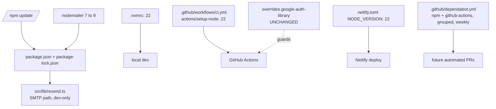

## Summary

Four independent, sequential edits bound to the approved spec: (1) run
`npm update` for the 9 in-range packages, (2) bump `nodemailer` 7 → 9 and
verify the SMTP call site in `src/lib/resend.ts`, (3) pin Node 22 in all
three config locations, (4) add `.github/dependabot.yml`. A final
verification task runs the full quality-gate triplet on Node 22 and re-checks
`npm audit` for 0 high. No framework majors; no architecture decisions.

This is mechanical dependency/infra work — single agent, serial waves. The
only judgmental step is verifying whether nodemailer 9 requires any code
change in `resend.ts` (pre-checked: usage is `createTransport` +
`sendMail`, both stable across 7 → 9, so the expected outcome is no code
change).

## Architecture

### Data flow



### File × Change map

| File | Change | AC |
|------|--------|----|
| `package.json` | `nodemailer: ^9.0.3`; `overrides` unchanged | AC2, AC6 |
| `package-lock.json` | regenerated by `npm update` + `npm install` | AC1 |
| `src/lib/resend.ts` | unchanged (expected) OR minimal adaptation | AC3 |
| `.nvmrc` | `20` → `22` | AC4 |
| `.github/workflows/ci.yml` | `node-version: 20` → `22` (setup-node step) | AC4 |
| `netlify.toml` | `NODE_VERSION = "20"` → `"22"` | AC4 |
| `.github/dependabot.yml` | NEW — npm + github-actions, grouped, weekly | AC5 |

## Bootstrap Context

From the approved frame + spec — empirically verified at investigation time:

- **nodemailer usage is minimal:** `src/lib/resend.ts:29-31` (`createTransport({host,port,secure:false})`) and `:218` (`sendMail({from,to,bcc,subject,html,headers,replyTo})`). Both are core stable APIs; no `jsonTransport`, no `disableFileAccess`/`disableUrlAccess` toggles (the CVEs touching those options are not exercised here, but the bump still clears them transitively).
- **Node pin is in exactly three places:** `.nvmrc`, CI `actions/setup-node`, `netlify.toml NODE_VERSION`.
- **No Dependabot config exists** — `.github/dependabot.yml` is a new file.
- **`overrides.google-auth-library` is guarded by a CI step** (`Verify google-auth-library dedupe`) — if `npm update` re-splits the dedupe, CI fails loudly. No manual guard needed beyond running the build.
- **`@astrojs/netlify` 6.x supports Node 22** — no adapter bump needed for the Node pin.

## Agents

| Agent | Task count | Files |
|-------|-----------|-------|
| devops-A | 5 | `package.json`, `package-lock.json`, `.nvmrc`, `ci.yml`, `netlify.toml`, `.github/dependabot.yml` |
| backend-dev-A | 1 | `src/lib/resend.ts` (verify only) |
| tester-A | 1 | full quality-gate verification |

## Wave Structure

2 waves, mostly serial (one agent). Wave 2 is verification only.

| Wave | Trigger | Agents | Tasks |
|------|---------|--------|-------|
| 1 | start | devops-A | T1 (`npm update`) · T2 (nodemailer 9 + verify resend.ts) · T3 (Node 22 × 3) · T4 (Dependabot) |
| 2 | Wave 1 done | tester-A | T5 (lint + test + build + audit on Node 22) |

### Budget — per task

| Task | Items | Class | Est. ops | Split? |
|------|-------|-------|----------|--------|
| T1 npm update | 1 cmd | trivial | 1 | — |
| T2 nodemailer 9 + verify | 2 | judgmental | 3 | — |
| T3 Node 22 × 3 files | 3 | trivial | 2 | — |
| T4 Dependabot config | 1 | bounded | 2 | — |
| T5 verify gates | 4 | bounded | 3 | — |

**Total estimated ops: 11** (well under all caps)

### Budget — per agent instance

| Instance | Tasks | Σ ops | Subjects | Split? |
|----------|-------|-------|----------|--------|
| devops-A | T1, T2, T3, T4 | 8 | deps, infra | — |
| tester-A | T5 | 3 | gates | — |

## Consistency Report

- Covered: 8/8 acceptance criteria
- Uncovered: 0
- Untraced: 0
- Exemptions: none — every AC is directly verifiable by a command.

## Micro-Tasks

### Slice S1 — Dependency + infra changes

#### T1 — Run `npm update` for semver-range bumps `[P]`

- **Files:** `package.json`, `package-lock.json`
- **Agent:** devops-A · **Instance:** devops-A · **Subject:** deps
- **Steps:**
  ```bash
  npm update
  ```
- **Verify:** `npm outdated` shows only the expected framework-major gaps (astro 7, react 19, typescript 7, tailwind 4, eslint 10, lucide-react 1, nodemailer 9 until T2). The 9 in-range packages now sit at `wanted`:
  - `@supabase/supabase-js` 2.110.3 · `@react-email/render` 2.1.0 · `resend` 6.17.2 · `stripe` 22.3.1 · `terser` 5.49.0 · `postcss` 8.5.19 · `eslint` 9.39.5 · `typescript-eslint` 8.64.0 · `vitest` 4.1.10
- **Guard:** confirm `npm ls google-auth-library --all` still resolves a single distinct version (the #86 CI step will also enforce this).
- **Expected:** lockfile diff shows only semver-compatible bumps; no unintended major lands.
- **Est:** 2 min · **Difficulty:** 1 · **Phase:** GREEN · **Slice:** V1
- **Spec trace:** AC1

#### T2 — Bump nodemailer 7 → 9 + verify resend.ts `[P]`

- **Files:** `package.json`, `package-lock.json`, `src/lib/resend.ts`
- **Agent:** devops-A (bump) + backend-dev-A (verify) · **Instance:** devops-A · **Subject:** deps/email
- **Steps:**
  ```bash
  npm install nodemailer@^9.0.3
  npm install -D @types/nodemailer@latest
  ```
  Then read the nodemailer 9 release notes for any breaking change affecting `createTransport({host,port,secure})` or `sendMail({from,to,bcc,subject,html,headers,replyTo})`.
- **Verify:**
  - `node -p "require('./package.json').dependencies.nodemailer"` → `^9.0.3`
  - `npm audit` shows 0 high advisories attributable to nodemailer
  - `npm run build` succeeds (resend.ts compiles)
- **Expected outcome:** `src/lib/resend.ts` needs **no code change** — both call sites use stable core APIs. If the CHANGELOG flags a breaking change, apply the minimal adaptation at `:29-31` / `:218` and cite the entry in a comment. The TS types (`@types/nodemailer`) must track the 9.x runtime.
- **Note:** `@types/nodemailer` is currently at `^6.4.23` (devDep) — bump to latest 7.x line to match nodemailer 9 runtime.
- **Est:** 5 min · **Difficulty:** 2 · **Phase:** GREEN · **Slice:** V1
- **Spec trace:** AC2, AC3

#### T3 — Pin Node 22 in `.nvmrc`, CI, `netlify.toml` `[P]`

- **Files:** `.nvmrc`, `.github/workflows/ci.yml`, `netlify.toml`
- **Agent:** devops-A · **Instance:** devops-A · **Subject:** infra
- **Steps:**
  - `.nvmrc`: replace `20` with `22`
  - `.github/workflows/ci.yml`: in the `Setup Node` step, `node-version: 20` → `node-version: 22`
  - `netlify.toml`: `NODE_VERSION = "20"` → `NODE_VERSION = "22"`
- **Verify:**
  ```bash
  test "$(cat .nvmrc)" = "22"
  grep -q "node-version: 22" .github/workflows/ci.yml
  grep -q 'NODE_VERSION = "22"' netlify.toml
  ```
- **Expected:** all three commands exit 0.
- **Est:** 2 min · **Difficulty:** 1 · **Phase:** GREEN · **Slice:** V1
- **Spec trace:** AC4

#### T4 — Create `.github/dependabot.yml` `[P]`

- **File:** `.github/dependabot.yml` (NEW)
- **Agent:** devops-A · **Instance:** devops-A · **Subject:** infra
- **Snippet:**
  ```yaml
  version: 2
  updates:
    # npm dependencies — grouped, weekly.
    # Groups keep dev/prod separate and bundle framework majors so a single
    # PR carries the coordinated bump (mitigates the React 19 / framer-motion
    # 12 split that motivated this issue's phased strategy).
    - package-ecosystem: npm
      directory: "/"
      schedule:
        interval: weekly
        day: monday
      open-pull-requests-limit: 10
      groups:
        dev-dependencies:
          dependency-type: development
        production-dependencies:
          dependency-type: production
      commit-message:
        prefix: "chore(deps)"

    # GitHub Actions versions — keep setup-node/checkout current.
    - package-ecosystem: github-actions
      directory: "/"
      schedule:
        interval: weekly
        day: monday
      commit-message:
        prefix: "chore(ci)"
  ```
- **Verify:** `node -e "require('js-yaml').load(require('fs').readFileSync('.github/dependabot.yml','utf8')); console.log('valid yaml')"` (or `python3 -c "import yaml,sys; yaml.safe_load(open('.github/dependabot.yml')); print('valid yaml')"`). Sanity-check: two `updates` entries, both `weekly`.
- **Expected:** parses as valid YAML with 2 update blocks.
- **Est:** 3 min · **Difficulty:** 1 · **Phase:** GREEN · **Slice:** V1
- **Spec trace:** AC5

### Slice S2 — Verification

#### T5 — Run full quality gates + audit on Node 22 `[P]`

- **Files:** none (verification only)
- **Agent:** tester-A · **Instance:** tester-A · **Subject:** gates
- **Steps (all must pass):**
  ```bash
  node -v                   # confirm 22.x active
  npm ci                    # clean reinstall from updated lockfile
  npm run lint
  npm run test
  npm run build
  npm audit | grep -i high  # expect no nodemailer/high lines
  node -p "require('./package.json').overrides"  # { 'google-auth-library': '10.9.0' }
  ```
- **Verify:**
  - `lint`, `test`, `build` each exit 0
  - `npm audit` shows **0 high** (moderate/low remaining must map to out-of-scope framework majors)
  - `overrides` block prints `{ 'google-auth-library': '10.9.0' }`
- **Expected:** green triplet + clean HIGH audit + overrides intact.
- **Est:** 4 min · **Difficulty:** 2 · **Phase:** GREEN · **Slice:** V2
- **Spec trace:** AC6, AC7, AC8

## Task IDs

- T1 → npm-update
- T2 → nodemailer-9
- T3 → node-22-pin
- T4 → dependabot
- T5 → verify-gates

## Notes

- **Commit granularity:** two logical commits — (a) `chore(deps): npm update + nodemailer 9 (HIGH CVE)`, (b) `chore(infra): Node 22 + Dependabot`. Keeps the diff reviewable and the security fix attributable.
- **PR description** must list the deferred majors (React 19, astro 7, tailwind 4, TS 7, eslint 10, lucide-react 1) so reviewers see the remaining `npm outdated` entries are intentional.
- **No `npm audit fix --force`** — it would jump straight to the framework majors we explicitly deferred.
