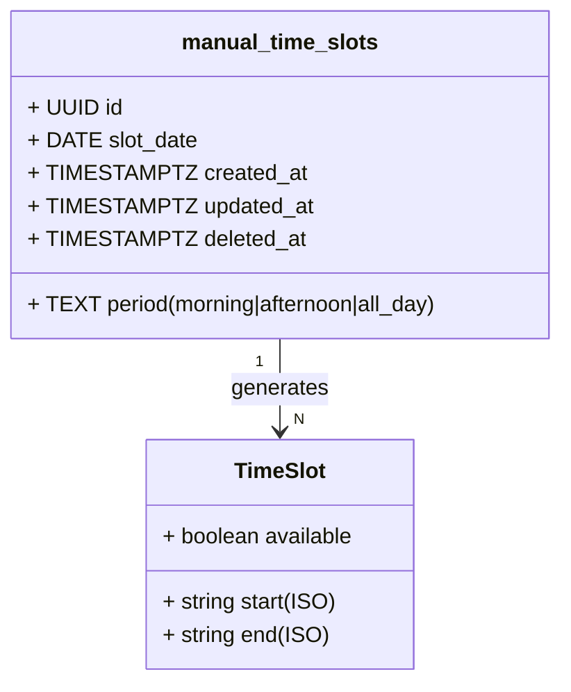

## Context

**Promoted from:** [Gestion manuelle des plages horaires — Analyse technique](../analyses/58-gestion-manuelle-plages-horaires-analysis.mdx)

Issue #58: "Actuellement, uniquement les mercredis sont éligibles à la prise de rendez-vous au cabinet."

## Goal

Permettre à la thérapeute d'ajouter/modifier/supprimer manuellement des plages horaires éligibles pour les rendez-vous au cabinet, au-delà du mercredi fixe actuel.

## Users

- **Primary:** Psychopraticienne (admin) — gestion via `/mes-rdvs`
- **Secondary:** Patients — bénéficient de créneaux supplémentaires lors booking

## Expected Behavior

### Workflow Admin

1. Thérapeute se connecte → accède `/mes-rdvs`
2. Section "Gestion des plages horaires" visible
3. Clique "Ajouter une plage" → modal formulaire
4. Sélectionne date + période (matin/après-midi/journée)
5. Valide → slot créé en DB, cache invalidé
6. Liste des slots mis à jour (confirmé visuellement)

### Workflow Booking

1. Patient sélectionne "Présentiel" → dureé 60/90min
2. API `/api/availability` appelle `generateCandidateSlots()`
3. Slots manuels (Supabase) fusionnés avec mercredi fixe
4. Google Calendar Freebusy filtre les busy
5. Patient voit créneaux disponibles (y compris slots manuels)

## Data Model & Consumers

### Data Structure (classDiagram)



### Consumer Map (flowchart)

```mermaid
flowchart TD
    subgraph Admin
        UI[TimeSlotManager.tsx]
    end

    subgraph API
        CRUD[time-slots API]
    end

    subgraph DB
        SLOTS[(manual_time_slots)]
        CACHE[(cache_keys)]
    end

    subgraph Booking
        AVAIL[availability.ts]
        GEN[generateCandidateSlots]
        GC[Google Calendar]
    end

    UI -->|POST/GET/PATCH/DELETE| CRUD
    CRUD -->|CRUD| SLOTS
    CRUD -->|invalidate| CACHE

    AVAIL -->|call| GEN
    GEN -->|fetch| SLOTS
    GEN -->|freebusy| GC
    GEN -->|return| AVAIL

    SLOTS -.|read| GEN
    CACHE -.|clear| CRUD
```

### Consumer Summary

| Consumer | Fields Consumed | When | Status |
|----------|------------------|------|--------|
| TimeSlotManager UI | id, slot_date, period, created_at, updated_at | Admin CRUD | This issue |
| time-slots API | All fields | Admin operations | This issue |
| generateCandidateSlots | slot_date, period | Booking availability query | This issue |
| Cache invalidation | prefix match 'availability:%' | After CRUD | This issue |

## Breadboard

### UI Affordances

| ID | Element | Event | Handler | Data |
|----|---------|-------|---------|------|
| U1 | Bouton "Ajouter plage" | Click | openModal() | — |
| U2 | Date picker | Change | validateDate() | Date |
| U3 | Select période | Change | setPeriod() | 'morning'\|'afternoon'\|'all_day' |
| U4 | Bouton Valider | Click | submitSlot() | {date, period} |
| U5 | Liste slots | Mount | fetchSlots() | Slot[] |
| U6 | Bouton modifier slot | Click | openEditModal(id) | Slot |
| U7 | Bouton supprimer | Click | confirmDelete(id) | id |
| U8 | Modal confirm delete | Confirm | deleteSlot(id) | — |

### API Endpoints

| ID | Endpoint | Method | Handler | Data |
|----|----------|--------|---------|------|
| A1 | /api/admin/time-slots | GET | listSlots() | Slot[] |
| A2 | /api/admin/time-slots | POST | createSlot(data) | Slot |
| A3 | /api/admin/time-slots/[id] | PATCH | updateSlot(id, data) | Slot |
| A4 | /api/admin/time-slots/[id] | DELETE | deleteSlot(id) | — |

### Data Layer

| ID | Function | Called By | Returns |
|----|----------|-----------|---------|
| D1 | fetchManualSlots() | A1, generateCandidateSlots | Slot[] |
| D2 | createManualSlot() | A2 | Slot |
| D3 | updateManualSlot() | A3 | Slot |
| D4 | deleteManualSlot() | A4 | — |
| D5 | invalidateAvailabilityCache() | A2, A3, A4 | — |

## Slices

| Slice | Description | Demo | Depends |
|-------|-------------|------|---------|
| 1. DB + Types | Table manual_time_slots + migration + types | `psql \d manual_time_slots` | — |
| 2. API CRUD | Endpoints GET/POST/PATCH/DELETE + functions | Postman/curl test | Slice 1 |
| 3. UI Admin | TimeSlotManager component + modal + liste | `/mes-rdvs` visible UI | Slice 2 |
| 4. Integration | generateCandidateSlots modifié + cache invalidation | Booking flow shows new slots | Slice 1, 2, 3 |

## Success Criteria

- [ ] Interface permettant de sélectionner un jour et une période (matin/après-midi/journée)
- [ ] Liste des plages horaires manuelles existantes visible dans `/mes-rdvs`
- [ ] Actions d'édition et de suppression fonctionnelles
- [ ] Les plages ajoutées sont prises en compte dans le système de prise de RDV (availability API)
- [ ] Table `manual_time_slots` créée avec RLS policy admin-only
- [ ] Cache invalidation déclenchée après CRUD
- [ ] UI accessible (WCAG 2.1 AA) : contrast, ARIA labels, keyboard nav
- [ ] Edge cases traités (doublons, dates passées, conflit RDV actifs)

## Edge Cases

| Cas | Traitement |
|-----|------------|
| Doublon date+period | Return 409 Conflict, message utilisateur |
| Date dans le passé | Validation UI + API, erreur "date doit être future" |
| Suppression slot avec RDV confirmés | Warning: "N RDV utilisent ce slot", confirm obligatoire |
| Supabase down | Degrade gracieusement: UI montre erreur, retry possible |
| Cache invalidation fail | Log warning, non-bloquant (stale cache acceptable court terme) |

## Constraints

- **Tech:** Astro 5 statique, Supabase, React Islands (`client:load`)
- **Time:** 1 semaine
- **Accessibilité:** WCAG 2.1 AA obligatoire
- **Performance:** Islands Architecture, minimiser JS

## Out of Scope

- Gestion automatique/récurrente des plages
- Synchronisation agenda externe
- Interface patient (seulement admin)
