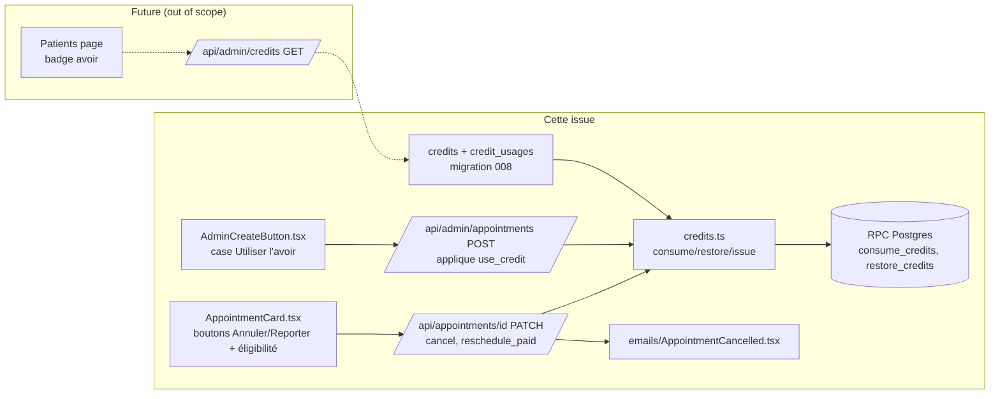

## Context

Promu depuis `artifacts/analyses/63-admin-annulation-avoir-credit-rdv-analysis.mdx`
(shape retenue : **Ledger** `credits` + `credit_usages`). Frame approuvé :
`artifacts/frames/63-admin-annulation-avoir-credit-rdv-frame.mdx`.

Décisions verrouillées en analyse : D1 (statut payé = `payment_received`), D2 (solde d'avoir
visible admin sur Patients + création), D3 (`credit_usages` = 1 ligne/tranche FIFO),
D4 (`credit_applied` colonne séparée ; montant Stripe = `final_price − credit_applied` ;
video montant=0 → `payment_received` direct). Atomicité FIFO via RPC `SECURITY DEFINER`.

## Goal

Permettre à la thérapeute d'**annuler ou reporter tout RDV** dans la fenêtre d'éligibilité,
d'émettre un **avoir interne** sur annulation d'un RDV payé, et de **réutiliser** cet avoir
lors d'une création manuelle — sans jamais appeler `stripe.refunds.create`.

## Users

- **Thérapeute (admin)** — utilisatrice finale de `/mes-rdvs/` et `/api/admin/*`. Voit les
  avoirs, les applique en création manuelle, annule/reporte les RDV.
- **Patient** — reçoit uniquement un email d'annulation (mention de l'avoir éventuel). N'a
  **aucune UI** pour consulter/utiliser un avoir.

## Expected Behavior

### Annulation

1. Sur la carte d'un RDV éligible (`scheduled_at ≥ début de la veille`, statut ≠
   `declined`/`cancelled`), un bouton **« Annuler »** (rouge) s'affiche à côté des actions
   existantes.
2. Un modal demande un message optionnel au patient, puis confirme.
3. Le statut passe à `cancelled`. L'événement Google Calendar lié est supprimé.
4. **Si le RDV a consommé un avoir** (`credit_applied > 0`) → l'avoir est **restitué**
   (restauration des `remaining` sources, suppression des `credit_usages`).
5. **Si le RDV est `payment_received`** → un **nouvel avoir** de `final_price − credit_applied`
   est créé (montant = cash réellement encaissé). Si ce montant est 0 (RDV 100% financé par
   avoir), aucun avoir n'est créé.
6. Le patient reçoit un email `AppointmentCancelled` : notification simple (pas d'avoir) OU
   mention d'avoir (montant, « valide en permanence », « contactez la thérapeute pour
   l'utiliser ») — jamais le mot « remboursement ».

### Report d'un RDV vidéo déjà payé (`payment_received`)

1. Le bouton **« Reporter »** déclenche un **move direct admin** : l'admin choisit un nouveau
   créneau, la date est mise à jour immédiatement, le paiement est **conservé**
   (`credit_applied` et `final_price` inchangés).
2. Meet/Calendar sont mis à jour via `updateCalendarEvent`.
3. **Aucun lien Stripe régénéré, aucun email de demande de paiement, aucune re-accept patient.**
4. Le patient reçoit un email de notification du nouveau créneau.

### Report d'un RDV non payé (`pending`/`payment_pending`)

Comportement inchangé : proposition au patient via `accept_reschedule` + lien signé.

### Création manuelle avec avoir

1. Dans `AdminCreateButton`, après saisie d'un `patient_email` disposant d'un avoir, une case
   **« Utiliser l'avoir (XX€ disponibles) »** apparaît.
2. Si cochée, `credit_applied` = min(avoir disponible, `final_price`). Le montant dû =
   `final_price − credit_applied`.
3. **Si montant dû = 0** → statut `payment_received` direct (pour `video`) / `confirmed`
   (pour `in-person`), aucun lien Stripe, Meet/Calendar générés.
4. **Si montant dû > 0 et mode `video`** → lien Stripe pour le solde restant.
5. Consommation FIFO atomique via RPC, reliquat conservé sur les avoirs sources.

## Data Model & Consumers

```mermaid
classDiagram
  class appointments {
    UUID id PK
    TEXT patient_email
    TEXT appointment_mode
    INTEGER base_price
    INTEGER discount
    INTEGER final_price
    INTEGER credit_applied
    TEXT status
    TIMESTAMPTZ scheduled_at
    TEXT google_calendar_event_id
  }
  class credits {
    UUID id PK
    TEXT patient_email
    UUID source_appointment_id FK
    INTEGER amount
    INTEGER remaining
    TEXT reason
    TIMESTAMPTZ created_at
    TIMESTAMPTZ updated_at
  }
  class credit_usages {
    UUID id PK
    UUID credit_id FK
    UUID appointment_id FK
    INTEGER amount
    TIMESTAMPTZ created_at
  }
  credits ||--o{ credit_usages : "consumed by"
  appointments ||--o| credits : "source of"
  appointments ||--o{ credit_usages : "consumer"
```



| Consommateur | Champs consommés | Quand | Statut |
|---|---|---|:---:|
| `AppointmentCard` (admin) | `scheduled_at`, `status`, `credit_applied` | rendu boutons + affichage | cette issue |
| `AdminCreateButton` (admin) | solde avoir par `patient_email` | création manuelle | cette issue |
| `PatientList` (admin) | solde avoir par email | badge info patient | future* |
| `[id].ts` PATCH `cancel` | `status`, `credit_applied`, `final_price`, `payment_received` | annulation | cette issue |
| `admin/appointments/index.ts` POST | solde avoir, `credit_applied` | création avec avoir | cette issue |

*Note : D2 du frame stipulait un badge Patients. En raffinant, le **minimum viable** est la
case dans `AdminCreateButton` (requis pour le critère C). Le badge Patients est reporté en
future pour limiter le scope ; l'endpoint `GET /api/admin/credits` est inclus pour le servir
ultérieurement et pour permettre à la case d'afficher le montant.

## Breadboard

### UI Affordances (admin)

| ID | Élément | Handler | Endpoint | Condition |
|---|---|---|---|---|
| U1 | Bouton « Annuler » | `handleCancel` | PATCH `cancel` | éligible (E) ∧ status ∉ {declined, cancelled} |
| U2 | Modal « Annuler » (msg optionnel) | `handleCancel` | PATCH `cancel` | U1 cliqué |
| U3 | Bouton « Reporter » (branche payée) | `handleReschedulePaid` | PATCH `reschedule_paid` | éligible ∧ status = `payment_received` ∧ mode `video` |
| U4 | Bouton « Reporter » (branche impayée) | `handleReschedule` (existant) | PATCH `reschedule` | éligible ∧ status ∈ {pending, payment_pending} |
| U5 | Case « Utiliser l'avoir (XX€) » | `handleSubmit` | POST admin | avoir dispo > 0 pour l'email saisi |

### API Affordances

| ID | Endpoint | Action | Effet |
|---|---|---|---|
| N1 | PATCH `/api/appointments/[id]` | `cancel` | status→cancelled, delete GCal, restore+issue credit, email |
| N2 | PATCH `/api/appointments/[id]` | `reschedule_paid` | move direct (video payé), update Meet/Calendar, email notif |
| N3 | POST `/api/admin/appointments` | (existante) + `use_credit` | consomme FIFO, ajuste montant Stripe/statut |
| N4 | GET `/api/admin/credits?email=` | — | solde + historique (sert U5 montant + future badge) |

### Data Affordances (lib `credits.ts`)

| ID | Fonction | Effet | Atomicité |
|---|---|---|---|
| S1 | `getAvailableCredit(email)` | SELECT SUM(remaining) WHERE email | lecture pure |
| S2 | `issueCreditForCancellation(appt)` | INSERT credits (UNIQUE source_appointment_id) | JS pur |
| S3 | `consumeCredits(email, amount, apptId)` | RPC `consume_credits` | RPC atomique |
| S4 | `restoreCredits(apptId)` | RPC `restore_credits` | RPC atomique |

## Slices

| # | Slice | Demo | Dépend |
|---|---|---|:---:|
| 1 | **Migration + lib credits + éligibilité** | `008_credits.sql` appliquée ; `credits.ts` + RPC durcis ; `isCancellableByTherapist` + helper TZ ; tests unitaires consume/restore/issue | — |
| 2 | **Annulation (cancel)** | Bouton U1+U2 sur RDV éligible → status `cancelled`, email, GCal supprimé | 1 |
| 3 | **Avoir auto sur annulation payée** | Annuler un `payment_received` → ligne `credits` créée ; idempotent | 1, 2 |
| 4 | **Restitution sur re-annulation** | Annuler un RDV avec `credit_applied > 0` → avoir restauré | 1, 2 |
| 5 | **Report vidéo payé (direct move)** | Reporter un `payment_received` → move direct, paiement conservé, pas de re-facturation | 1 |
| 6 | **Création manuelle avec avoir** | Case U5 → déduction, montant=0 skip Stripe, reliquat conservé | 1 |
| 7 | **Endpoint GET solde avoir** | `GET /api/admin/credits` (sert U5 montant + future badge Patients) | 1 |

## Success Criteria

### Migration & lib (slice 1)
- [ ] `supabase/migrations/008_credits.sql` crée `credits` + `credit_usages` + colonne `appointments.credit_applied` + RLS service_role-only + trigger `updated_at` + contrainte `UNIQUE(credits.source_appointment_id)`.
- [ ] RPC `consume_credits(p_email TEXT, p_amount INT, p_appointment_id UUID) RETURNS TABLE(credit_id UUID, amount INT)` — atomique, FIFO, `SECURITY DEFINER`, **`REVOKE EXECUTE FROM PUBLIC; GRANT EXECUTE TO service_role;`**, owner = rôle minimal dédié (pas `postgres`).
- [ ] RPC `restore_credits(p_appointment_id UUID) RETURNS void` — même durcissement (SECURITY DEFINER + REVOKE/GRANT).
- [ ] `src/lib/credits.ts` exporte `getAvailableCredit`, `issueCreditForCancellation`, `consumeCredits`, `restoreCredits`.
- [ ] Helper `isCancellableByTherapist(appt)` (`src/lib/appointment-eligibility.ts`) : `scheduled_at ≥ startOfYesterdayParis`, partagé client/serveur ; + `startOfYesterdayParis` (`src/utils/date.ts`).
- [ ] Tests unitaires `tests/credits.test.ts` couvrent : consume exact, consume partiel (reliquat), consume > disponible (échec), restore, double-issue bloqué par UNIQUE, plusieurs NULL `source_appointment_id` autorisés (Postgres).

### Annulation (slice 2)
- [ ] Bouton « Annuler » visible sur RDV éligible (E), caché si status ∈ {declined, cancelled} ou hors fenêtre.
- [ ] Action `cancel` dans PATCH `[id].ts` : status → `cancelled`, supprime l'événement GCal si présent, envoie email `AppointmentCancelled`.
- [ ] L'email d'annulation n'utilise **jamais** le mot « remboursement » (assertion de contenu testée).
- [ ] L'échec d'envoi email ne fait pas échouer l'annulation (non-blocking, loggué).

### Avoir auto (slice 3)
- [ ] Annuler un RDV `payment_received` crée une ligne `credits` (`amount = remaining = final_price − credit_applied`).
- [ ] Annuler un RDV non-`payment_received` ne crée **aucune** ligne `credits`.
- [ ] Un 2e `cancel` sur le même RDV (re-clic) ne crée **pas** de 2e avoir (UNIQUE source_appointment_id).

### Restitution (slice 4)
- [ ] Annuler un RDV avec `credit_applied > 0` restaure les `remaining` sources et supprime les `credit_usages`.
- [ ] La restitution s'exécute **avant** la création d'un éventuel nouvel avoir (ordre : restore puis issue).

### Report vidéo payé (slice 5)
- [ ] `reschedule_paid` met à jour `scheduled_at` sans changer status/prix/stripe, appelle `updateCalendarEvent`, envoie un email de notification (pas `PaymentRequest`, **pas de lien d'acceptation** — email simple type `AppointmentRescheduledNotify` ou réutilise `AppointmentRescheduled` sans acceptUrl).
- [ ] Aucun appel à `createAppointmentPaymentLink` ni `stripe.paymentLinks.update` sur `reschedule_paid`.

### Création avec avoir (slice 6)
- [ ] Case « Utiliser l'avoir » visible uniquement si `getAvailableCredit(email) > 0`, affiche le montant disponible.
- [ ] `credit_applied` = min(avoir, final_price) consommé via RPC FIFO.
- [ ] Si montant dû (`final_price − credit_applied`) = 0 → statut `payment_received` (video) / `confirmed` (in-person), aucun lien Stripe généré.
- [ ] Si montant dû > 0 et video → lien Stripe pour le solde.
- [ ] Reliquat d'avoir conservé sur les lignes `credits` sources (remaining > 0 possible).

### Éligibilité & endpoint (slice 7)
- [ ] `GET /api/admin/credits?email=` retourne `{ balance, history[] }` (auth admin).

## Edge Cases

| Cas | Stratégie |
|---|---|
| Re-clic bouton Annuler (concurrence) | UNIQUE(source_appointment_id) bloque le double-avoir ; status déjà `cancelled` → 409 |
| Consommation concurrente (2 créations même email) | RPC `consume_credits` transactionnel (verrou par ligne) |
| Avoir > prix (reliquat) | `consumeCredits` consomme partiellement, `remaining` mis à jour |
| Avoir insuffisant (demande > disponible) | RPC échoue (RAISE) → 409 ; pas de consommation partielle forcée par l'API |
| RDV vidéo 100% avoir (montant=0) annulé | restore (credit_applied > 0) ; pas de nouvel avoir (final_price − credit_applied = 0) |
| Stripe mock en dev | `payment_received` atteint sans cash ; avoir créé « à vide » — acceptable, documenté dans README/CLAUDE.md |
| Annulation d'un RDV déjà écoulé (veille) | Autorisé par conception (jugement thérapeute) — pas de garde-fou automatique |
| Email patient échoue | Non-bloquant (comme `decline`), loggué |
| Suppression GCal échoue | Non-bloquant (comme `decline`), loggué |
| Patient introuvable en BDD à l'annulation | N/A — l'email est sur le RDV, pas de lookup patient |
| Report d'un RDV avoir-only vers prix différent | Prix/avoir conservés inchangés (pas de re-facturation) |

## Out of Scope

- `stripe.refunds.create` (jamais).
- UI patient pour les avoirs.
- Création manuelle d'avoir depuis la page Patients (badge Patients aussi reporté).
- Annulation self-service patient.
- Migration rétroactive des RDV historiques.
- Notifications SMS d'annulation (epic #40).
