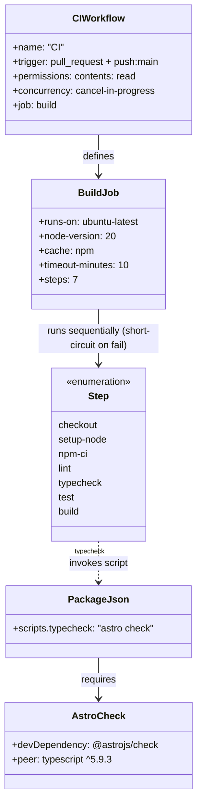
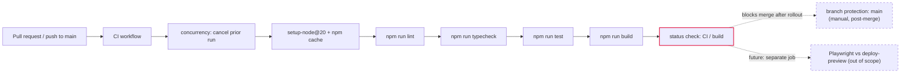

## Context

Promoted from `artifacts/frames/67-ci-lint-typecheck-test-build-pipeline-frame.mdx`
(F-lite, approved 2026-07-04). Analysis skipped — single-domain CI/tooling task
with the approach already specified in the issue body.

**Grounding verification performed during spec authoring** (findings that adjust
the issue's stated assumptions). All four scripts were run locally on a fresh
`npm ci` to confirm what actually passes today:

1. `@astrojs/check` is **NOT** a devDependency today. The issue body claims it is;
   it is not in `package.json:49-74`. Running `astro check` prompts to install it.
   → Implementation must add `@astrojs/check` to `devDependencies`. (`typescript`
   is already present at `^5.9.3` — the required peer dep — so no extra install.)
2. Node version is pinned to **20** in `netlify.toml` (`NODE_VERSION = "20"`) but
   there is no `.nvmrc` or `package.json#engines`. CI uses Node 20 to match the
   deploy target, and a `.nvmrc` is added so local dev can't drift from CI.
   *(Node 20 reached EOL 2026-04-30; upgrading to Node 22/24 is a worthwhile
   follow-up but is explicitly out of scope for this CI-gating keystone — it
   would touch `netlify.toml`, the new workflow, `.nvmrc`, and risk a full
   reinstall. Scope boundary: match current reality, don't migrate runtimes.)*
3. The stale `@ts-expect-error` is at `src/pages/api/stripe-webhook.ts:5`
   (`// @ts-expect-error — stripe pas encore installé`) guarding the
   `import type Stripe from 'stripe'` on line 6. `stripe@^22.1.1` resolves fine —
   the directive is genuinely stale and safe to remove. **Causal coupling:**
   TypeScript emits `TS2578 "Unused '@ts-expect-error' directive"` for stale
   directives, so `astro check` will FAIL until the directive is removed. The
   typecheck script and the directive removal are one atomic unit — merged into
   a single slice (S1).
4. **`npm run lint` FAILS today** — 1 hard error: `'normalizePathname' is defined
   but never used` at `src/components/navigation/DesktopNav.tsx:11`
   (`@typescript-eslint/no-unused-vars`). The function is genuinely dead code.
   → CI cannot be green unless this is fixed in the same PR. Added to S2.
5. **`npm run test` PASSES** — 25/25, script is already `vitest run` (non-watch,
   CI-safe). No hang risk.
6. **`npm run build` PASSES** — 904ms + SSR function bundling. No build-time
   secrets required (verified: build completed with only `.env` from
   `.env.example`, no `GITHUB_TOKEN`-equivalent needed).

## Goal

Gate every merge to `main` behind a GitHub Actions CI workflow that runs lint,
typecheck, unit tests, and build — so no type/lint/test/build breakage can reach
production via Netlify auto-deploy.

## Users

- **Developers** — get immediate, structured feedback on PRs before review and
  before Netlify even picks up the deploy preview.
- **Patients / end users** — stop receiving production deploys of broken commits.

## Expected Behavior

1. A developer opens a PR targeting `main` (or pushes directly to `main`).
2. Within ~2 minutes, a GitHub Actions workflow named **CI** starts. Any
   in-flight run for the same ref is cancelled (concurrency control).
3. The workflow runs a single job (`build`) on `ubuntu-latest` with Node 20 and
   npm caching. Commands run sequentially as steps so a failure short-circuits:
   `npm ci` → `npm run lint` → `npm run typecheck` → `npm run test` →
   `npm run build`. The job is bounded by `timeout-minutes: 10`.
4. If any command fails, the PR shows a red ✗ on the **CI / build** check and
   (once branch protection is configured) **cannot merge**.
5. If all pass, the check is green and the PR is mergeable.
6. A developer running `git pull origin main` and `npm ci` locally can reproduce
   CI's verdict exactly by running the same four scripts.

**Why a single sequential job (not a matrix / parallel jobs):** for a sub-minute
pipeline, the `npm ci` + cache-restore cost would be paid per parallel job,
exceeding any wall-clock savings. Sequential steps also give implicit stage
gating (lint fails → typecheck/test/build don't run). Split into parallel jobs
the day any single step exceeds ~2 min — documented as a future trigger, not
current scope.

**Branch-protection rollout (chicken-and-egg):** GitHub only lets an admin select
a status check as *required* after it has reported at least once on `main`. The
rollout sequence is therefore:
1. Merge this PR → workflow runs on first `push: main` → `CI / build` reports.
2. An admin configures branch protection: require `CI / build`, require branches
   up to date, dismiss stale approvals on push.
3. Branch protection is a **manual repo setting** — it is NOT automated from the
   workflow (creating protection rules needs `administration: write`, which the
   default `GITHUB_TOKEN` does not grant and should not). The acceptance criterion
   is "the rule is configured and documented," not "a workflow step sets it."

**Stripe-webhook specifics:** removing the stale `@ts-expect-error` is part of
this change. After removal, `npm run typecheck` must pass — i.e. `stripe`'s types
resolve cleanly. This is the canary that proves the gate works on payment-critical
code.

## Data Model & Consumers

This issue touches no runtime data model. The "data" is the CI contract itself.

### CI contract structure (`classDiagram`)

### Consumer map (`flowchart`)

### Consumer summary

| Consumer | Fields consumed | When | Status |
|----------|-----------------|------|--------|
| GitHub branch protection (main) | `CI / build` check name | on every PR merge attempt | **this issue** |
| Developer (local) | `package.json#scripts.typecheck` | before push, after pull | **this issue** |
| Netlify | none (CI is independent of deploy) | parallel to deploy-preview | unaffected |
| Playwright follow-up | deploy-preview URL | future PR | future (out of scope) |

## Breadboard

No UI affordances. Affordances map to **CI jobs → triggers → commands → artifacts**.

| ID | Affordance | Trigger | Handler (step) | Produces |
|----|-----------|---------|----------------|----------|
| N1 | `typecheck` npm script | `npm run typecheck` | runs `astro check` (needs `@astrojs/check` devDep) | exit 0 on clean types, non-zero on TS error |
| N2 | CI workflow file | `pull_request`, `push: main` | `.github/workflows/ci.yml` (single `build` job) | GitHub check named `CI / build` |
| N3 | `setup-node` action | workflow job start | `actions/setup-node@v4` `node-version: 20` `cache: npm` | Node 20 env + `~/.npm` cache restore (key auto-derived from `package-lock.json`) |
| N4 | Workflow hardening | job start | `permissions: contents: read`, `concurrency:` cancel-in-progress, `timeout-minutes: 10` | least-privilege token, no stacked runs, bounded runtime |
| N5 | Branch protection rule | manual repo setting (main) | required status check = `CI / build`, dismiss stale reviews | merge blocked on red/missing check (configured post-merge, see rollout) |
| N6 | Stripe types canary | removal of stale `@ts-expect-error` | `import type Stripe from 'stripe'` resolves | typecheck passes → directive was stale (proves gate catches type drift) |
| N7 | Lint baseline green | removal of dead `normalizePathname` | delete unused fn at `DesktopNav.tsx:11` | `npm run lint` exits 0 (currently 1 error) |
| N8 | Local/CI Node parity | `.nvmrc` at repo root | pins `20` | `nvm use` matches CI + netlify |

**Wiring:** N1 (script) is invoked by N2 (workflow) at the typecheck step. N3
enables fast repeated runs. N4 hardens the job. N5 makes N2's verdict binding
(post-merge manual step). N6 + N7 are the proof-cases that the gate catches real
drift (type + lint). N8 keeps local dev honest. N1 requires the stale directive
(N6) be removed in the same slice or `astro check` fails on `TS2578`.

## Slices

Vertical increments, each independently demoable/mergeable. Ordered so earlier
slices unblock later ones, and so the repo is green at every slice boundary.

| Slice | Scope | Demo | Depends on |
|-------|-------|------|------------|
| **S1 — typecheck green** | Add `@astrojs/check` devDep + `"typecheck": "astro check"` to `package.json`; remove stale `@ts-expect-error` at `stripe-webhook.ts:5` (causally coupled — `TS2578` fails until removed) | `npm run typecheck` exits 0 locally | — |
| **S2 — lint green** | Remove dead `normalizePathname` at `DesktopNav.tsx:11` | `npm run lint` exits 0 (was 1 error) | — (independent of S1) |
| **S3 — CI workflow** | `.github/workflows/ci.yml`: single `build` job, Node 20, `cache: npm`, `permissions: contents: read`, `concurrency` cancel-in-progress, `timeout-minutes: 10`; steps run lint+typecheck+test+build sequentially | workflow appears as `CI / build` check on the PR, runs green | S1, S2 (so the workflow passes) |
| **S4 — parity + protection** | Add `.nvmrc` (`20`); document branch-protection rollout (manual: require `CI / build`, up-to-date, dismiss stale) | `.nvmrc` respected by `nvm use`; branch-protection runbook in PR description | S3 (check must exist on main before it can be required) |

## Success Criteria

- [ ] `npm run typecheck` exists in `package.json` (`"typecheck": "astro check"`) and exits 0 when run locally
- [ ] `@astrojs/check` is present in `devDependencies` (issue body incorrectly assumed it was already there)
- [ ] The stale `@ts-expect-error` at `src/pages/api/stripe-webhook.ts:5` is removed and `npm run typecheck` still passes (proves the directive was stale — `stripe` types resolve)
- [ ] `npm run lint` exits 0 (dead `normalizePathname` at `DesktopNav.tsx:11` removed) — currently exits non-zero with 1 error
- [ ] `.github/workflows/ci.yml` exists and runs `lint`, `typecheck`, `test`, `build` on every `pull_request` and `push: main`
- [ ] CI workflow uses Node 20 (matches `netlify.toml` `NODE_VERSION = "20"`) and `actions/setup-node@v4` with `cache: npm`
- [ ] CI workflow declares `permissions: contents: read`, a `concurrency` block with `cancel-in-progress: true`, and `timeout-minutes: 10`
- [ ] `.nvmrc` exists at repo root pinning `20` (local/CI/netlify parity)
- [ ] Branch protection on `main` requires the `CI / build` status check before merge, requires branches up to date, and dismisses stale reviews on push (manual repo setting, documented in PR description with the rollout sequence)

## Complexity

**Tier: F-lite.** ~5 files (`package.json`, `.github/workflows/ci.yml`,
`src/pages/api/stripe-webhook.ts`, `src/components/navigation/DesktopNav.tsx`,
`.nvmrc`) + one manual repo setting (branch protection). Single domain
(developer infrastructure / CI). No runtime architecture changes, no new
patterns. Acceptance criteria are binary and locally reproducible — verified by
running all four scripts on a fresh `npm ci` during spec authoring.
