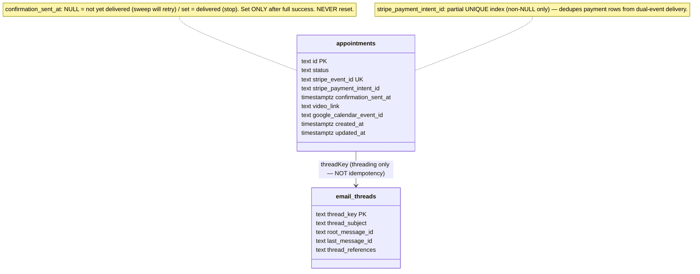
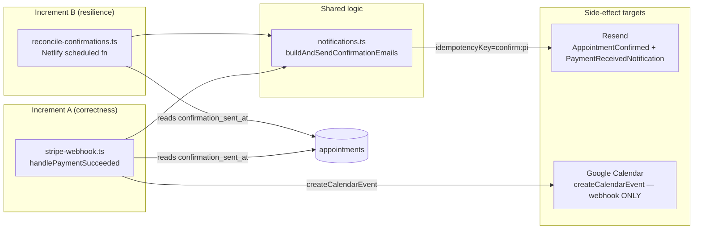

## Context

Promoted from `artifacts/analyses/68-stripe-payment-reconciliation-idempotency-analysis.mdx`.
Frame: `artifacts/frames/68-stripe-payment-reconciliation-idempotency-frame.mdx`.
Issue: #68.

The analysis selected **Shape 2 (staged)** — separate the event-dedup domain
(`stripe_event_id`) from the side-effect-completion domain
(`confirmation_sent_at`), make email sends idempotent via a Resend idempotency
key on `stripe_payment_intent_id`, and add a reconciliation sweep as a backstop.

**Revisions after expert review (architect + devops):**
- The `confirmation_sent_at` column moves to **Increment A** (the webhook reorder
  depends on it — it cannot be deferred to Increment B as the analysis staged it).
- The "reset claim on failure" primitive is **removed**. It opened a duplicate-
  email window (email sent → later step fails → reset → retry → duplicate). The
  Resend idempotency key is the concurrent-dedup primitive; `confirmation_sent_at`
  is the durable "done" flag, set only after full success, never reset.
- The extracted shared function is **email-only** (`buildAndSendConfirmationEmails`),
  not the full side-effect bundle. Calendar creation stays webhook-only (it's
  coupled to `import.meta.env` via `resolveCalendarAuth` and the sweep doesn't
  need it — `.ics` links are pure functions of appointment data).
- Sweep gets a `LIMIT`, wall-clock deadline guard, and poison-message escape
  (per devops review).

## Goal

A patient who pays always receives their confirmation email + calendar invite +
video link **before the appointment start time** — in seconds via the webhook
(happy path), within the hour via the reconciliation sweep (backstop), with zero
duplicate emails under any retry or overlap scenario.

## Users

- **Primary — patient (prepaid teleconsultation):** pays, lands on `/rdv/merci/`,
  expects the confirmation email with video link + .ics. Today the merci page
  shows no inline video link — the email is the single delivery surface. If the
  email is lost, they have no app-side retrieval and must contact support or
  rebook (risking a duplicate payment).
- **Secondary — therapist (Oriane):** receives `PaymentReceivedNotification` to
  know a payment landed and prepare the session. Same loss path applies to her
  notification.
- **Tertiary — maintainer:** operates the reconciliation sweep and monitors for
  stuck rows. Needs observable logs matching the `send-reminders.ts` pattern.

## Expected Behavior

### Layered idempotency (the core design)

Two independent layers prevent duplicate emails; each covers what the other
cannot:

| Layer | Primitive | Scope | What it prevents |
|-------|-----------|-------|------------------|
| **L1 — Resend idempotency key** | `confirm:{stripe_payment_intent_id}` passed as `resend.emails.send(payload, { idempotencyKey })` | Per payment intent, ~24h TTL (Resend-side) | Concurrent in-flight sends (webhook + sweep + Stripe retry overlapping) — Resend dedupes server-side |
| **L2 — `confirmation_sent_at` flag** | Set to `now()` only after ALL side effects succeed; never reset | Per appointment, durable | Sweep re-sending a row that already succeeded; provides the "stop trying" signal |

`stripe_event_id` (existing, UNIQUE) remains the **payment-receipt** idempotency
key — it dedupes the DB write for the payment itself, independent of confirmation
delivery.

### Happy path (webhook delivers)

1. Patient pays; Stripe fires `payment_intent.succeeded` (and shortly after,
   `checkout.session.completed`).
2. Webhook verifies signature, calls `handlePaymentSucceeded(appointmentId,
   paymentIntentId, eventId)`.
3. **Payment receipt** (atomic, idempotent on event id):
   `UPDATE appointments SET status='payment_received', stripe_event_id=eventId,
   stripe_payment_intent_id=pi WHERE id=$1 AND status='payment_pending' AND
   stripe_event_id IS NULL`. If no row updated → already processed → return.
4. **Delivery gate** (read check, not a claim):
   `SELECT confirmation_sent_at, ... FROM appointments WHERE id=$1`. If
   `confirmation_sent_at IS NOT NULL` → already delivered → return. (Concurrent
   attempts that both pass this gate are deduped by L1.)
5. Run side effects: calendar event creation (if video mode, no existing event)
   via `createCalendarEvent`, then `buildAndSendConfirmationEmails(appointment,
   { videoLink })` — both emails sent with Resend idempotency key
   `confirm:{stripe_payment_intent_id}`.
6. **On full success:** `UPDATE appointments SET confirmation_sent_at=now() WHERE
   id=$1 AND confirmation_sent_at IS NULL` (durable "done" flag; the `IS NULL`
   guard is belt-and-suspenders).
7. **On any failure:** return 500 → Stripe retries. `confirmation_sent_at`
   stays NULL. The retry (or the sweep) re-attempts; L1 dedupes any email that
   the failed attempt partially sent.

### Stripe dual-event overlap (both events in flight)

8. Second event arrives while the first is mid-side-effect. Step 3 no-ops
   (payment recorded). Step 4: both may read `confirmation_sent_at IS NULL` and
   proceed — but both call Resend with the same idempotency key
   (`confirm:{same intent id}`) → **L1 dedupes server-side → one email pair
   delivered.** Whichever invocation finishes second sets `confirmation_sent_at`
   (the `IS NULL` guard makes the second UPDATE a no-op if the first already set
   it).
9. If the second event arrives much later (after the first fully succeeded),
   step 4 sees `confirmation_sent_at IS NOT NULL` → returns. No re-send.

### Reconciliation sweep (backstop — Increment B)

10. Hourly Netlify scheduled function queries
    `status='payment_received' AND confirmation_sent_at IS NULL AND created_at >
    now() - interval '14 days' ORDER BY scheduled_at ASC LIMIT 25` (time-bounded
    + batch-bounded; earliest appointments first).
11. For each row, it calls `buildAndSendConfirmationEmails(appointment,
    { videoLink: appointment.video_link })` with the same idempotency key.
    L1 dedupes vs. any concurrent webhook attempt.
12. On success, set `confirmation_sent_at`. On failure, leave NULL (next sweep
    retries). **Per-row error isolation:** one bad row doesn't abort the batch.
13. **Wall-clock deadline guard:** if elapsed time exceeds 8500ms (margin under
    Netlify's 10s hobby timeout), break early — remaining rows drain next hour.
14. **Poison-message escape:** a row whose email send returns a permanent 4xx
    (e.g., undeliverable address) is marked `confirmation_sent_at = now()` to
    stop retrying, and logged at `error` level. (Retryable 429/5xx leave it NULL.)

### Idempotency guarantee

No patient ever receives two `AppointmentConfirmed` emails for one payment, and
no therapist receives two `PaymentReceivedNotification` emails — regardless of
Stripe retry cadence, dual-event overlap, or sweep + webhook concurrency. L1
handles concurrent in-flight; L2 prevents post-success re-sends.

## Data Model & Consumers

### Data structure



### Consumer map



| Consumer | Fields consumed | When | Status |
|----------|-----------------|------|--------|
| `stripe-webhook.ts` | `confirmation_sent_at`, `stripe_event_id`, `stripe_payment_intent_id`, `status` | Every Stripe event | Increment A |
| `reconcile-confirmations.ts` | `confirmation_sent_at`, `status`, `created_at`, `video_link` | Hourly | Increment B |
| `notifications.ts` (new) | full appointment row (read-only) | Called by webhook + sweep | Increment A |
| `send-reminders.ts` | `reminder_sent_at` (unrelated column) | Daily | Existing, unchanged |
| Admin UI (`AppointmentCard.tsx`) | `status` (display only) | Render | Existing, unchanged |

## Breadboard

### Affordances

| ID | Element | Handler | Data |
|----|---------|---------|------|
| U1 | Stripe → webhook event | `POST /api/stripe-webhook` | `{type, data:{object}, id}` |
| N1 | Atomic payment receipt | `handlePaymentSucceeded` step 3 | `UPDATE appointments SET status, stripe_event_id, stripe_payment_intent_id WHERE id AND status='payment_pending' AND stripe_event_id IS NULL` |
| N2 | Delivery gate (read) | `handlePaymentSucceeded` step 4 / sweep | `SELECT confirmation_sent_at FROM appointments WHERE id=$1` — skip if set |
| N3 | Mark delivered | `handlePaymentSucceeded` step 6 / sweep | `UPDATE appointments SET confirmation_sent_at=now() WHERE id=$1 AND confirmation_sent_at IS NULL` |
| S1 | Build + send confirmation emails | `notifications.ts buildAndSendConfirmationEmails` | 2 emails with idempotency keys |
| S2 | Resend send (idempotent) | `sendEmail({...idempotencyKey})` | `resend.emails.send(payload, {idempotencyKey})` |
| S3 | Calendar event creation | `createCalendarEvent` (webhook only) | guarded by `google_calendar_event_id IS NULL` |
| C1 | Scheduled sweep trigger | Netlify `Config = { schedule: '5 * * * *' }` | hourly, offset 5 min |
| C2 | Sweep query | `reconcile-confirmations.ts` | `WHERE status='payment_received' AND confirmation_sent_at IS NULL AND created_at > cutoff ORDER BY scheduled_at ASC LIMIT 25` |

### Wiring

```
Stripe event (U1)
  → signature verify (existing)
  → handlePaymentSucceeded
    → N1 (payment receipt, idempotent on stripe_event_id)
    → N2 (gate) ── confirmation_sent_at set → return (already delivered)
    → S3 (calendar, if needed — webhook only)
    → S1 (buildAndSendConfirmationEmails)
        → S2 (emails with idempotency key confirm:{pi})
    → success → N3 (mark delivered)
    → failure → return 500 (Stripe retries; confirmation_sent_at stays NULL)

Hourly (C1, offset :05) → reconcile-confirmations.ts
  → C2 (query stale rows, LIMIT 25, deadline-guarded)
  → for each: N2 (gate) → S1 → success → N3 / failure → skip (next sweep)
```

## Slices

| # | Slice | Increment | Demo | Files |
|---|-------|-----------|------|-------|
| 1 | Migration: dedupe `stripe_payment_intent_id` + partial unique index | A | Migration applies cleanly on prod data with existing dupes | `supabase/migrations/008_payment_intent_unique.sql` |
| 2 | Migration: add `confirmation_sent_at` column | A | Column exists, nullable | `supabase/migrations/009_confirmation_sent_at.sql` |
| 3 | Resend `idempotencyKey` param (Resend + SMTP paths) | A | Two concurrent sends with same key → one email | `src/lib/resend.ts` |
| 4 | Extract `buildAndSendConfirmationEmails` (email-only, accepts injected `sendEmail` fn) | A | Function callable with injected sender | `src/lib/notifications.ts` |
| 5 | Webhook reorder: gate on `confirmation_sent_at`, mark delivered after success, pass idempotency keys | A | Simulate failed side effect → retry resends via idempotency key, no dupes | `src/pages/api/stripe-webhook.ts`, `src/types/appointment.ts` |
| 6 | Reconciliation sweep function (LIMIT, deadline guard, poison escape) | B | Manual trigger re-sends for stale row, respects LIMIT | `netlify/functions/reconcile-confirmations.ts`, `netlify.toml` (env docs) |

**Ship sequence:** Slices 1-5 = Increment A (mergeable, closes the bug for new
payments). Slice 6 = Increment B (backstop for historical + abandoned events).
Dependencies: 5 depends on 1, 2, 3, 4. 6 depends on 2, 4.

## Success Criteria

### Increment A (correctness)

- [ ] Migration `008` dedupes existing `stripe_payment_intent_id` rows (keep latest by `updated_at DESC, id DESC`, null the rest) in the same transaction as the index creation, with an audit table capturing nulled rows
- [ ] Partial unique index exists on `appointments(stripe_payment_intent_id) WHERE stripe_payment_intent_id IS NOT NULL`
- [ ] Migration `009` adds nullable `confirmation_sent_at TIMESTAMPTZ` column to `appointments`
- [ ] `handlePaymentSucceeded` reads `confirmation_sent_at` (gate N2) and returns early if already set
- [ ] `handlePaymentSucceeded` sets `confirmation_sent_at = now()` (N3) only after side effects fully succeed; it is **never** reset on failure
- [ ] Both confirmation emails (`AppointmentConfirmed`, `PaymentReceivedNotification`) are sent with Resend idempotency key `confirm:{stripe_payment_intent_id}` (via the new `idempotencyKey` param)
- [ ] `buildAndSendConfirmationEmails` accepts an injected `sendEmail` function (no `import.meta.env` access inside `src/lib/notifications.ts`)
- [ ] Simulated side-effect failure + retry: the retry re-sends, and Resend dedupes if the first attempt partially sent (unit test with mocked sendEmail verifying idempotency key passed)
- [ ] Simulated dual-event overlap (two concurrent `handlePaymentSucceeded` calls, same intent id): both pass the read gate but only one email pair is delivered (unit test verifying both calls pass `confirm:{samePi}` as idempotency key)
- [ ] No existing webhook behavior regresses (mock GET path still works; calendar creation logic unchanged)
- [ ] `Appointment` type includes `confirmation_sent_at: string | null`
- [ ] Stale `@ts-expect-error` on the stripe import in `stripe-webhook.ts` removed (verified build stays green — `stripe` is installed at `^22.1.1`)

### Increment B (resilience)

- [ ] Netlify scheduled function `reconcile-confirmations.ts` runs hourly (`schedule: '5 * * * *'`, offset to dodge `:00` webhook contention)
- [ ] Sweep queries `status='payment_received' AND confirmation_sent_at IS NULL AND created_at > now() - interval '14 days' ORDER BY scheduled_at ASC LIMIT 25`
- [ ] Sweep reuses `buildAndSendConfirmationEmails` (no duplicated email logic)
- [ ] Sweep passes the same idempotency key `confirm:{stripe_payment_intent_id}` so it dedupes vs. concurrent webhook attempts
- [ ] Sweep has per-row error isolation (one failed resend does not abort the batch)
- [ ] Sweep has a wall-clock deadline guard (breaks at 8500ms elapsed, logs `deadlineHit: true`)
- [ ] Sweep has a poison-message escape: permanent 4xx from Resend marks the row `confirmation_sent_at=now()` and logs `error`; retryable 429/5xx leaves it NULL
- [ ] Sweep logs structured summary per invocation: `{ found, sent, failed, deadlineHit, msElapsed }` matching the `send-reminders.ts` console pattern
- [ ] Sweep instantiates its own Supabase (service-role key) + Resend clients from `process.env` (mirroring `send-reminders.ts`); fails fast with a clear log if required env vars are missing
- [ ] Sweep does NOT call `createCalendarEvent` (email-only re-send; `.ics` links come from pure ICS builders)
- [ ] Manual sweep trigger against a stale row successfully sends the confirmation
- [ ] `netlify.toml` documents any new env requirements (none expected — reuses existing `SUPABASE_*`, `RESEND_*`)

### Cross-cutting

- [ ] QG passes: `npm run lint`, typecheck (`astro check`), build, unit tests green
- [ ] No new runtime dependency added (Resend idempotency is a native SDK option in `resend@^6.12.3`, confirmed at `node_modules/resend/dist/index.d.cts:178`)

## Open Questions

- [NEEDS CLARIFICATION] **Sweep backfill cutoff.** 14-day window (`created_at > now() - interval '14 days'`) bounds re-send scope. Appointments are typically booked days-weeks ahead, so 14 days catches anything imminent. Confirm this is acceptable, or tighten to 7 days. (Affects slice 6.)
- [NEEDS CLARIFICATION] **Sweep cadence.** Hourly (`'5 * * * *'`) satisfies the frame's "within the hour" SLA. Tighter cadence (every 15 min) = ~4× Netlify invocations/month (cost) but faster recovery for imminent appointments. Recommend hourly for v1.
- [NEEDS CLARIFICATION] **Webhook latency after reorder.** Reordering keeps the email send before the Stripe 200. Confirm total side-effect time (calendar + 2 emails) stays well under Netlify's 10s hobby / 26s pro timeout. If risky, option: keep calendar creation but make email fire-and-forget (return 200, rely on sweep) — weakens the retry guarantee. Recommend measuring first.

## Out of Scope

- Email threading system rewrite (`threadKey` / `email_threads` unchanged)
- Non-payment Stripe events (only `payment_intent.succeeded` / `checkout.session.completed`)
- Admin-triggered manual resend UI
- `/mes-rdvs` self-service video-link retrieval (separate issue — would reduce email single-point-of-failure for the patient; valuable follow-up but not required to fix the bug)
- Inline video link on `/rdv/merci` page (separate issue — would eliminate the email-as-single-point-of-failure; valuable follow-up)
- Outbox pattern / distributed transaction (gold standard but heavier than warranted)
- Stripe receipt configuration (Stripe's own receipt is independent)
- Refactoring `google-calendar.ts` to accept injected auth (the sweep avoids needing it by being email-only)
- Booking-layer idempotency (preventing a confused patient from rebooking into a duplicate payment) — separate concern, not caused by this bug
