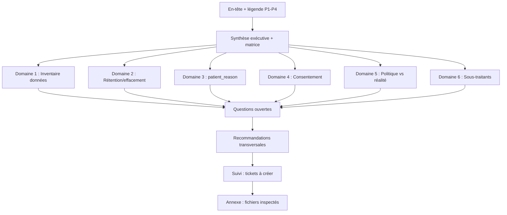

## Context

Cette spec définit la **note de constats** (le livrable de l'issue #72) — un document Markdown qui sera committé dans `docs/audits/`. Elle dérive de l'analyse `72-rgpd-patient-data-compliance-audit-analysis.md` (investigation des 6 domaines, Shape 3 hybride recommandée) et du frame `72-rgpd-patient-data-compliance-audit-frame.md` (stance neutre sur Art. 9, livrable doc-only, français).

**Promoted from :** analyse #72 (section Constats par domaine + Shapes + Directions de remédiation).

## Goal

Une note de constats décisionnelle, en français, mergée dans `docs/audits/`, qui énumère chaque écart RGPD avec sévérité (P1–P4) et direction de remédiation, permettant à la praticienne de prioriser et au développeur de créer les tickets de suivi sans ré-investigation.

## Users

- **Praticienne (Oriane Montabonnet) — primaire :** lit la matrice P1-d'abord pour voir l'exposition et prioriser les actions. A un public non-technique mais un fort intérêt métier (confiance patient, exposition CNIL).
- **Développeur des remédiations — secondaire :** lit les détails par-domaine avec citations file:line pour créer les tickets de suivi et implémenter les remédiations sans ré-investigation.
- **Futur auditeur / CNIL — tertiaire :** consulte le document comme artefact de conformité. Doit pouvoir retracer chaque constat à une preuve (file:line ou citation de politique).

## Expected Behavior

Le document `docs/audits/2026-07-rgpd-patient-data.md` suit la structure **Shape 3 hybride** (matrice de synthèse + détails par-domaine) :

1. **En-tête** : titre, date (2026-07-11), auteur, périmètre de l'audit, méthodologie (fichiers inspectés, migrations, politiques lues), stance (neutre sur Art. 9), légende de sévérité P1–P4, lien vers l'analyse source.
2. **Synthèse exécutive** : (a) un paragraphe de cadrage risque-métier (confiance patient comme actif commercial, exposition CNIL) ; (b) un **encadré « 3 actions prioritaires » en langage métier** (3–5 phrases, traduisant les deux P1 + le P2 le plus pressant pour la praticienne, sans jargon technique) ; (c) la **matrice de synthèse** — tableau de tous les constats (ID, domaine, sévérité, écart en une ligne, direction de remédiation en une ligne). Triée P1 → P4. L'encadré précède la matrice pour que la praticienne ait une lecture humaine avant les 18 lignes techniques.
3. **Constats détaillés par-domaine** (6 sections, Domaine 1 → Domaine 6) : chaque section liste les constats du domaine avec preuve (file:line ou citation), sévérité, direction de remédiation **suffisamment précise pour chiffrer un ticket** (nomme la surface concernée : fichiers/systèmes touchés, sans spécifier l'implémentation), et renvoi au(x) constat(s) transversaux dans la matrice.
4. **Questions ouvertes / préoccupations non résolues** : Art. 9 (avis juridique requis), scopes OAuth Google (à confirmer), réglage CookieYes Consent Mode v2 (vérification manuelle), `therapist_notes` (potentiellement clinique / secret médical).
5. **Recommandations transversales** : registre Art. 30, préparation breach Art. 33/34, AIPD/DPIA si Art. 9 confirmé, **critère de succès/échec de l'audit** (la note documente explicitement : succès = chaque P1 remédié en flux réel (code/politique) OU explicitement accepté avec décision documentée dans les 6 mois, ET chaque P2 a un plan de remédiation séquencé avec responsable et date. L'ancien critère « zéro P1 remédié = échec » est noté comme trop permissif et rejeté).
6. **Suivi** : liste des tickets de suivi à créer (un par constat P1/P2/P3), avec libellé de ticket suggéré. **Recommandation GA4 (résolution χ2) :** pour D5.2/D6.2, la note **recommande la suppression de GA4** (aligner le code sur la promesse déjà publiée — élimine trivialement le P1 de fausse déclaration, zéro réécriture de politique sur ce point, plus conforme CNIL pour un cabinet santé-adjacent) et documente la **divulgation de GA4** comme alternative si la praticienne souhaite garder l'analytics (avec le coût associé : réécriture politique + sous-traitant à divulguer). La praticienne décide, mais la note prend position.
7. **Annexe** : liste des fichiers inspectés, politiques lues, migrations examinées.

Le document est **en français** (cohérent avec le métier et la politique existante). Les termes techniques de code (`patient_reason`, `deleted_at`, `url_passthrough`, `gtag`) restent en anglais. Les citations de la politique de confidentialité sont en français (verbatim).

## Data Model & Consumers

### Structure du document (au lieu d'un data model — livrable doc)

### Consommateurs du document

| Consommateur | Sections consommées | Quand | Statut |
|---|---|---|---|
| Praticienne | Synthèse exécutive + matrice | Lecture unique pour prioriser | Cette issue |
| Développeur remédiations | Détails par-domaine + tickets | À chaque ticket de suivi | Cette issue |
| Auditeur CNIL / futur | Tout le document + annexe | Inspection conformité | Cette issue |
| Frame/analyse (pipeline) | — | — | Future (référence) |

### IDs de constats (schéma de référencement)

Chaque constat a un ID stable `D{domaine}.{n}` (numérique) pour le suivi transversal :
- `D1.1` = premier constat du Domaine 1
- `D5.2` = deuxième constat du Domaine 5 (le P1 « politique ment sur GA4 »)
- `D5.5` = absence d'effacement (P1)
- etc.

Ces IDs apparaissent dans la matrice de synthèse ET dans les détails par-domaine, pour les renvois croisés (ex. `patient_reason` est référencé en D1.1, D3.1, D5.1).

> **Registre figé (revue doc-writer) :** le breadboard ci-dessous est le **registre canonique et figé** des IDs de constats. Tout nouveau constat découvert pendant la rédaction s'ajoute **à la fin de son domaine** (ex. D4.7), sans renuméroter les existants. Les facettes redondantes (D5.2 ≡ D6.2 ; D2.1 ≡ D5.5 — mêmes problèmes sous deux angles) sont traitées par déduplication de la remédiation : **écrire la direction de remédiation une fois** sur le constat principal, et renvoyer en croisé sur la facette.

## Breadboard — cartographie constats → sections du document

| ID constat | Domaine | Sévérité | Section détail | Apparaît aussi dans (facette) | Ticket suivi |
|---|---|---|---|---|---|
| D1.1 | 1 | P3 | Domaine 1 | D3.1 (transversal `patient_reason`) | Oui |
| D1.2 | 1 | P3 | Domaine 1 | — | Oui (logs PII, regroupé) |
| D2.1 | 2 | P1 | Domaine 2 | D5.5 (facette : effacement) | Oui |
| D2.2 | 2 | P2 | Domaine 2 | — | Oui (tables annexes) |
| D3.1 | 3 | P2 | Domaine 3 | D1.1, D5.1 (transversal `patient_reason`) | Oui |
| D4.1 | 4 | P3 | Domaine 4 | — | Oui (ex-D4.A : `trackEvent` sans gate) |
| D4.2 | 4 | P3 | Domaine 4 | — | Oui (ex-D4.B : `url_passthrough:true`) |
| D4.3 | 4 | P3 | Domaine 4 | — | Oui (ex-D4.C : consent update délégué CookieYes) |
| D4.4 | 4 | P4 | Domaine 4 | — | Oui (ex-D4.D : précision CSP) |
| D4.5 | 4 | P4 | Domaine 4 | — | Oui (ex-D4.E : chargement GA4 inconditionnel) |
| D4.6 | 4 | P4 | Domaine 4 | — | Oui (ex-D4.F : plafond polling 6s) |
| D5.1 | 5 | P2 | Domaine 5 | D3.1 | Oui |
| D5.2 | 5 | P1 | Domaine 5 | D6.2 (facette : sous-traitant GA4 omis) | Oui |
| D5.3 | 5 | P2 | Domaine 5 | D2.1 | Oui |
| D5.4 | 5 | P2 | Domaine 5 | — | Oui |
| D5.5 | 5 | P1 | Domaine 5 | D2.1 (facette : effacement) | Oui |
| D6.1 | 6 | P2 | Domaine 6 | — | Oui (CookieYes omis) |
| D6.2 | 6 | P1 | Domaine 6 | D5.2 (facette : GA4 omis+démenti) | Oui |

## Slices — incréments de rédaction

| Slice | Contenu | Démo | Dépend |
|---|---|---|---|
| S1 | En-tête + légende + méthodologie + synthèse exécutive (paragraphe risque-métier) | Le document s'ouvre, la praticienne comprend le périmètre et l'enjeu | — |
| S2 | Matrice de synthèse (tous les constats, P1→P4) | Vue exécutive complète, tous les IDs assignés | S1 |
| S3 | Domaines 1–2 (inventaire + rétention/effacement) | Détails avec preuves file:line pour le développeur | S2 |
| S4 | Domaines 3–4 (patient_reason + consentement) | Détails + renvois transversaux | S2 |
| S5 | Domaines 5–6 (politique vs réalité + sous-traitants) | Détails + les deux P1 documentés | S2 |
| S6 | Questions ouvertes + recommandations transversales + tickets de suivi + annexe | Document fermé, traçable, actionnable | S3, S4, S5 |

Les slices sont **indépendamment vérifiables** (chacun peut être relu isolément), mais le document n'est complet qu'après S6.

## Success Criteria

- [ ] Le fichier `docs/audits/2026-07-rgpd-patient-data.md` existe et est mergé
- [ ] Le document est entièrement en français (termes techniques de code en anglais acceptés)
- [ ] L'en-tête contient : date, périmètre, méthodologie, stance Art. 9, légende P1–P4, lien vers l'analyse source
- [ ] La synthèse exécutive contient un **encadré « 3 actions prioritaires » en langage métier** (3–5 phrases, traduisant les P1 sans jargon) AVANT la matrice
- [ ] La matrice de synthèse liste TOUS les constats avec colonnes : ID, domaine, sévérité, écart (1 ligne), remédiation (1 ligne) — triée P1 → P4
- [ ] Chaque constat P1 (**D2.1, D5.2, D5.5, D6.2** — les quatre) est documenté en détail avec preuve (file:line ou citation verbatim de la politique)
- [ ] Chaque constat de sévérité P1/P2/P3 a une direction de remédiation **assez précise pour chiffrer un ticket** (nomme la surface concernée : fichiers/systèmes touchés — ex. « `Layout.astro:88` + `netlify.toml` CSP », « endpoint admin `/api/admin/erasure` à créer + cascade `credits` » — sans spécifier l'implémentation)
- [ ] La section `patient_reason` (Domaine 3) documente explicitement la question Art. 9 ouverte avec les deux scénarios (qualifié Art. 9 vs Art. 6) et leur impact sur les sévérités
- [ ] Le diff politique vs réalité (Domaine 5) couvre au minimum les écarts 5.1–5.5 documentés dans l'analyse
- [ ] La section sous-traitants (Domaine 6) identifie CookieYes et GA4 comme sous-traitants non divulgués
- [ ] La section questions ouvertes liste au minimum : Art. 9 (avis juridique), scopes OAuth Google (à confirmer), réglage CookieYes (vérif manuelle), `therapist_notes` (potentiellement clinique)
- [ ] La section recommandations transversales mentionne : registre Art. 30, préparation breach Art. 33/34, AIPD si Art. 9 confirmé
- [ ] La section recommandations transversales documente un **critère de succès/échec explicite** (chaque P1 remédié en flux réel OU accepté documenté dans 6 mois + chaque P2 a un plan séquencé)
- [ ] La note **recommande la suppression de GA4** (résolution D5.2/D6.2) et documente la divulgation comme alternative
- [ ] La section suivi liste au moins un libellé de ticket suggéré par constat P1 (D2.1, D5.2, D5.5, D6.2) et P2, suffisamment précis pour création post-merge mécanique
- [ ] L'annexe liste les fichiers inspectés (au minimum : `confidentialite.astro`, migrations 001–008, `Layout.astro`, `analytics.ts`, les API routes citées)
- [ ] Le document ne contient aucune recommandation d'implémentation de code (livrable doc-only, per Frame §Out of Scope)
- [ ] **Intégrité des références croisées :** chaque lien « Apparaît aussi dans » du breadboard apparaît effectivement comme renvoi dans le document (ex. D5.2 ↔ D6.2, D2.1 ↔ D5.5, D1.1 ↔ D3.1 ↔ D5.1 sont bidirectionnels)
- [ ] Tous les IDs de constats (`D{domaine}.{n}`) apparaissent dans au moins une section de détail ET dans la matrice de synthèse (pas de constat orphelin)

## Open Questions (χ)

- **χ1 :** ~~Critère d'échec resserré vs original~~ **Résolu** — la note documente le critère resserré (« chaque P1 remédié en flux OU accepté documenté + chaque P2 a un plan ») comme recommandation, et note l'ancien critère comme trop permissif et rejeté. (Critère de réussite #13 garantit la présence de cette section.)
- **χ2 :** ~~Suppression vs divulgation GA4~~ **Résolu** — la note **recommande la suppression** (aligner le code sur la promesse publiée, plus conforme CNIL) et documente la divulgation comme alternative documentée. La praticienne décide, mais la note prend position. (Critère de réussite #14 garantit cette recommandation.)
- **χ3 :** Faut-il créer un `docs/audits/README.md` index, ou le document est-il autonome (le premier audit) ? *Résolu : autonome pour ce cycle (c'est le premier audit), README créé si un 2e audit suit.*

## Out of Scope (rappel)

- Implémentation des remédiations (tickets de suivi séparés)
- Classification juridique définitive d'Art. 9 (avis CNIL/avocat requis)
- Rédaction d'une AIPD/DPIA formelle
- Ré-audit de sécurité applicative (déjà couvert)
- **Création des tickets de suivi GitHub** (la note liste les libellés suggérés par constat P1/P2/P3). La création effective des issues GitHub est un **step post-merge explicite et tracé** : après le merge de la note de constats, le porteur de l'issue #72 crée les tickets listés et ferme #72. Cette étape satisfait le critère d'acceptation de #72 (« follow-up implementation issues created ») — elle n'est pas silencieusement omise, elle est séquencée après le merge du livrable document. La note DOIT contenir assez de détail (libellés + surface concernée) pour que cette création soit mécanique, sans ré-investigation.
