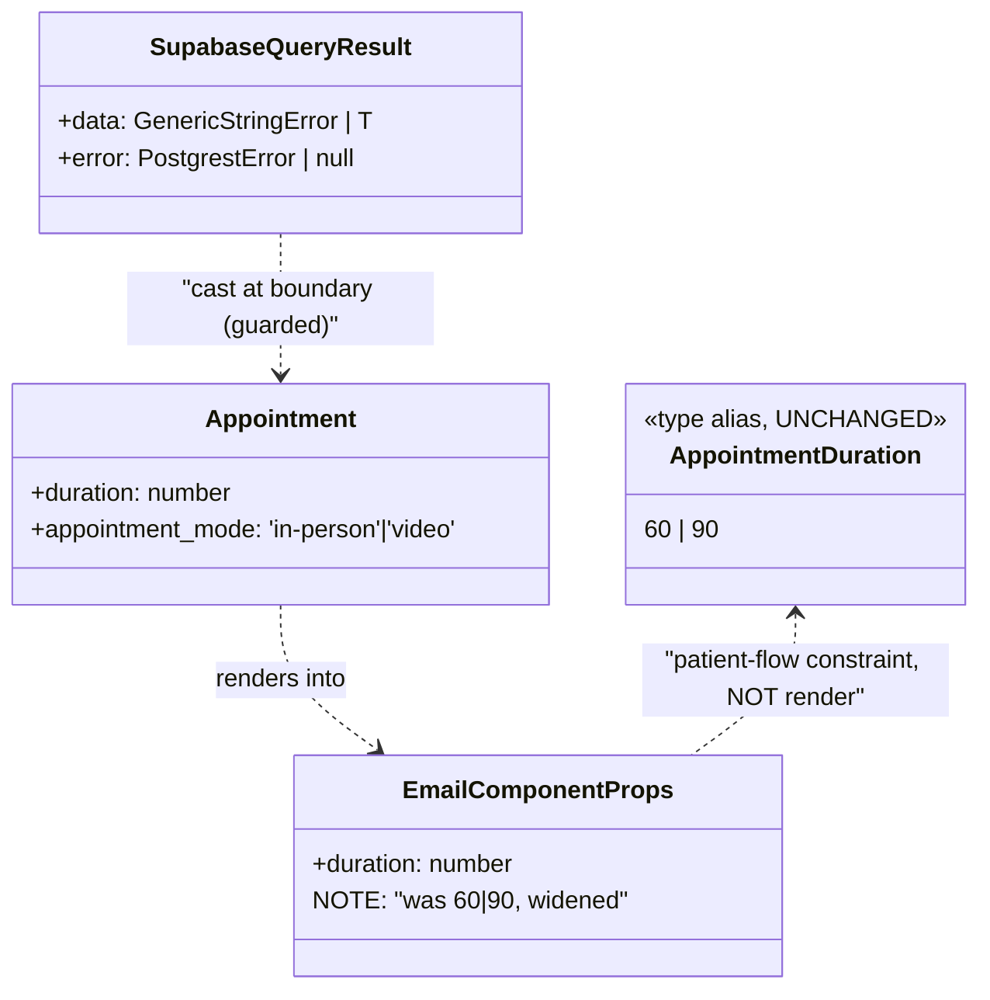
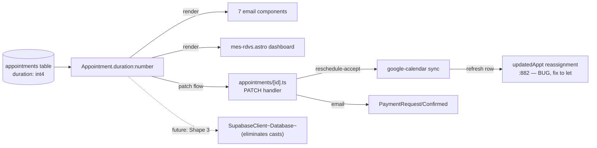

## Context

Derived from the approved analysis (Shape 2 recommended). The repo's
`npm run typecheck` (= `astro check`) reports **26 errors** across 9 root
causes; PR #67/#85 shipped CI with typecheck as a non-blocking advisory job
(`continue-on-error: true`) to land the pipeline without resolving the
backlog. This spec clears all 26 and promotes typecheck to a blocking gate
member, following Shape 2: dedupe at the root where cheap, widen the one
boundary type that was never valid, reorder (not cast) the frame-flagged
site, and apply narrow boundary casts with safety comments elsewhere.

Two suspected logic bugs investigated: `:882` is a real P0-grade production
crash (const reassignment), `:213` is dead code (not a runtime bug).

## Goal

`npm run typecheck` exits 0 on `main`, the CI typecheck job is a blocking
gate member, and no cast added by this PR masks a runtime defect.

## Users

- **Maintainers (Tavian):** gain a CI signal that rejects type-drift PRs
  before merge.
- **Therapist (primary beneficiary of the `:882` fix):** accepting an in-person
  appointment reschedule no longer hits a mid-flow crash — the confirmation
  email sends and the appointment row updates. (The therapist operates the
  reschedule-accept flow; the patient is a passive/downstream beneficiary.)

## Expected Behavior

1. Running `npm run typecheck` locally exits 0 with "0 errors".
2. Pushing a PR that introduces a type error fails the CI `typecheck` job,
   and that failure blocks merge (per GitHub required-status-checks).
3. Accepting an in-person appointment reschedule (the `:882` path: new or
   recreated `google_calendar_event_id`) no longer throws
   `TypeError: Assignment to constant variable`. The type-level proof
   (`let` replaces `const`) is the regression guard (no Astro-`APIRoute`
   test harness exists in the repo). A manual smoke check on the first
   post-merge prod deploy confirms the runtime path; see Success Criteria.
4. Video appointments still render location as `'Téléconsultation'` (the
   `:213` dead-ternary removal changes nothing at runtime).
5. `mes-rdvs` on a Supabase error renders an empty/degraded dashboard (as
   today via `rows ?? []`) — the reorder only ensures the cast cannot mask
   the error shape; no new user-visible state is required.
6. Appointment emails render the `duration` field identically before/after
   (the prop widening from `60 | 90` to `number` is type-only).

## Data Model & Consumers

### Data structure — types touched

### Consumer map

| Consumer | Fields consumed | When | Status |
|----------|----------------|------|--------|
| 7 email components | `duration` | every appointment email | widen prop to `number` (this issue) |
| `appointments/[id].ts` PATCH | full row, `google_calendar_event_id` | reschedule-accept | fix `:882` const + `:213` dead code (this issue) |
| `mes-rdvs.astro` | list of appointments | admin dashboard load | reorder error guard before cast (this issue) |
| `SupabaseClient<Database>` | typed query results | all queries | future (Shape 3, follow-up) |

## Breadboard

### N1 — `package.json` overrides

| Element | Handler | Data |
|---------|---------|------|
| `overrides.google-auth-library = "10.9.0"` | npm install dedupes | single `OAuth2Client` class → clears #2 (×3) + #6a (×3) |
| regenerate `package-lock.json` | `npm install` | committed in same PR or `npm ci` hard-fails |
| CI assertion single-copy (new step in `ci.yml`) | `npm ls google-auth-library --all --json` → assert exactly one install path; fail on duplicate. Dedicated step (not embedded in `build`) — it's a dependency-tree invariant. | guards future dedup drift on `googleapis` bumps |

### N2 — email component prop widening (×7 components)

| Element | Handler | Data |
|---------|---------|------|
| `duration: 60 \| 90` → `duration: number` | prop type change | clears #1 (×7) at the render boundary |

### N3 — logic bug fixes

| Element | Handler | Data |
|---------|---------|------|
| `:823` `const updatedAppt` → `let` + comment | fix const-reassignment TypeError | clears #4 — P0 crash |
| `:213` dead ternary → literal `'Téléconsultation'` | remove unreachable branch | clears #5 |

### N4 — cast safety + reorder

| Element | Handler | Data |
|---------|---------|------|
| `:823`, `:882` `as unknown as Appointment` + safety comment | guarded casts (error checked first) | clears #3a (×2) |
| `mes-rdvs.astro:54` reorder: bind `appointments` as `error ? [] : (rows as Appointment[])` — empty-array coercion on error (no new user-visible state; matches today's `rows ?? []` degradation). Cast applies only on the verified-success branch. | control-flow change, NOT a blanket cast | clears #3b (frame-flagged) |

### N5 — library/version boundary fixes

| Element | Handler | Data |
|---------|---------|------|
| `stripe.ts:21` drop `as Stripe.LatestApiVersion`, keep literal | version pin | clears #7 |
| `supabase.ts:60,81` typed ws adapter (3–5 lines) or boundary cast + comment | bridge `@types/ws` ↔ realtime-js | clears #8 (×2) |
| `auth.server.ts:89,95` narrow type assertion on `context` + version-pin comment | better-auth v1.6.11 cast | clears #9 (×2) |

### N6 — googleapis overload #6b (independent of dedup — verified)

| Element | Handler | Data |
|---------|---------|------|
| `google-calendar.ts:662` remove `conferenceDataVersion: 1` from the `.get()` params | `Params$Resource$Events$Get` has no `conferenceDataVersion` property (it belongs on `insert`/`patch`, not `get`). Empirically verified: this error persists after the `overrides` dedup. Removing the invalid property resolves the overload. | clears :662 + cascades to clear :667 (`.data` access becomes valid once the overload resolves to the Promise variant) |
| `google-calendar.ts:800` property pick on `Schema$Event` arg (extract only `id`, `conferenceData`, `hangoutLink`) | shape mismatch against `extractEventResult`'s narrower param type | clears :800 |

Note: `calendar_v3.Schema$Event` is already imported (google-calendar.ts:8).
`GaxiosResponse` import not needed once :662 is fixed by property removal.

### N7 — CI gate promotion

| Element | Handler | Data |
|---------|---------|------|
| `.github/workflows/ci.yml` drop `continue-on-error` from typecheck step | job now fails the run | gate enabled |
| rename `typecheck-advisory` → `typecheck` (standalone job — matches current structure; preserves distinct required-check granularity vs folding into `build`); update **two** stale comment blocks: the `#68`-referencing block (ci.yml:42-45) AND the "Three of the four quality gates" block (ci.yml:18-20, which becomes false once typecheck joins the gate) | honest job name + accurate gate docs | signal clarity |
| GitHub Settings → main rule → add `typecheck` to required-status-checks. **Ordering hazard:** the rename and the required-check update MUST happen in the same change window, or merges block on a name mismatch (old `typecheck-advisory` check name invalidated). | repo setting (outside repo) | gate actually blocks merge |

## Slices

| # | Slice | Errors cleared | Demo | Risk |
|---|-------|---------------|------|------|
| S1 | **Type-boundary fixes** — N1 (overrides+lockfile) + N2 (7 email props) + N5 (stripe/ws/better-auth) + N6 (googleapis overload) | 21 | `npm run typecheck` error count drops 26 → 5 | Low — all type-only, no runtime behavior change. Override runtime-safety not CI-provable (treat first prod deploy as smoke check). |
| S2 | **Code fixes** — N3 (`:882` let + `:213` literal) + N4 (2 unknown casts + mes-rdvs reorder) | 5 | `npm run typecheck` exits 0; reschedule-accept path no longer crashes | Medium — touches runtime code. `:882` is a P0 fix. mes-rdvs reorder is a control-flow change. |
| S3 | **CI gate** — N7 (drop continue-on-error, rename, branch-protection verify) | 0 (gate) | CI `typecheck` job fails the run on a deliberately-introduced type error; required-status-check confirmed | Low — workflow + repo setting. Rename invalidates old check name if pre-configured. |

Ordered S1 → S2 → S3. S1 and S2 are independently verifiable via error-count
delta; S3 is the gate flip (depends on S1+S2 reaching exit 0).

## Success Criteria

- [ ] `npm run typecheck` exits 0 with "0 errors" (binary: pass/fail)
- [ ] `continue-on-error: true` removed from the typecheck step in `.github/workflows/ci.yml` (binary: present/absent)
- [ ] `typecheck-advisory` job renamed to `typecheck` and **both** stale comment blocks updated — the `#68` block (ci.yml:42-45) AND the "Three of the four quality gates" block (ci.yml:18-20) (binary: grep for `typecheck-advisory` = 0 matches; grep for "Three of the four" = 0 matches)
- [ ] `package-lock.json` regenerated and committed in the same PR as the `overrides` field — `npm ci` succeeds on a clean checkout (prerequisite), AND `package-lock.json` diff is scoped to google-auth-library consolidation with no unrelated transitive bumps (binary: reviewer confirms diff is scoped)
- [ ] `npm ls google-auth-library --all --json` reports a single install path (binary: CI assertion step passes — this is the real proof of dedup, the AC above only proves the lockfile installs)
- [ ] Stripe `'2024-12-18.acacia'` literal verified to match the live account's pinned API version (Dashboard → Developers → API version) — [NEEDS CLARIFICATION: maintainer must confirm the account version, cannot verify from code]
- [ ] `:882` const-reassignment crash fixed (`const` → `let` + explanatory comment) (binary: grep `let updatedAppt` at :823). **Typecheck-going-green is the type-level proof; runtime proof is the manual smoke check below.**
- [ ] `:213` dead ternary replaced with literal `'Téléconsultation'` (binary: grep `appointment_mode === 'in-person'` at :213 = 0 matches)
- [ ] `mes-rdvs.astro` binds `appointments` as `error ? [] : (rows as Appointment[])` — empty-array coercion on error, cast only on the verified-success branch (binary: the `error` check precedes/conditions the cast, not follows it)
- [ ] No `as any` or `// @ts-ignore` introduced by this PR (binary: `git diff` grep = 0 matches)
- [ ] GitHub `main` branch protection requires the `typecheck` status check (binary: maintainer confirms in Settings → Branches). **The job rename and this required-check update happen in the same change window.**
- [ ] **Manual smoke check (post-merge, first prod deploy):** the reschedule-accept flow for an in-person appointment with a newly-created `google_calendar_event_id` does not throw and the confirmation email sends. (CI's green typecheck proves type-soundness, NOT runtime-safety of the override resolution or the `:882` fix — this smoke check closes that gap.)

## Operational risks (CI / deploy)

- **CI wall-clock:** the typecheck job installs the full dependency tree
  independently (its own `npm ci` + `astro check`), roughly doubling CI
  wall-clock for the repo. The `overrides` dedup makes `npm ci` faster
  (smaller tree), partially offsetting this. Acceptable for a single-PR
  repo; flag if latency becomes a complaint.
- **No documented rollback path:** once typecheck is a blocking required
  check, a future urgent PR against a pre-existing type error has no escape
  hatch (the old `continue-on-error: true` was it). Agreed bypass: an admin
  temporarily disables the required check in branch protection, then
  re-enables. Document this in the PR description so a 3am incident has a
  runbook.
- **Green typecheck ≠ override runtime-safe:** CI's typecheck proves
  type-soundness; it does NOT execute the auth/calendar code path (Netlify
  runs `astro build`, no `astro check`; CI build doesn't import the auth
  path meaningfully). A transitive incompatibility from the override can
  land green and surface only as a prod outage. The manual smoke check AC
  closes this gap; do not assume CI green means runtime-safe.
- **Job-rename invalidation:** renaming `typecheck-advisory` → `typecheck`
  invalidates the old check name if it was pre-configured in branch
  protection. The rename and the required-check update must be in the same
  change window (captured in the AC).

## Out of Scope

(per frame + analysis)
- SHA-pinning GitHub Actions (separate hardening pass).
- Node 20 → 22 upgrade.
- Shape 3 (Supabase DB-type generation) — follow-up issue.
- `:823` state-smell refactor (extract reschedule-accept sync helper) — follow-up issue.
- `AdminCreateButton.customDurationMinutes` positivity validation — pre-existing, follow-up.
- `AppointmentDuration` alias duplication consolidation — follow-up.
- Runtime unit test for `:882` (no Astro-APIRoute test harness in repo; typecheck-going-green is the guard) — optional follow-up.
